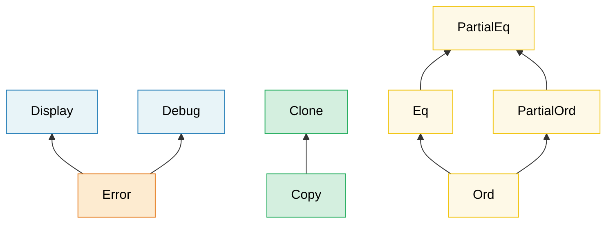

# 2. 深入 Trait 🟡

> **你将学到：**
> - 关联类型 vs 泛型参数 —— 以及何时使用各自
> - GAT、blanket impl、标记 trait 和 trait 对象安全规则
> - 虚表和胖指针的内部工作原理
> - 扩展 trait、枚举分发和类型化命令模式

## 关联类型 vs 泛型参数

两者都允许 trait 处理不同类型，但用途不同：

```rust
// --- 关联类型：每种类型一个实现 ---
trait Iterator {
    type Item; // 每个迭代器只产生一种 Item

    fn next(&mut self) -> Option<Self::Item>;
}

// 一个始终产生 i32 的自定义迭代器 —— 没有选择
struct Counter { max: i32, current: i32 }

impl Iterator for Counter {
    type Item = i32; // 每个实现恰好一种 Item 类型
    fn next(&mut self) -> Option<i32> {
        if self.current < self.max {
            self.current += 1;
            Some(self.current)
        } else {
            None
        }
    }
}

// --- 泛型参数：每种类型多个实现 ---
trait Convert<T> {
    fn convert(&self) -> T;
}

// 一种类型可以为多种目标类型实现 Convert：
impl Convert<f64> for i32 {
    fn convert(&self) -> f64 { *self as f64 }
}
impl Convert<String> for i32 {
    fn convert(&self) -> String { self.to_string() }
}
```

**何时使用哪个**：

| 使用 | 何时 |
|-----|------|
| **关联类型** | 每个实现类型恰好有一种自然的输出/结果。`Iterator::Item`、`Deref::Target`、`Add::Output` |
| **泛型参数** | 一种类型可以有意义地为多种不同类型实现该 trait。`From<T>`、`AsRef<T>`、`PartialEq<Rhs>` |

**直觉**：如果问"这个迭代器的 `Item` 是什么？"有意义，就用关联类型。如果问"这个能转换成 `f64` 吗？能转换成 `String` 吗？能转换成 `bool` 吗？"有意义，就用泛型参数。

```rust
// 现实例子：std::ops::Add
trait Add<Rhs = Self> {
    type Output; // 关联类型 —— 加法只有一种结果类型
    fn add(self, rhs: Rhs) -> Self::Output;
}

// Rhs 是泛型参数 —— 你可以把不同类型加到 Meters 上：
struct Meters(f64);
struct Centimeters(f64);

impl Add<Meters> for Meters {
    type Output = Meters;
    fn add(self, rhs: Meters) -> Meters { Meters(self.0 + rhs.0) }
}
impl Add<Centimeters> for Meters {
    type Output = Meters;
    fn add(self, rhs: Centimeters) -> Meters { Meters(self.0 + rhs.0 / 100.0) }
}
```

### 泛型关联类型（GAT）

自 Rust 1.65 起，关联类型可以有自己的泛型参数。
这使得**借贷迭代器**成为可能 —— 返回与迭代器本身而非底层集合绑定的引用的迭代器：

```rust
// 没有 GAT —— 不可能表达借贷迭代器：
// trait LendingIterator {
//     type Item<'a>;  // ← 这在 1.65 之前被拒绝
// }

// 使用 GAT（Rust 1.65+）：
// 注意：这是一个自定义 trait，区别于标准库的 Iterator。
// 在实际代码中，命名为 LendingIterator 以避免与标准 Iterator 混淆。
trait LendingIterator {
    type Item<'a> where Self: 'a;

    fn next(&mut self) -> Option<Self::Item<'_>>;
}

// 示例：产生重叠窗口的迭代器
struct WindowIter<'data> {
    data: &'data [u8],
    pos: usize,
    window_size: usize,
}

impl<'data> LendingIterator for WindowIter<'data> {
    type Item<'a> = &'a [u8] where Self: 'a;

    fn next(&mut self) -> Option<&[u8]> {
        if self.pos + self.window_size <= self.data.len() {
            let window = &self.data[self.pos..self.pos + self.window_size];
            self.pos += 1;
            Some(window)
        } else {
            None
        }
    }
}
```

> **何时需要 GAT**：借贷迭代器、流式解析器，或关联类型的生命周期依赖于 `&self` 借用的任何 trait。对于大多数代码，普通的关联类型就够了。

### 超 trait 和 trait 层次结构

Trait 可以要求其他 trait 作为前置条件，形成层次结构：



> 箭头从子 trait 指向超 trait：实现 `Error` 需要 `Display` + `Debug`。

一个 trait 可以要求实现者也实现其他 trait：

```rust
use std::fmt;

// Display 是 Error 的超 trait
trait Error: fmt::Display + fmt::Debug {
    fn source(&self) -> Option<&(dyn Error + 'static)> { None }
}
// 任何实现 Error 的类型也必须实现 Display 和 Debug

// 构建你自己的层次结构：
trait Identifiable {
    fn id(&self) -> u64;
}

trait Timestamped {
    fn created_at(&self) -> chrono::DateTime<chrono::Utc>;
}

// Entity 需要两者：
trait Entity: Identifiable + Timestamped {
    fn is_active(&self) -> bool;
}

// 实现 Entity 强制你实现全部三个：
struct User { id: u64, name: String, created: chrono::DateTime<chrono::Utc> }

impl Identifiable for User {
    fn id(&self) -> u64 { self.id }
}
impl Timestamped for User {
    fn created_at(&self) -> chrono::DateTime<chrono::Utc> { self.created }
}
impl Entity for User {
    fn is_active(&self) -> bool { true }
}
```

### Blanket 实现

为满足某个约束的**所有**类型实现 trait：

```rust
// std 这样做：任何实现 Display 的类型自动获得 ToString
impl<T: fmt::Display> ToString for T {
    fn to_string(&self) -> String {
        format!("{self}")
    }
}
// 现在 i32、&str、你的自定义类型 —— 任何有 Display 的都能免费获得 to_string()。

// 你自己的 blanket impl：
trait Loggable {
    fn log(&self);
}

// 每个 Debug 类型自动成为 Loggable：
impl<T: std::fmt::Debug> Loggable for T {
    fn log(&self) {
        eprintln!("[LOG] {self:?}");
    }
}

// 现在任何 Debug 类型都有 .log()：
// 42.log();              // [LOG] 42
// "hello".log();         // [LOG] "hello"
// vec![1, 2, 3].log();   // [LOG] [1, 2, 3]
```

> **注意**：Blanket 实现很强大，但不可逆转 —— 你不能为已被 blanket impl 覆盖的类型添加更具体的 impl（孤儿规则 + 一致性）。谨慎设计。

### 标记 Trait

没有方法的 trait —— 标记类型具有某种属性：

```rust
// 标准库的标记 trait：
// Send    —— 可安全在线程间传输
// Sync    —— 可安全在线程间共享 (&T)
// Unpin   —— 固定后可安全移动
// Sized   —— 编译时已知大小
// Copy    —— 可用 memcpy 复制

// 你自己的标记 trait：
/// 标记：此传感器已出厂校准
trait Calibrated {}

struct RawSensor { reading: f64 }
struct CalibratedSensor { reading: f64 }

impl Calibrated for CalibratedSensor {}

// 只有校准过的传感器才能用于生产：
fn record_measurement<S: Calibrated>(sensor: &S) {
    // ...
}
// record_measurement(&RawSensor { reading: 0.0 }); // ❌ 编译错误
// record_measurement(&CalibratedSensor { reading: 0.0 }); // ✅
```

这直接连接到**第 3 章的类型状态模式**。

### Trait 对象安全规则

并非每个 trait 都能用作 `dyn Trait`。一个 trait 是**对象安全**的，只有在以下条件下：

1. Trait 本身没有 `Self: Sized` 约束
2. 方法没有泛型类型参数
3. 没有在返回位置使用 `Self`（除了通过 `Box<Self>` 等间接方式）
4. 没有关联函数（方法必须有 `&self`、`&mut self` 或 `self`）

```rust
// ✅ 对象安全 —— 可用作 dyn Drawable
trait Drawable {
    fn draw(&self);
    fn bounding_box(&self) -> (f64, f64, f64, f64);
}

let shapes: Vec<Box<dyn Drawable>> = vec![/* ... */]; // ✅ 可以

// ❌ 不是对象安全 —— 在返回位置使用 Self
trait Clonable {
    fn clone_self(&self) -> Self;
    //                       ^^^^ 运行时无法知道具体大小
}
// let items: Vec<Box<dyn Clonable>> = ...; // ❌ 编译错误

// ❌ 不是对象安全 —— 泛型方法
trait Converter {
    fn convert<T>(&self) -> T;
    //        ^^^ 虚表不能包含无限的单态化
}

// ❌ 不是对象安全 —— 关联函数（无 self）
trait Factory {
    fn create() -> Self;
    // 没有 &self —— 如何通过 trait 对象调用它？
}
```

**变通方法**：

```rust
// 添加 `where Self: Sized` 以从虚表中排除方法：
trait MyTrait {
    fn regular_method(&self); // 包含在虚表中

    fn generic_method<T>(&self) -> T
    where
        Self: Sized; // 从虚表中排除 —— 不能通过 dyn MyTrait 调用
}

// 现在 dyn MyTrait 有效，但 generic_method 只能在具体类型已知时调用。
```

> **经验法则**：如果你计划使用 `dyn Trait`，保持方法简单 —— 无泛型、无返回类型中的 `Self`、无 `Sized` 约束。有疑问时，试试 `let _: Box<dyn YourTrait>;` 并让编译器告诉你。

### Trait 对象的底层 —— 虚表和胖指针

`&dyn Trait`（或 `Box<dyn Trait>`）是**胖指针** —— 两个机器字：

```text
┌──────────────────────────────────────────────────┐
│  &dyn Drawable (64位上：16 字节总计)              │
├──────────────┬───────────────────────────────────┤
│  data_ptr    │  vtable_ptr                       │
│  (8 字节)    │  (8 字节)                         │
│  ↓           │  ↓                                │
│  ┌─────────┐ │  ┌──────────────────────────────┐ │
│  │ Circle  │ │  │ vtable for <Circle as        │ │
│  │ {       │ │  │           Drawable>           │ │
│  │  r: 5.0 │ │  │                              │ │
│  │ }       │ │  │  drop_in_place: 0x7f...a0    │ │
│  └─────────┘ │  │  size:           8            │ │
│              │  │  align:          8            │ │
│              │  │  draw:          0x7f...b4     │ │
│              │  │  bounding_box:  0x7f...c8     │ │
│              │  └──────────────────────────────┘ │
└──────────────┴───────────────────────────────────┘
```

**虚表调用如何工作**（例如 `shape.draw()`）：

1. 从胖指针（第二个字）加载 `vtable_ptr`
2. 在虚表中索引找到 `draw` 函数指针
3. 调用它，将 `data_ptr` 作为 `self` 参数传递

这类似于 C++ 虚调用的成本（每次调用一次指针间接），
但 Rust 将虚表指针存储在胖指针中而非对象内部 —— 所以栈上的普通 `Circle`
根本不携带虚表指针。

```rust
trait Drawable {
    fn draw(&self);
    fn area(&self) -> f64;
}

struct Circle { radius: f64 }

impl Drawable for Circle {
    fn draw(&self) { println!("Drawing circle r={}", self.radius); }
    fn area(&self) -> f64 { std::f64::consts::PI * self.radius * self.radius }
}

struct Square { side: f64 }

impl Drawable for Square {
    fn draw(&self) { println!("Drawing square s={}", self.side); }
    fn area(&self) -> f64 { self.side * self.side }
}

fn main() {
    let shapes: Vec<Box<dyn Drawable>> = vec![
        Box::new(Circle { radius: 5.0 }),
        Box::new(Square { side: 3.0 }),
    ];

    // 每个元素是胖指针：(data_ptr, vtable_ptr)
    // Circle 和 Square 的虚表是不同的
    for shape in &shapes {
        shape.draw();  // 虚表分发 → Circle::draw 或 Square::draw
        println!("  area = {:.2}", shape.area());
    }

    // 大小比较：
    println!("size_of::<&Circle>()        = {}", std::mem::size_of::<&Circle>());
    // → 8 字节（一个指针 —— 编译器知道类型）
    println!("size_of::<&dyn Drawable>()  = {}", std::mem::size_of::<&dyn Drawable>());
    // → 16 字节（data_ptr + vtable_ptr）
}
```

**性能成本模型**：

| 方面 | 静态分发（`impl Trait` / 泛型） | 动态分发（`dyn Trait`） |
|--------|------------------------------------------|-------------------------------|
| 调用开销 | 零 —— 被 LLVM 内联 | 每次调用一次指针间接 |
| 内联 | ✅ 编译器可以内联 | ❌ 不透明的函数指针 |
| 二进制大小 | 较大（每种类型一份） | 较小（一份共享函数） |
| 指针大小 | 瘦（1 个字） | 胖（2 个字） |
| 异构集合 | ❌ | ✅ `Vec<Box<dyn Trait>>` |

> **虚表成本何时重要**：在紧密循环中调用 trait 方法数百万次时，间接和无法内联可能很显著（慢 2-10 倍）。对于冷路径、配置或插件架构，`dyn Trait` 的灵活性值得小小成本。

### 高阶 trait 界限（HRTB）

有时你需要一个能处理*任意*生命周期引用而非特定生命周期的函数。这就是 `for<'a>` 语法出现的地方：

```rust
// 问题：这个函数需要一个能处理任意生命周期引用的闭包，
// 而不仅仅是一个特定生命周期。

// ❌ 这太严格了 —— 'a 由调用者固定：
// fn apply<'a, F: Fn(&'a str) -> &'a str>(f: F, data: &'a str) -> &'a str

// ✅ HRTB：F 必须适用于所有可能的生命周期：
fn apply<F>(f: F, data: &str) -> &str
where
    F: for<'a> Fn(&'a str) -> &'a str,
{
    f(data)
}

fn main() {
    let result = apply(|s| s.trim(), "  hello  ");
    println!("{result}"); // "hello"
}
```

**何时遇到 HRTB**：
- `Fn(&T) -> &U` trait —— 编译器在大多数情况下自动推断 `for<'a>`
- 必须跨不同借用工作的自定义 trait 实现
- 使用 `serde` 反序列化：`for<'de> Deserialize<'de>`

```rust,ignore
// serde 的 DeserializeOwned 定义为：
// trait DeserializeOwned: for<'de> Deserialize<'de> {}
// 含义："可从任意生命周期的数据反序列化"
//（即结果不从输入借用）

use serde::de::DeserializeOwned;

fn parse_json<T: DeserializeOwned>(input: &str) -> T {
    serde_json::from_str(input).unwrap()
}
```

> **实践建议**：你很少需要自己写 `for<'a>`。它主要出现在闭包参数的 trait 界限中，编译器会隐式处理。但在错误信息中识别它（"期望 `for<'a> Fn(&'a ...)` 界限"）有助于理解编译器在要求什么。

### `impl Trait` —— 参数位置 vs 返回位置

`impl Trait` 出现在两个位置，具有**不同的语义**：

```rust
// --- 参数位置的 impl Trait (APIT) ---
// "调用者选择类型" —— 泛型参数的语法糖
fn print_all(items: impl Iterator<Item = i32>) {
    for item in items { println!("{item}"); }
}
// 等价于：
fn print_all_verbose<I: Iterator<Item = i32>>(items: I) {
    for item in items { println!("{item}"); }
}
// 调用者决定：print_all(vec![1,2,3].into_iter())
//                 print_all(0..10)

// --- 返回位置的 impl Trait (RPIT) ---
// "被调用者选择类型" —— 函数选择一个具体类型
fn evens(limit: i32) -> impl Iterator<Item = i32> {
    (0..limit).filter(|x| x % 2 == 0)
    // 具体类型是 Filter<Range<i32>, Closure>
    // 但调用者只看到"某个 Iterator<Item = i32>"
}
```

**关键区别**：

| | APIT（`fn foo(x: impl T)`） | RPIT（`fn foo() -> impl T`） |
|---|---|---|
| 谁选择类型？ | 调用者 | 被调用者（函数体） |
| 单态化？ | 是 —— 每种类型一份 | 是 —— 一种具体类型 |
| Turbofish？ | 否（`foo::<X>()` 不允许） | 不适用 |
| 等价于 | `fn foo<X: T>(x: X)` | 存在类型 |

#### Trait 定义中的 RPIT（RPITIT）

自 Rust 1.75 起，你可以直接在 trait 定义中使用 `-> impl Trait`：

```rust
trait Container {
    fn items(&self) -> impl Iterator<Item = &str>;
    //                 ^^^^ 每个实现者返回自己的具体类型
}

struct CsvRow {
    fields: Vec<String>,
}

impl Container for CsvRow {
    fn items(&self) -> impl Iterator<Item = &str> {
        self.fields.iter().map(String::as_str)
    }
}

struct FixedFields;

impl Container for FixedFields {
    fn items(&self) -> impl Iterator<Item = &str> {
        ["host", "port", "timeout"].into_iter()
    }
}
```

> **在 Rust 1.75 之前**，你必须使用 `Box<dyn Iterator>` 或关联类型在 trait 中达到此效果。RPITIT 消除了分配。

#### `impl Trait` vs `dyn Trait` —— 决策指南

```text
你在编译时知道具体类型吗？
├── YES → 使用 impl Trait 或泛型（零成本，可内联）
└── NO  → 你需要异构集合吗？
     ├── YES → 使用 dyn Trait（Box<dyn T>, &dyn T）
     └── NO  → 你需要跨 API 边界的相同 trait 对象吗？
          ├── YES → 使用 dyn Trait
          └── NO  → 使用泛型 / impl Trait
```

| 特性 | `impl Trait` | `dyn Trait` |
|---------|-------------|------------|
| 分发 | 静态（单态化） | 动态（虚表） |
| 性能 | 最佳 —— 可内联 | 每次调用一次间接 |
| 异构集合 | ❌ | ✅ |
| 每种类型的二进制大小 | 每种一份副本 | 共享代码 |
| Trait 必须对象安全？ | 否 | 是 |
| 能在 trait 定义中工作 | ✅（Rust 1.75+） | 始终可以 |

***

## 使用 `Any` 和 `TypeId` 进行类型擦除

有时你需要存储*未知*类型的值并在以后向下转换它们 —— 这是 C 中的 `void*` 或 C# 中的 `object` 熟悉的模式。Rust 通过 `std::any::Any` 提供此功能：

```rust
use std::any::Any;

// 存储异构值：
fn log_value(value: &dyn Any) {
    if let Some(s) = value.downcast_ref::<String>() {
        println!("String: {s}");
    } else if let Some(n) = value.downcast_ref::<i32>() {
        println!("i32: {n}");
    } else {
        // TypeId 让你在运行时检查类型：
        println!("Unknown type: {:?}", value.type_id());
    }
}

// 对插件系统、事件总线或 ECS 风格架构有用：
struct AnyMap(std::collections::HashMap<std::any::TypeId, Box<dyn Any + Send>>);

impl AnyMap {
    fn new() -> Self { AnyMap(std::collections::HashMap::new()) }

    fn insert<T: Any + Send + 'static>(&mut self, value: T) {
        self.0.insert(std::any::TypeId::of::<T>(), Box::new(value));
    }

    fn get<T: Any + Send + 'static>(&self) -> Option<&T> {
        self.0.get(&std::any::TypeId::of::<T>())?
            .downcast_ref()
    }
}

fn main() {
    let mut map = AnyMap::new();
    map.insert(42_i32);
    map.insert(String::from("hello"));

    assert_eq!(map.get::<i32>(), Some(&42));
    assert_eq!(map.get::<String>().map(|s| s.as_str()), Some("hello"));
    assert_eq!(map.get::<f64>(), None); // 从未插入
}
```

> **何时使用 `Any`**：插件/扩展系统、类型索引映射（`typemap`）、错误向下转换（`anyhow::Error::downcast_ref`）。当类型集在编译时已知时，优先使用泛型或 trait 对象 —— `Any` 是最后的手段，用编译时安全换取灵活性。

***

## 扩展 Trait —— 为你无法控制的类型添加方法

Rust 的孤儿规则阻止你为外来类型实现外来 trait。
扩展 trait 是标准解决方法：定义一个**新 trait**在你的 crate 中，
其方法对满足约束的任何类型有 blanket 实现。调用者导入
trait，新方法就出现在现有类型上。

这个模式在 Rust 生态系统中无处不在：`itertools::Itertools`、`futures::StreamExt`、
`tokio::io::AsyncReadExt`、`tower::ServiceExt`。

### 问题

```rust
// 我们想为所有产生 f64 的迭代器添加 .mean() 方法。
// 但 Iterator 在 std 中定义，f64 是原语 —— 孤儿规则阻止：
//
// impl<I: Iterator<Item = f64>> I {   // ❌ 不能为外来类型添加固有方法
//     fn mean(self) -> f64 { ... }
// }
```

### 解决方案：扩展 Trait

```rust
/// 数值迭代器的扩展方法。
pub trait IteratorExt: Iterator {
    /// 计算算术平均值。对于空迭代器返回 `None`。
    fn mean(self) -> Option<f64>
    where
        Self: Sized,
        Self::Item: Into<f64>;
}

// Blanket 实现 —— 自动适用于所有迭代器
impl<I: Iterator> IteratorExt for I {
    fn mean(self) -> Option<f64>
    where
        Self: Sized,
        Self::Item: Into<f64>,
    {
        let mut sum: f64 = 0.0;
        let mut count: u64 = 0;
        for item in self {
            sum += item.into();
            count += 1;
        }
        if count == 0 { None } else { Some(sum / count as f64) }
    }
}

// 用法 —— 只需导入 trait：
use crate::IteratorExt;  // 一个导入，方法就出现在所有迭代器上

fn analyze_temperatures(readings: &[f64]) -> Option<f64> {
    readings.iter().copied().mean()  // .mean() 现在可用了！
}

fn analyze_sensor_data(data: &[i32]) -> Option<f64> {
    data.iter().copied().mean()  // 对 i32 也有效（i32: Into<f64>）
}
```

### 现实世界例子：诊断结果扩展

```rust
use std::collections::HashMap;

struct DiagResult {
    component: String,
    passed: bool,
    message: String,
}

/// Vec<DiagResult> 的扩展 trait —— 添加领域特定分析方法。
pub trait DiagResultsExt {
    fn passed_count(&self) -> usize;
    fn failed_count(&self) -> usize;
    fn overall_pass(&self) -> bool;
    fn failures_by_component(&self) -> HashMap<String, Vec<&DiagResult>>;
}

impl DiagResultsExt for Vec<DiagResult> {
    fn passed_count(&self) -> usize {
        self.iter().filter(|r| r.passed).count()
    }

    fn failed_count(&self) -> usize {
        self.iter().filter(|r| !r.passed).count()
    }

    fn overall_pass(&self) -> bool {
        self.iter().all(|r| r.passed)
    }

    fn failures_by_component(&self) -> HashMap<String, Vec<&DiagResult>> {
        let mut map = HashMap::new();
        for r in self.iter().filter(|r| !r.passed) {
            map.entry(r.component.clone()).or_default().push(r);
        }
        map
    }
}

// 现在任何 Vec<DiagResult> 都有这些方法：
fn report(results: Vec<DiagResult>) {
    if !results.overall_pass() {
        let failures = results.failures_by_component();
        for (component, fails) in &failures {
            eprintln!("{component}: {} failures", fails.len());
        }
    }
}
```

### 命名约定

Rust 生态系统使用一致的 `Ext` 后缀：

| Crate | 扩展 Trait | 扩展自 |
|-------|----------------|---------|
| `itertools` | `Itertools` | `Iterator` |
| `futures` | `StreamExt`, `FutureExt` | `Stream`, `Future` |
| `tokio` | `AsyncReadExt`, `AsyncWriteExt` | `AsyncRead`, `AsyncWrite` |
| `tower` | `ServiceExt` | `Service` |
| `bytes` | `BufMut`（部分） | `&mut [u8]` |
| 你的 crate | `DiagResultsExt` | `Vec<DiagResult>` |

### 何时使用

| 情况 | 使用扩展 Trait？ |
|-----------|:---:|
| 为外来类型添加便利方法 | ✅ |
| 在泛型集合上分组领域特定逻辑 | ✅ |
| 方法需要访问私有字段 | ❌（使用包装器/newtype） |
| 方法逻辑上属于你控制的新类型 | ❌（直接添加到你的类型） |
| 你希望方法无需任何导入就可用 | ❌（只有固有方法可以） |

***

## 枚举分发 —— 无 `dyn` 的静态多态

当你有**封闭集合**的类型实现一个 trait 时，你可以用枚举替换 `dyn Trait`，
枚举的变体持有具体类型。这消除了虚表间接和堆分配，
同时保留相同的面向调用者的接口。

### `dyn Trait` 的问题

```rust
trait Sensor {
    fn read(&self) -> f64;
    fn name(&self) -> &str;
}

struct Gps { lat: f64, lon: f64 }
struct Thermometer { temp_c: f64 }
struct Accelerometer { g_force: f64 }

impl Sensor for Gps {
    fn read(&self) -> f64 { self.lat }
    fn name(&self) -> &str { "GPS" }
}
impl Sensor for Thermometer {
    fn read(&self) -> f64 { self.temp_c }
    fn name(&self) -> &str { "Thermometer" }
}
impl Sensor for Accelerometer {
    fn read(&self) -> f64 { self.g_force }
    fn name(&self) -> &str { "Accelerometer" }
}

// 使用 dyn 的异构集合 —— 有效，但有成本：
fn read_all_dyn(sensors: &[Box<dyn Sensor>]) -> Vec<f64> {
    sensors.iter().map(|s| s.read()).collect()
    // 每个 .read() 通过虚表间接
    // 每个 Box 在堆上分配
}
```

### 枚举分发解决方案

```rust
// 用枚举替换 trait 对象：
enum AnySensor {
    Gps(Gps),
    Thermometer(Thermometer),
    Accelerometer(Accelerometer),
}

impl AnySensor {
    fn read(&self) -> f64 {
        match self {
            AnySensor::Gps(s) => s.read(),
            AnySensor::Thermometer(s) => s.read(),
            AnySensor::Accelerometer(s) => s.read(),
        }
    }

    fn name(&self) -> &str {
        match self {
            AnySensor::Gps(s) => s.name(),
            AnySensor::Thermometer(s) => s.name(),
            AnySensor::Accelerometer(s) => s.name(),
        }
    }
}

// 现在：无堆分配，无虚表，内联存储
fn read_all(sensors: &[AnySensor]) -> Vec<f64> {
    sensors.iter().map(|s| s.read()).collect()
    // 每个 .read() 是一个 match 分支 —— 编译器可以内联一切
}

fn main() {
    let sensors = vec![
        AnySensor::Gps(Gps { lat: 47.6, lon: -122.3 }),
        AnySensor::Thermometer(Thermometer { temp_c: 72.5 }),
        AnySensor::Accelerometer(Accelerometer { g_force: 1.02 }),
    ];

    for sensor in &sensors {
        println!("{}: {:.2}", sensor.name(), sensor.read());
    }
}
```

### 在枚举上实现 Trait

为互操作性，你可以在枚举本身上实现原始 trait：

```rust
impl Sensor for AnySensor {
    fn read(&self) -> f64 {
        match self {
            AnySensor::Gps(s) => s.read(),
            AnySensor::Thermometer(s) => s.read(),
            AnySensor::Accelerometer(s) => s.read(),
        }
    }

    fn name(&self) -> &str {
        match self {
            AnySensor::Gps(s) => s.name(),
            AnySensor::Thermometer(s) => s.name(),
            AnySensor::Accelerometer(s) => s.name(),
        }
    }
}

// 现在 AnySensor 可以通过泛型在任何期望 Sensor 的地方工作：
fn report<S: Sensor>(s: &S) {
    println!("{}: {:.2}", s.name(), s.read());
}
```

### 用宏减少样板代码

match 分支委托是重复的。宏消除了它：

```rust
macro_rules! dispatch_sensor {
    ($self:expr, $method:ident $(, $arg:expr)*) => {
        match $self {
            AnySensor::Gps(s) => s.$method($($arg),*),
            AnySensor::Thermometer(s) => s.$method($($arg),*),
            AnySensor::Accelerometer(s) => s.$method($($arg),*),
        }
    };
}

impl Sensor for AnySensor {
    fn read(&self) -> f64     { dispatch_sensor!(self, read) }
    fn name(&self) -> &str    { dispatch_sensor!(self, name) }
}
```

对于大型项目，`enum_dispatch` crate 完全自动化了这一点：

```rust
use enum_dispatch::enum_dispatch;

#[enum_dispatch]
trait Sensor {
    fn read(&self) -> f64;
    fn name(&self) -> &str;
}

#[enum_dispatch(Sensor)]
enum AnySensor {
    Gps,
    Thermometer,
    Accelerometer,
}
// 所有委托代码自动生成。
```

### `dyn Trait` vs 枚举分发 —— 决策指南

```text
类型集是封闭的吗（编译时已知）？
├── YES → 优先使用枚举分发（更快，无堆分配）
│         ├── 少数变体（< ~20）？     → 手动枚举
│         └── 很多变体或在增长？ → enum_dispatch crate
└── NO  → 必须使用 dyn Trait（插件、用户提供类型）
```

| 属性 | `dyn Trait` | 枚举分发 |
|----------|:-----------:|:-------------:|
| 分发成本 | 虚表间接（~2ns） | 分支预测（~0.3ns） |
| 堆分配 | 通常需要（Box） | 无（内联） |
| 缓存友好 | 否（指针追逐） | 是（连续） |
| 对新类型开放 | ✅（任何人都可以 impl） | ❌（封闭集合） |
| 代码大小 | 共享 | 每个变体一份副本 |
| Trait 必须对象安全 | 是 | 否 |
| 添加变体 | 无代码更改 | 更新枚举 + match 分支 |

### 何时使用枚举分发

| 场景 | 建议 |
|----------|---------------|
| 诊断测试类型（CPU、GPU、网卡、内存...） | ✅ 枚举分发 —— 封闭集合，编译时已知 |
| 总线协议（SPI、I2C、UART...） | ✅ 枚举分发或 Config trait |
| 插件系统（用户运行时加载 .so） | ❌ 使用 `dyn Trait` |
| 2-3 个变体 | ✅ 手动枚举分发 |
| 10+ 变体和很多方法 | ✅ `enum_dispatch` crate |
| 性能关键的内部循环 | ✅ 枚举分发（消除虚表） |

***

## 能力混合 —— 关联类型作为零成本组合

Ruby 开发者用**混合**组合行为 —— `include SomeModule` 将方法注入类。带有**关联类型 + 默认方法 + blanket impl** 的 Rust trait 产生相同结果，除了：

* 一切在**编译时**解析 —— 没有方法丢失的惊喜
* 每个关联类型是一个**旋钮**，改变默认方法产生的内容
* 编译器**单态化**每个组合 —— 零虚表开销

### 问题：跨切面总线依赖

硬件诊断例程共享常见操作 —— 读取 IPMI 传感器、切换 GPIO 线路、通过 SPI 采样温度 —— 但不同诊断需要不同组合。Rust 中不存在继承层次结构。将每个总线句柄作为函数参数传递会产生笨拙的签名。我们需要一种方式**混合**总线能力 à la carte。

### 步骤 1 —— 定义"成分" Trait

每个成分通过关联类型提供一种硬件能力：

```rust
use std::io;

// ── 总线抽象（硬件团队提供的 trait） ──────────
pub trait SpiBus {
    fn spi_transfer(&self, tx: &[u8], rx: &mut [u8]) -> io::Result<()>;
}

pub trait I2cBus {
    fn i2c_read(&self, addr: u8, reg: u8, buf: &mut [u8]) -> io::Result<()>;
    fn i2c_write(&self, addr: u8, reg: u8, data: &[u8]) -> io::Result<()>;
}

pub trait GpioPin {
    fn set_high(&self) -> io::Result<()>;
    fn set_low(&self) -> io::Result<()>;
    fn read_level(&self) -> io::Result<bool>;
}

pub trait IpmiBmc {
    fn raw_command(&self, net_fn: u8, cmd: u8, data: &[u8]) -> io::Result<Vec<u8>>;
    fn read_sensor(&self, sensor_id: u8) -> io::Result<f64>;
}

// ── 成分 trait —— 每个总线一个，携带关联类型 ───
pub trait HasSpi {
    type Spi: SpiBus;
    fn spi(&self) -> &Self::Spi;
}

pub trait HasI2c {
    type I2c: I2cBus;
    fn i2c(&self) -> &Self::I2c;
}

pub trait HasGpio {
    type Gpio: GpioPin;
    fn gpio(&self) -> &Self::Gpio;
}

pub trait HasIpmi {
    type Ipmi: IpmiBmc;
    fn ipmi(&self) -> &Self::Ipmi;
}
```

每个成分都很小、泛型且可单独测试。

### 步骤 2 —— 定义"混合" Trait

混合 trait 将其所需的成分声明为超 trait，然后通过**默认**提供所有方法 —— 实现者免费获得它们：

```rust
/// 混合：风扇诊断 —— 需要 I2C（转速计）+ GPIO（PWM 使能）
pub trait FanDiagMixin: HasI2c + HasGpio {
    /// 通过 I2C 从转速计 IC 读取风扇 RPM。
    fn read_fan_rpm(&self, fan_id: u8) -> io::Result<u32> {
        let mut buf = [0u8; 2];
        self.i2c().i2c_read(0x48 + fan_id, 0x00, &mut buf)?;
        Ok(u16::from_be_bytes(buf) as u32 * 60) // 转速计数 → RPM
    }

    /// 通过 GPIO 使能或禁用风扇 PWM 输出。
    fn set_fan_pwm(&self, enable: bool) -> io::Result<()> {
        if enable { self.gpio().set_high() }
        else      { self.gpio().set_low() }
    }

    /// 完整风扇健康检查 —— 读取 RPM + 验证在阈值内。
    fn check_fan_health(&self, fan_id: u8, min_rpm: u32) -> io::Result<bool> {
        let rpm = self.read_fan_rpm(fan_id)?;
        Ok(rpm >= min_rpm)
    }
}

/// 混合：温度监控 —— 需要 SPI（热电偶 ADC）+ IPMI（BMC 传感器）
pub trait TempMonitorMixin: HasSpi + HasIpmi {
    /// 通过 SPI ADC 读取热电偶（例如 MAX31855）。
    fn read_thermocouple(&self) -> io::Result<f64> {
        let mut rx = [0u8; 4];
        self.spi().spi_transfer(&[0x00; 4], &mut rx)?;
        let raw = i32::from_be_bytes(rx) >> 18; // 14 位有符号
        Ok(raw as f64 * 0.25)
    }

    /// 通过 IPMI 读取 BMC 管理的温度传感器。
    fn read_bmc_temp(&self, sensor_id: u8) -> io::Result<f64> {
        self.ipmi().read_sensor(sensor_id)
    }

    /// 交叉验证：热电偶 vs BMC 必须在 delta 内一致。
    fn validate_temps(&self, sensor_id: u8, max_delta: f64) -> io::Result<bool> {
        let tc = self.read_thermocouple()?;
        let bmc = self.read_bmc_temp(sensor_id)?;
        Ok((tc - bmc).abs() <= max_delta)
    }
}

/// 混合：电源时序 —— 需要 GPIO（轨道使能）+ IPMI（事件日志）
pub trait PowerSeqMixin: HasGpio + HasIpmi {
    /// 断言 power-good GPIO 并通过 IPMI 传感器验证。
    fn enable_power_rail(&self, sensor_id: u8) -> io::Result<bool> {
        self.gpio().set_high()?;
        std::thread::sleep(std::time::Duration::from_millis(50));
        let voltage = self.ipmi().read_sensor(sensor_id)?;
        Ok(voltage > 0.8) // 高于额定 80% = 良好
    }

    /// 解除断言电源并通过 IPMI OEM 命令记录关闭。
    fn disable_power_rail(&self) -> io::Result<()> {
        self.gpio().set_low()?;
        // 向 BMC 记录 OEM "电源轨道关闭" 事件
        self.ipmi().raw_command(0x2E, 0x01, &[0x00, 0x01])?;
        Ok(())
    }
}
```

### 步骤 3 —— Blanket Impl 使其真正成为"混合"

神奇的一行 —— 提供成分，获得方法：

```rust
impl<T: HasI2c + HasGpio>  FanDiagMixin    for T {}
impl<T: HasSpi  + HasIpmi>  TempMonitorMixin for T {}
impl<T: HasGpio + HasIpmi>  PowerSeqMixin   for T {}
```

任何实现正确成分 trait 的结构体**自动**获得每个混合方法 —— 无样板、无转发、无继承。

### 步骤 4 —— 连接生产环境

```rust
// ── 具体总线实现（Linux 平台） ───────────────
struct LinuxSpi  { dev: String }
struct LinuxI2c  { dev: String }
struct SysfsGpio { pin: u32 }
struct IpmiTool  { timeout_secs: u32 }

impl SpiBus for LinuxSpi {
    fn spi_transfer(&self, _tx: &[u8], _rx: &mut [u8]) -> io::Result<()> {
        // spidev ioctl —— 为简洁省略
        Ok(())
    }
}
impl I2cBus for LinuxI2c {
    fn i2c_read(&self, _addr: u8, _reg: u8, _buf: &mut [u8]) -> io::Result<()> {
        // i2c-dev ioctl —— 为简洁省略
        Ok(())
    }
    fn i2c_write(&self, _addr: u8, _reg: u8, _data: &[u8]) -> io::Result<()> { Ok(()) }
}
impl GpioPin for SysfsGpio {
    fn set_high(&self) -> io::Result<()>  { /* /sys/class/gpio */ Ok(()) }
    fn set_low(&self) -> io::Result<()>   { Ok(()) }
    fn read_level(&self) -> io::Result<bool> { Ok(true) }
}
impl IpmiBmc for IpmiTool {
    fn raw_command(&self, _nf: u8, _cmd: u8, _data: &[u8]) -> io::Result<Vec<u8>> {
        // 调用 ipmitool —— 为简洁省略
        Ok(vec![])
    }
    fn read_sensor(&self, _id: u8) -> io::Result<f64> { Ok(25.0) }
}

// ── 生产平台 —— 所有四个总线 ─────────────────
struct DiagPlatform {
    spi:  LinuxSpi,
    i2c:  LinuxI2c,
    gpio: SysfsGpio,
    ipmi: IpmiTool,
}

impl HasSpi  for DiagPlatform { type Spi  = LinuxSpi;  fn spi(&self)  -> &LinuxSpi  { &self.spi  } }
impl HasI2c  for DiagPlatform { type I2c  = LinuxI2c;  fn i2c(&self)  -> &LinuxI2c  { &self.i2c  } }
impl HasGpio for DiagPlatform { type Gpio = SysfsGpio; fn gpio(&self) -> &SysfsGpio { &self.gpio } }
impl HasIpmi for DiagPlatform { type Ipmi = IpmiTool;  fn ipmi(&self) -> &IpmiTool  { &self.ipmi } }

// DiagPlatform 现在拥有所有混合方法：
fn production_diagnostics(platform: &DiagPlatform) -> io::Result<()> {
    let rpm = platform.read_fan_rpm(0)?;       // 来自 FanDiagMixin
    let tc  = platform.read_thermocouple()?;   // 来自 TempMonitorMixin
    let ok  = platform.enable_power_rail(42)?;  // 来自 PowerSeqMixin
    println!("Fan: {rpm} RPM, Temp: {tc}°C, Power: {ok}");
    Ok(())
}
```

### 步骤 5 —— 用 Mock 测试（无需硬件）

```rust
#[cfg(test)]
mod tests {
    use super::*;
    use std::cell::Cell;

    struct MockSpi  { temp: Cell<f64> }
    struct MockI2c  { rpm: Cell<u32> }
    struct MockGpio { level: Cell<bool> }
    struct MockIpmi { sensor_val: Cell<f64> }

    impl SpiBus for MockSpi {
        fn spi_transfer(&self, _tx: &[u8], rx: &mut [u8]) -> io::Result<()> {
            // 将 mock 温度编码为 MAX31855 格式
            let raw = ((self.temp.get() / 0.25) as i32) << 18;
            rx.copy_from_slice(&raw.to_be_bytes());
            Ok(())
        }
    }
    impl I2cBus for MockI2c {
        fn i2c_read(&self, _addr: u8, _reg: u8, buf: &mut [u8]) -> io::Result<()> {
            let tach = (self.rpm.get() / 60) as u16;
            buf.copy_from_slice(&tach.to_be_bytes());
            Ok(())
        }
        fn i2c_write(&self, _: u8, _: u8, _: &[u8]) -> io::Result<()> { Ok(()) }
    }
    impl GpioPin for MockGpio {
        fn set_high(&self)  -> io::Result<()>   { self.level.set(true);  Ok(()) }
        fn set_low(&self)   -> io::Result<()>   { self.level.set(false); Ok(()) }
        fn read_level(&self) -> io::Result<bool> { Ok(self.level.get()) }
    }
    impl IpmiBmc for MockIpmi {
        fn raw_command(&self, _: u8, _: u8, _: &[u8]) -> io::Result<Vec<u8>> { Ok(vec![]) }
        fn read_sensor(&self, _: u8) -> io::Result<f64> { Ok(self.sensor_val.get()) }
    }

    // ── 部分平台：只有风扇相关总线 ─────────────────
    struct FanTestRig {
        i2c:  MockI2c,
        gpio: MockGpio,
    }
    impl HasI2c  for FanTestRig { type I2c  = MockI2c;  fn i2c(&self)  -> &MockI2c  { &self.i2c  } }
    impl HasGpio for FanTestRig { type Gpio = MockGpio; fn gpio(&self) -> &MockGpio { &self.gpio } }
    // FanTestRig 获得 FanDiagMixin 但没有 TempMonitorMixin 或 PowerSeqMixin

    #[test]
    fn fan_health_check_passes_above_threshold() {
        let rig = FanTestRig {
            i2c:  MockI2c  { rpm: Cell::new(6000) },
            gpio: MockGpio { level: Cell::new(false) },
        };
        assert!(rig.check_fan_health(0, 4000).unwrap());
    }

    #[test]
    fn fan_health_check_fails_below_threshold() {
        let rig = FanTestRig {
            i2c:  MockI2c  { rpm: Cell::new(2000) },
            gpio: MockGpio { level: Cell::new(false) },
        };
        assert!(!rig.check_fan_health(0, 4000).unwrap());
    }
}
```

注意 `FanTestRig` 只实现了 `HasI2c + HasGpio` —— 它自动获得 `FanDiagMixin`，但编译器**拒绝** `rig.read_thermocouple()`，因为 `HasSpi` 未满足。这是编译时强制执行的混合作用域。

### 条件方法 —— Ruby 做不到的

在单个默认方法上添加 `where` 约束。只有当关联类型满足额外约束时，方法才**存在**：

```rust
/// DMA 能力 SPI 控制器的标记 trait
pub trait DmaCapable: SpiBus {
    fn dma_transfer(&self, tx: &[u8], rx: &mut [u8]) -> io::Result<()>;
}

/// 中断能力 GPIO 引脚的标记 trait
pub trait InterruptCapable: GpioPin {
    fn wait_for_edge(&self, timeout_ms: u32) -> io::Result<bool>;
}

pub trait AdvancedDiagMixin: HasSpi + HasGpio {
    // 始终可用
    fn basic_probe(&self) -> io::Result<bool> {
        let mut rx = [0u8; 1];
        self.spi().spi_transfer(&[0xFF], &mut rx)?;
        Ok(rx[0] != 0x00)
    }

    // 仅当 SPI 控制器支持 DMA 时存在
    fn bulk_sensor_read(&self, buf: &mut [u8]) -> io::Result<()>
    where
        Self::Spi: DmaCapable,
    {
        self.spi().dma_transfer(&vec![0x00; buf.len()], buf)
    }

    // 仅当 GPIO 引脚支持中断时存在
    fn wait_for_fault_signal(&self, timeout_ms: u32) -> io::Result<bool>
    where
        Self::Gpio: InterruptCapable,
    {
        self.gpio().wait_for_edge(timeout_ms)
    }
}

impl<T: HasSpi + HasGpio> AdvancedDiagMixin for T {}
```

如果你的平台 SPI 不支持 DMA，调用 `bulk_sensor_read()` 是**编译错误**，不是运行时崩溃。Ruby 最接近的等价物是 `respond_to?` 检查 —— 但它在部署时发生，而不是编译时。

### 可组合性：堆叠混合

多个混合可以共享相同的成分 —— 没有菱形问题：

```text
┌─────────────┐    ┌───────────┐    ┌──────────────┐
│ FanDiagMixin│    │TempMonitor│    │ PowerSeqMixin│
│  (I2C+GPIO) │    │ (SPI+IPMI)│    │  (GPIO+IPMI) │
└──────┬──────┘    └─────┬─────┘    └──────┬───────┘
       │                 │                 │
       │   ┌─────────────┴─────────────┐   │
       └──►│      DiagPlatform         │◄──┘
           │ HasSpi+HasI2c+HasGpio     │
           │        +HasIpmi           │
           └───────────────────────────┘
```

`DiagPlatform` 实现 `HasGpio` **一次**，`FanDiagMixin` 和 `PowerSeqMixin` 都使用相同的 `self.gpio()`。在 Ruby 中，这将是两个模块都调用 `self.gpio_pin` —— 但如果它们期望不同的引脚号，你会在运行时发现冲突。在 Rust 中，你可以在类型层面消歧。

### 对比：Ruby 混合 vs Rust 能力混合

| 维度 | Ruby 混合 | Rust 能力混合 |
|-----------|-------------|------------------------|
| 分发 | 运行时（方法表查找） | 编译时（单态化） |
| 安全组合 | MRO 线性化隐藏冲突 | 编译器拒绝歧义 |
| 条件方法 | 运行时 `respond_to?` | 编译时 `where` 约束 |
| 开销 | 方法分发 + GC | 零成本（内联） |
| 可测试性 | 通过元编程 stub/mock | 泛型 mock 类型 |
| 添加新总线 | 运行时 `include` | 添加成分 trait，重新编译 |
| 运行时灵活性 | `extend`、`prepend`、开放类 | 无（完全静态） |

### 何时使用能力混合

| 场景 | 使用混合？ |
|----------|:-----------:|
| 多个诊断共享总线读取逻辑 | ✅ |
| 测试工具需要不同的总线子集 | ✅（部分成分结构体） |
| 方法仅对某些总线能力（DMA、IRQ）有效 | ✅（条件 `where` 约束） |
| 你需要运行时模块加载（插件） | ❌（使用 `dyn Trait` 或枚举分发） |
| 单个结构体只有一个总线 —— 无需共享 | ❌（保持简单） |
| 跨 crate 成分与一致性问题 | ⚠️（使用 newtype 包装器） |

> **关键要点 —— 能力混合**
>
> 1. **成分 trait** = 关联类型 + 访问器方法（例如 `HasSpi`）
> 2. **混合 trait** = 成分上的超 trait 约束 + 默认方法体
> 3. **Blanket impl** = `impl<T: HasX + HasY> Mixin for T {}` —— 自动注入方法
> 4. **条件方法** = 单个默认上的 `where Self::Spi: DmaCapable` 约束
> 5. **部分平台** = 只实现所需成分的测试结构体
> 6. **零运行时成本** —— 编译器为每个平台类型生成专用代码

***

## 类型化命令 —— GADT 风格的返回类型安全

在 Haskell 中，**广义代数数据类型（GADT）** 让数据类型的每个构造器细化类型参数 —— 所以 `Expr Int` 和 `Expr Bool` 由类型检查器强制执行。Rust 没有直接的 GADT 语法，但**带有关联类型的 trait** 达到相同的保证：命令类型**决定**响应类型，混合它们是编译错误。

这个模式对于硬件诊断特别强大，其中 IPMI 命令、寄存器读取和传感器查询各自返回不同的物理量，这些量永远不应该混淆。

### 问题：无类型的 `Vec<u8>` 沼泽

大多数 C/C++ IPMI 堆栈 —— 以及天真的 Rust 移植 —— 在各处使用原始字节：

```rust
use std::io;

struct BmcConnectionUntyped { timeout_secs: u32 }

impl BmcConnectionUntyped {
    fn raw_command(&self, net_fn: u8, cmd: u8, data: &[u8]) -> io::Result<Vec<u8>> {
        // ... 调用 ipmitool ...
        Ok(vec![0x00, 0x19, 0x00]) // stub
    }
}

fn diagnose_thermal_untyped(bmc: &BmcConnectionUntyped) -> io::Result<()> {
    // 读取 CPU 温度 —— 传感器 ID 0x20
    let raw = bmc.raw_command(0x04, 0x2D, &[0x20])?;
    let cpu_temp = raw[0] as f64;  // 🤞 希望字节 0 是读数

    // 读取风扇速度 —— 传感器 ID 0x30
    let raw = bmc.raw_command(0x04, 0x2D, &[0x30])?;
    let fan_rpm = raw[0] as u32;  // 🐛 BUG：风扇速度是 2 字节 LE

    // 读取入口电压 —— 传感器 ID 0x40
    let raw = bmc.raw_command(0x04, 0x2D, &[0x40])?;
    let voltage = raw[0] as f64;  // 🐛 BUG：需要除以 1000

    // 🐛 比较 °C 与 RPM —— 编译，但无意义
    if cpu_temp > fan_rpm as f64 {
        println!("uh oh");
    }

    // 🐛 传递伏特作为温度 —— 编译正常
    log_temp_untyped(voltage);
    log_volts_untyped(cpu_temp);

    Ok(())
}

fn log_temp_untyped(t: f64)  { println!("Temp: {t}°C"); }
fn log_volts_untyped(v: f64) { println!("Voltage: {v}V"); }
```

**每个读数都是 `f64`** —— 编译器不知道一个是温度，一个是 RPM，一个是电压。四个不同的 bug 编译时没有警告：

| # | Bug | 后果 | 发现时机 |
|---|-----|-------------|------------|
| 1 | 风扇 RPM 解析为 1 字节而非 2 | 读取 25 RPM 而非 6400 | 生产，凌晨 3 点风扇故障洪泛 |
| 2 | 电压未除以 1000 | 12000V 而非 12.0V | 阈值检查标记每个 PSU |
| 3 | 比较 °C 与 RPM | 无意义的布尔值 | 可能永远不会 |
| 4 | 传递伏特到 `log_temp_untyped()` | 日志中静默数据损坏 | 6 个月后，读取历史 |

### 解决方案：通过关联类型实现类型化命令

#### 步骤 1 —— 领域 newtype

```rust
#[derive(Debug, Clone, Copy, PartialEq, PartialOrd)]
struct Celsius(f64);

#[derive(Debug, Clone, Copy, PartialEq, PartialOrd)]
struct Rpm(u32);

#[derive(Debug, Clone, Copy, PartialEq, PartialOrd)]
struct Volts(f64);

#[derive(Debug, Clone, Copy, PartialEq, PartialOrd)]
struct Watts(f64);
```

#### 步骤 2 —— 命令 trait（GADT 等价物）

关联类型 `Response` 是关键 —— 它将每个命令绑定到其返回类型：

```rust
trait IpmiCmd {
    /// GADT "索引" —— 决定 execute() 返回什么。
    type Response;

    fn net_fn(&self) -> u8;
    fn cmd_byte(&self) -> u8;
    fn payload(&self) -> Vec<u8>;

    /// 解析被封装在这里 —— 每个命令知道自己的字节布局。
    fn parse_response(&self, raw: &[u8]) -> io::Result<Self::Response>;
}
```

#### 步骤 3 —— 每个命令一个结构体，解析写一次

```rust
struct ReadTemp { sensor_id: u8 }
impl IpmiCmd for ReadTemp {
    type Response = Celsius;  // ← "此命令返回温度"
    fn net_fn(&self) -> u8 { 0x04 }
    fn cmd_byte(&self) -> u8 { 0x2D }
    fn payload(&self) -> Vec<u8> { vec![self.sensor_id] }
    fn parse_response(&self, raw: &[u8]) -> io::Result<Celsius> {
        // 每个 IPMI SDR 的有符号字节 —— 写一次，测一次
        Ok(Celsius(raw[0] as i8 as f64))
    }
}

struct ReadFanSpeed { fan_id: u8 }
impl IpmiCmd for ReadFanSpeed {
    type Response = Rpm;     // ← "此命令返回 RPM"
    fn net_fn(&self) -> u8 { 0x04 }
    fn cmd_byte(&self) => u8 { 0x2D }
    fn payload(&self) -> Vec<u8> { vec![self.fan_id] }
    fn parse_response(&self, raw: &[u8]) -> io::Result<Rpm> {
        // 2 字节 LE —— 正确的布局，编码一次
        Ok(Rpm(u16::from_le_bytes([raw[0], raw[1]]) as u32))
    }
}

struct ReadVoltage { rail: u8 }
impl IpmiCmd for ReadVoltage {
    type Response = Volts;   // ← "此命令返回电压"
    fn net_fn(&self) -> u8 { 0x04 }
    fn cmd_byte(&self) -> u8 { 0x2D }
    fn payload(&self) -> Vec<u8> { vec![self.rail] }
    fn parse_response(&self, raw: &[u8]) -> io::Result<Volts> {
        // 毫伏 → 伏特，总是正确
        Ok(Volts(u16::from_le_bytes([raw[0], raw[1]]) as f64 / 1000.0))
    }
}

struct ReadFru { fru_id: u8 }
impl IpmiCmd for ReadFru {
    type Response = String;
    fn net_fn(&self) -> u8 { 0x0A }
    fn cmd_byte(&self) -> u8 { 0x11 }
    fn payload(&self) -> Vec<u8> { vec![self.fru_id, 0x00, 0x00, 0xFF] }
    fn parse_response(&self, raw: &[u8]) -> io::Result<String> {
        Ok(String::from_utf8_lossy(raw).to_string())
    }
}
```

#### 步骤 4 —— 执行器（零 `dyn`，单态化）

```rust
struct BmcConnection { timeout_secs: u32 }

impl BmcConnection {
    /// 泛型于任何命令 —— 编译器为每种命令类型生成一个版本。
    fn execute<C: IpmiCmd>(&self, cmd: &C) -> io::Result<C::Response> {
        let raw = self.raw_send(cmd.net_fn(), cmd.cmd_byte(), &cmd.payload())?;
        cmd.parse_response(&raw)
    }

    fn raw_send(&self, _nf: u8, _cmd: u8, _data: &[u8]) -> io::Result<Vec<u8>> {
        Ok(vec![0x19, 0x00]) // stub —— 真实实现调用 ipmitool
    }
}
```

#### 步骤 5 —— 调用者代码：所有四个 bug 变成编译错误

```rust
fn diagnose_thermal(bmc: &BmcConnection) -> io::Result<()> {
    let cpu_temp: Celsius = bmc.execute(&ReadTemp { sensor_id: 0x20 })?;
    let fan_rpm:  Rpm     = bmc.execute(&ReadFanSpeed { fan_id: 0x30 })?;
    let voltage:  Volts   = bmc.execute(&ReadVoltage { rail: 0x40 })?;

    // Bug #1 —— 不可能：解析位于 ReadFanSpeed::parse_response
    // Bug #2 —— 不可能：缩放位于 ReadVoltage::parse_response

    // Bug #3 —— 编译错误：
    // if cpu_temp > fan_rpm { }
    //    ^^^^^^^^   ^^^^^^^
    //    Celsius    Rpm      → "类型不匹配" ❌

    // Bug #4 —— 编译错误：
    // log_temperature(voltage);
    //                 ^^^^^^^  Volts，期望 Celsius ❌

    // 只有正确的比较能编译：
    if cpu_temp > Celsius(85.0) {
        println!("CPU overheating: {:?}", cpu_temp);
    }
    if fan_rpm < Rpm(4000) {
        println!("Fan too slow: {:?}", fan_rpm);
    }

    Ok(())
}

fn log_temperature(t: Celsius) { println!("Temp: {:?}", t); }
fn log_voltage(v: Volts)       { println!("Voltage: {:?}", v); }
```

### 用于诊断脚本的宏 DSL

对于运行很多顺序命令的大型诊断例程，宏提供了简洁的声明式语法，同时保留完整的类型安全：

```rust
/// 执行一系列类型化 IPMI 命令，返回结果元组。
/// 元组的每个元素都有命令自己的 Response 类型。
macro_rules! diag_script {
    ($bmc:expr; $($cmd:expr),+ $(,)?) => {{
        ( $( $bmc.execute(&$cmd)?, )+ )
    }};
}

fn full_pre_flight(bmc: &BmcConnection) -> io::Result<()> {
    // 展开为：(Celsius, Rpm, Volts, String) —— 每个类型都被跟踪
    let (temp, rpm, volts, board_pn) = diag_script!(bmc;
        ReadTemp     { sensor_id: 0x20 },
        ReadFanSpeed { fan_id:    0x30 },
        ReadVoltage  { rail:      0x40 },
        ReadFru      { fru_id:    0x00 },
    );

    println!("Board: {:?}", board_pn);
    println!("CPU: {:?}, Fan: {:?}, 12V: {:?}", temp, rpm, volts);

    // 类型安全的阈值检查：
    assert!(temp  < Celsius(95.0), "CPU too hot");
    assert!(rpm   > Rpm(3000),     "Fan too slow");
    assert!(volts > Volts(11.4),   "12V rail sagging");

    Ok(())
}
```

宏只是语法糖 —— 元组类型 `(Celsius, Rpm, Volts, String)` 由编译器完全推断。交换两个命令，解构在编译时而非运行时出错。

### 用于异构命令列表的枚举分发

当你需要 `Vec` 的混合命令（例如，从 JSON 加载的可配置脚本）时，使用枚举分发保持无 `dyn`：

```rust
enum AnyReading {
    Temp(Celsius),
    Rpm(Rpm),
    Volt(Volts),
    Text(String),
}

enum AnyCmd {
    Temp(ReadTemp),
    Fan(ReadFanSpeed),
    Voltage(ReadVoltage),
    Fru(ReadFru),
}

impl AnyCmd {
    fn execute(&self, bmc: &BmcConnection) -> io::Result<AnyReading> {
        match self {
            AnyCmd::Temp(c)    => Ok(AnyReading::Temp(bmc.execute(c)?)),
            AnyCmd::Fan(c)     => Ok(AnyReading::Rpm(bmc.execute(c)?)),
            AnyCmd::Voltage(c) => Ok(AnyReading::Volt(bmc.execute(c)?)),
            AnyCmd::Fru(c)     => Ok(AnyReading::Text(bmc.execute(c)?)),
        }
    }
}

/// 动态诊断脚本 —— 命令在运行时加载
fn run_script(bmc: &BmcConnection, script: &[AnyCmd]) -> io::Result<Vec<AnyReading>> {
    script.iter().map(|cmd| cmd.execute(bmc)).collect()
}
```

你失去了逐元素类型跟踪（一切都是 `AnyReading`），但获得了运行时灵活性 —— 解析仍然封装在每个 `IpmiCmd` impl 中。

### 测试类型化命令

```rust
#[cfg(test)]
mod tests {
    use super::*;

    struct StubBmc {
        responses: std::collections::HashMap<u8, Vec<u8>>,
    }

    impl StubBmc {
        fn execute<C: IpmiCmd>(&self, cmd: &C) -> io::Result<C::Response> {
            let key = cmd.payload()[0]; // 传感器 ID 作为键
            let raw = self.responses.get(&key)
                .ok_or_else(|| io::Error::new(io::ErrorKind::NotFound, "no stub"))?;
            cmd.parse_response(raw)
        }
    }

    #[test]
    fn read_temp_parses_signed_byte() {
        let bmc = StubBmc {
            responses: [( 0x20, vec![0xE7] )].into() // -25 as i8 = 0xE7
        };
        let temp = bmc.execute(&ReadTemp { sensor_id: 0x20 }).unwrap();
        assert_eq!(temp, Celsius(-25.0));
    }

    #[test]
    fn read_fan_parses_two_byte_le() {
        let bmc = StubBmc {
            responses: [( 0x30, vec![0x00, 0x19] )].into() // 0x1900 = 6400
        };
        let rpm = bmc.execute(&ReadFanSpeed { fan_id: 0x30 }).unwrap();
        assert_eq!(rpm, Rpm(6400));
    }

    #[test]
    fn read_voltage_scales_millivolts() {
        let bmc = StubBmc {
            responses: [( 0x40, vec![0xE8, 0x2E] )].into() // 0x2EE8 = 12008 mV
        };
        let v = bmc.execute(&ReadVoltage { rail: 0x40 }).unwrap();
        assert!((v.0 - 12.008).abs() < 0.001);
    }
}
```

每个命令的解析被独立测试。如果 `ReadFanSpeed` 在新的 IPMI 规范修订版中从 2 字节 LE 变为 4 字节 BE，你更新**一个** `parse_response`，测试就会捕获回归。

### 这如何映射到 Haskell GADT

```text
Haskell GADT                         Rust 等价物
────────────────                     ───────────────────────
data Cmd a where                     trait IpmiCmd {
  ReadTemp :: SensorId -> Cmd Temp       type Response;
  ReadFan  :: FanId    -> Cmd Rpm        ...
                                     }

eval :: Cmd a -> IO a                fn execute<C: IpmiCmd>(&self, cmd: &C)
                                         -> io::Result<C::Response>

Type refinement in case branches     单态化：编译器生成
                                     execute::<ReadTemp>() → 返回 Celsius
                                     execute::<ReadFanSpeed>() → 返回 Rpm
```

两者都保证：**命令决定返回类型**。Rust 通过泛型单态化而非类型级情况分析实现它 —— 相同的安全性，零运行时成本。

### 前后对比总结

| 维度 | 无类型（`Vec<u8>`） | 类型化命令 |
|-----------|:---:|:---:|
| 每种传感器的代码行数 | ~3（每个调用站点的重复） | ~15（写一次测一次） |
| 可能出现解析错误的位置 | 每个调用站点 | 在一个 `parse_response` impl 中 |
| 单位混淆 bug | 无限 | 零（编译错误） |
| 添加新传感器 | 修改 N 个文件，复制粘贴解析 | 添加 1 个结构体 + 1 个 impl |
| 运行时成本 | — | 相同（单态化） |
| IDE 自动完成 | 到处都是 `f64` | `Celsius`、`Rpm`、`Volts` —— 自文档化 |
| 代码审查负担 | 必须验证每个原始字节解析 | 每种传感器验证一个 `parse_response` |
| 宏 DSL | 不适用 | `diag_script!(bmc; ReadTemp{..}, ReadFan{..})` → `(Celsius, Rpm)` |
| 动态脚本 | 手动分发 | `AnyCmd` 枚举 —— 仍无 `dyn` |

### 何时使用类型化命令

| 场景 | 建议 |
|----------|:--------------:|
| 具有不同物理单位的 IPMI 传感器读取 | ✅ 类型化命令 |
| 不同宽度字段的寄存器映射 | ✅ 类型化命令 |
| 网络协议消息（请求 → 响应） | ✅ 类型化命令 |
| 单个命令类型，一种返回格式 | ❌ 过度设计 —— 直接返回该类型 |
| 原型设计/探索未知设备 | ❌ 先用原始字节，之后再类型化 |
| 编译时不知道命令的插件系统 | ⚠️ 使用 `AnyCmd` 枚举分发 |

> **关键要点 —— Trait**
> - 关联类型 = 每种类型一个 impl；泛型参数 = 每种类型多个 impl
> - GAT 解锁借贷迭代器和 async-in-traits 模式
> - 对封闭集合使用枚举分发（快）；对开放集合使用 `dyn Trait`（灵活）
> - `Any` + `TypeId` 是编译时类型未知时的逃生舱

> **另请参阅：**[第 1 章 —— 泛型](ch01-generics-the-full-picture.md) 了解单态化以及泛型何时导致代码膨胀。[第 3 章 —— Newtype 与类型状态](ch03-the-newtype-and-type-state-patterns.md) 了解将 trait 与配置 trait 模式结合使用。

---

### 练习：带关联类型的 Repository ★★★（约 40 分钟）

设计一个带有关联 `Error`、`Id` 和 `Item` 类型的 `Repository` trait。为内存存储实现它，并展示编译时类型安全。

<details>
<summary>🔑 解决方案</summary>

```rust
use std::collections::HashMap;

trait Repository {
    type Item;
    type Id;
    type Error;

    fn get(&self, id: &Self::Id) -> Result<Option<&Self::Item>, Self::Error>;
    fn insert(&mut self, item: Self::Item) -> Result<Self::Id, Self::Error>;
    fn delete(&mut self, id: &Self::Id) -> Result<bool, Self::Error>;
}

#[derive(Debug, Clone)]
struct User {
    name: String,
    email: String,
}

struct InMemoryUserRepo {
    data: HashMap<u64, User>,
    next_id: u64,
}

impl InMemoryUserRepo {
    fn new() -> Self {
        InMemoryUserRepo { data: HashMap::new(), next_id: 1 }
    }
}

impl Repository for InMemoryUserRepo {
    type Item = User;
    type Id = u64;
    type Error = std::convert::Infallible;

    fn get(&self, id: &u64) -> Result<Option<&User>, Self::Error> {
        Ok(self.data.get(id))
    }

    fn insert(&mut self, item: User) -> Result<u64, Self::Error> {
        let id = self.next_id;
        self.next_id += 1;
        self.data.insert(id, item);
        Ok(id)
    }

    fn delete(&mut self, id: &u64) -> Result<bool, Self::Error> {
        Ok(self.data.remove(id).is_some())
    }
}

fn create_and_fetch<R: Repository>(repo: &mut R, item: R::Item) -> Result<(), R::Error>
where
    R::Item: std::fmt::Debug,
    R::Id: std::fmt::Debug,
{
    let id = repo.insert(item)?;
    println!("Inserted with id: {id:?}");
    let retrieved = repo.get(&id)?;
    println!("Retrieved: {retrieved:?}");
    Ok(())
}

fn main() {
    let mut repo = InMemoryUserRepo::new();
    create_and_fetch(&mut repo, User {
        name: "Alice".into(),
        email: "alice@example.com".into(),
    }).unwrap();
}
```

</details>

***

