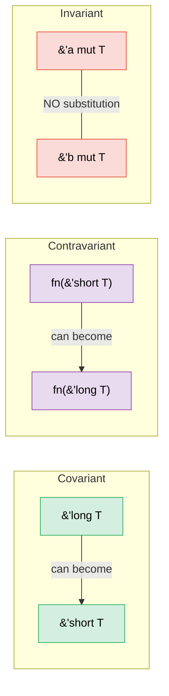

# 4. PhantomData —— 不携带数据的类型 🔴

> **你将学到：**
> - 为什么 `PhantomData<T>` 存在以及它解决的三个问题
> - 用于编译时作用域强制的生命周期标记
> - 用于维度安全算术的单位量模式
> - 方差（协变、逆变、不变）以及 PhantomData 如何控制它

## PhantomData 解决的问题

`PhantomData<T>` 是一个零大小类型，它告诉编译器"这个结构体在逻辑上与 `T` 关联，即使它不包含 `T`"。它影响方差、drop 检查和自动 trait 推断 —— 而不占用任何内存。

```rust
use std::marker::PhantomData;

// 没有 PhantomData：
struct Slice<'a, T> {
    ptr: *const T,
    len: usize,
    // 问题：编译器不知道这个结构体借用了 'a
    // 也不知道它与 T 在 drop-check 目的上关联
}

// 有 PhantomData：
struct Slice<'a, T> {
    ptr: *const T,
    len: usize,
    _marker: PhantomData<&'a T>,
    // 现在编译器知道：
    // 1. 这个结构体借用了生命周期 'a 的数据
    // 2. 它在 'a 上是协变的（生命周期可以缩短）
    // 3. Drop check 考虑 T
}
```

**PhantomData 的三个工作**：

| 工作 | 示例 | 作用 |
|-----|---------|-------------|
| **生命周期绑定** | `PhantomData<&'a T>` | 结构体被视为借用了 `'a` |
| **所有权模拟** | `PhantomData<T>` | Drop check 假设结构体拥有一个 `T` |
| **方差控制** | `PhantomData<fn(T)>` | 使结构体在 `T` 上逆变 |

### 生命周期标记

使用 `PhantomData` 防止混合来自不同"会话"或"上下文"的值：

```rust
use std::marker::PhantomData;

/// 只在特定 arena 的生命周期内有效的句柄
struct ArenaHandle<'arena> {
    index: usize,
    _brand: PhantomData<&'arena ()>,
}

struct Arena {
    data: Vec<String>,
}

impl Arena {
    fn new() -> Self {
        Arena { data: Vec::new() }
    }

    /// 分配一个字符串并返回一个带标记的句柄
    fn alloc<'a>(&'a mut self, value: String) -> ArenaHandle<'a> {
        let index = self.data.len();
        self.data.push(value);
        ArenaHandle { index, _brand: PhantomData }
    }

    /// 通过句柄查找 —— 只接受来自 THIS arena 的句柄
    fn get<'a>(&'a self, handle: ArenaHandle<'a>) -> &'a str {
        &self.data[handle.index]
    }
}

fn main() {
    let mut arena1 = Arena::new();
    let handle1 = arena1.alloc("hello".to_string());

    // 不能将 handle1 与不同 arena 一起使用 —— 生命周期不匹配
    // let mut arena2 = Arena::new();
    // arena2.get(handle1); // ❌ 生命周期不匹配

    println!("{}", arena1.get(handle1)); // ✅
}
```

### 单位量模式

在编译时防止混合不兼容的单位，零运行时成本：

```rust
use std::marker::PhantomData;
use std::ops::{Add, Mul};

// 单位标记类型（零大小）
struct Meters;
struct Seconds;
struct MetersPerSecond;

#[derive(Debug, Clone, Copy)]
struct Quantity<Unit> {
    value: f64,
    _unit: PhantomData<Unit>,
}

impl<U> Quantity<U> {
    fn new(value: f64) -> Self {
        Quantity { value, _unit: PhantomData }
    }
}

// 只能加相同单位：
impl<U> Add for Quantity<U> {
    type Output = Quantity<U>;
    fn add(self, rhs: Self) -> Self::Output {
        Quantity::new(self.value + rhs.value)
    }
}

// Meters / Seconds = MetersPerSecond（自定义 trait）
impl std::ops::Div<Quantity<Seconds>> for Quantity<Meters> {
    type Output = Quantity<MetersPerSecond>;
    fn div(self, rhs: Quantity<Seconds>) -> Quantity<MetersPerSecond> {
        Quantity::new(self.value / rhs.value)
    }
}

fn main() {
    let dist = Quantity::<Meters>::new(100.0);
    let time = Quantity::<Seconds>::new(9.58);
    let speed = dist / time; // Quantity<MetersPerSecond>
    println!("Speed: {:.2} m/s", speed.value); // 10.44 m/s

    // let nonsense = dist + time; // ❌ 编译错误：不能加 Meters + Seconds
}
```

> **这是纯粹的类型系统魔法** —— `PhantomData<Meters>` 是零大小的，
> 所以 `Quantity<Meters>` 与 `f64` 有相同的布局。没有运行时包装开销，
> 但在编译时有完整的单位安全。

### PhantomData 和 Drop Check

当编译器检查结构体的析构函数是否可能访问过期数据时，它使用 `PhantomData` 来决定：

```rust
use std::marker::PhantomData;

// PhantomData<T> —— 编译器假设我们可能 drop 一个 T
// 这意味着 T 必须活得比我们长
struct OwningSemantic<T> {
    ptr: *const T,
    _marker: PhantomData<T>,  // "我在逻辑上拥有一个 T"
}

// PhantomData<*const T> —— 编译器假设我们不拥有 T
// 更宽松 —— T 不需要比我们活得久
struct NonOwningSemantic<T> {
    ptr: *const T,
    _marker: PhantomData<*const T>,  // "我只是指向 T"
}
```

**实践规则**：包装原始指针时，仔细选择 PhantomData：
- 写一个拥有其数据的容器？→ `PhantomData<T>`
- 写一个视图/引用类型？→ `PhantomData<&'a T>` 或 `PhantomData<*const T>`

### 方差 —— 为什么 PhantomData 的类型参数重要

**方差**决定泛型类型是否可以用子类型或超类型替换（在 Rust 中，"子类型"意味着"有更长生命周期"）。方差错误会导致拒绝好代码或接受错误代码。



#### 三种方差

| 方差 | 含义 | "我可以替换…" | Rust 示例 |
|----------|---------|---------------------|--------------|
| **协变** | 子类型流过 | `'long` 在期望 `'short` 的地方 ✅ | `&'a T`、`Vec<T>`、`Box<T>` |
| **逆变** | 子类型*反向*流 | `'short` 在期望 `'long` 的地方 ✅ | `fn(T)`（在参数位置） |
| **不变** | 不允许替换 | 两个方向都不行 ✅ | `&mut T`、`Cell<T>`、`UnsafeCell<T>` |

#### 为什么 `&'a T` 在 `'a` 上是协变的

```rust
fn print_str(s: &str) {
    println!("{s}");
}

fn main() {
    let owned = String::from("hello");
    // owned 贯穿整个函数（'long）
    // print_str 期望 &'_ str（'short —— 仅用于调用）
    print_str(&owned); // ✅ 协变性：'long → 'short 是安全的
    // 更长生命周期的引用总可以在需要更短生命周期的地方使用。
}
```

#### 为什么 `&mut T` 在 `T` 上是不变的

```rust
// 如果 &mut T 在 T 上是协变的，这会编译：
fn evil(s: &mut &'static str) {
    // 我们可以将更短生命的 &str 写入 &'static str 槽！
    let local = String::from("temporary");
    // *s = &local; // ← 会创建一个悬垂的 &'static str
}

// 不变性防止这个： &'static str ≠ &'a str 当可变时。
// 编译器完全拒绝替换。
```

#### PhantomData 如何控制方差

`PhantomData<X>` 给予你的结构体**与 `X` 相同的方差**：

```rust
use std::marker::PhantomData;

// 在 'a 上协变 —— Ref<'long> 可以用作 Ref<'short>
struct Ref<'a, T> {
    ptr: *const T,
    _marker: PhantomData<&'a T>,  // 在 'a 上协变，在 T 上协变
}

// 在 T 上不变 —— 防止 T 的不sound生命周期缩短
struct MutRef<'a, T> {
    ptr: *mut T,
    _marker: PhantomData<&'a mut T>,  // 在 'a 上协变，在 T 上不变
}

// 在 T 上逆变 —— 对回调容器有用
struct CallbackSlot<T> {
    _marker: PhantomData<fn(T)>,  // 在 T 上逆变
}
```

**PhantomData 方差速查表**：

| PhantomData 类型 | 在 `T` 上的方差 | 在 `'a` 上的方差 | 使用时机 |
|------------------|--------------------|--------------------|-----------|
| `PhantomData<T>` | 协变 | — | 你逻辑上拥有一个 `T` |
| `PhantomData<&'a T>` | 协变 | 协变 | 你借用生命周期 `'a` 的 `T` |
| `PhantomData<&'a mut T>` | **不变** | 协变 | 你可变借用 `T` |
| `PhantomData<*const T>` | 协变 | — | 指向 `T` 的非拥有指针 |
| `PhantomData<*mut T>` | **不变** | — | 指向 `T` 的非拥有可变指针 |
| `PhantomData<fn(T)>` | **逆变** | — | `T` 出现在参数位置 |
| `PhantomData<fn() -> T>` | 协变 | — | `T` 出现在返回位置 |
| `PhantomData<fn(T) -> T>` | **不变** | — | `T` 在两个位置出现，互相抵消 |

#### 实践例子：为什么这很重要

```rust
use std::marker::PhantomData;

// 一个用会话生命周期标记值的令牌。
// 必须在 'a 上是协变的 —— 否则调用者不能在传递给
// 需要更短借用的函数时缩短生命周期。
struct SessionToken<'a> {
    id: u64,
    _brand: PhantomData<&'a ()>,  // ✅ 协变 —— 调用者可以缩短 'a
    // _brand: PhantomData<fn(&'a ())>,  // ❌ 逆变 —— 破坏人体工程学
    // _brand: PhantomData<&'a mut ()>;  // ❌ () 上不变 —— 过于严格
}

fn use_token(token: &SessionToken<'_>) {
    println!("Using token {}", token.id);
}

fn main() {
    let token = SessionToken { id: 42, _brand: PhantomData };
    use_token(&token); // ✅ 有效，因为 SessionToken 在 'a 上是协变的
}
```

> **决策规则**：从 `PhantomData<&'a T>`（协变）开始。只有在你的抽象分发 `T` 的可变访问时，才切换到 `PhantomData<&'a mut T>`（不变）。几乎从不使用 `PhantomData<fn(T)>`（逆变）—— 它只对回调存储场景正确。

> **关键要点 —— PhantomData**
> - `PhantomData<T>` 携带类型/生命周期信息而无运行时成本
> - 用于生命周期标记、方差控制和单位量模式
> - Drop check：`PhantomData<T>` 告诉编译器你的类型逻辑上拥有一个 `T`

> **另请参阅：**[第 3 章 —— Newtype 与类型状态](ch03-the-newtype-and-type-state-patterns.md) 了解使用 PhantomData 的类型状态模式。[第 11 章 —— Unsafe Rust](ch11-unsafe-rust-controlled-danger.md) 了解 PhantomData 如何与原始指针交互。

---

### 练习：带 PhantomData 的单位量 ★★（约 30 分钟）

扩展单位量模式以支持：
- `Meters`、`Seconds`、`Kilograms`
- 相同单位的加法
- 乘法：`Meters * Meters = SquareMeters`
- 除法：`Meters / Seconds = MetersPerSecond`

<details>
<summary>🔑 解决方案</summary>

```rust
use std::marker::PhantomData;
use std::ops::{Add, Mul, Div};

#[derive(Clone, Copy)]
struct Meters;
#[derive(Clone, Copy)]
struct Seconds;
#[derive(Clone, Copy)]
struct Kilograms;
#[derive(Clone, Copy)]
struct SquareMeters;
#[derive(Clone, Copy)]
struct MetersPerSecond;

#[derive(Debug, Clone, Copy)]
struct Qty<U> {
    value: f64,
    _unit: PhantomData<U>,
}

impl<U> Qty<U> {
    fn new(v: f64) -> Self { Qty { value: v, _unit: PhantomData } }
}

impl<U> Add for Qty<U> {
    type Output = Qty<U>;
    fn add(self, rhs: Self) -> Self::Output { Qty::new(self.value + rhs.value) }
}

impl Mul<Qty<Meters>> for Qty<Meters> {
    type Output = Qty<SquareMeters>;
    fn mul(self, rhs: Qty<Meters>) -> Qty<SquareMeters> {
        Qty::new(self.value * rhs.value)
    }
}

impl Div<Qty<Seconds>> for Qty<Meters> {
    type Output = Qty<MetersPerSecond>;
    fn div(self, rhs: Qty<Seconds>) -> Qty<MetersPerSecond> {
        Qty::new(self.value / rhs.value)
    }
}

fn main() {
    let width = Qty::<Meters>::new(5.0);
    let height = Qty::<Meters>::new(3.0);
    let area = width * height; // Qty<SquareMeters>
    println!("Area: {:.1} m²", area.value);

    let dist = Qty::<Meters>::new(100.0);
    let time = Qty::<Seconds>::new(9.58);
    let speed = dist / time;
    println!("Speed: {:.2} m/s", speed.value);

    let sum = width + height; // 相同单位 ✅
    println!("Sum: {:.1} m", sum.value);

    // let bad = width + time; // ❌ 编译错误：不能加 Meters + Seconds
}
```

</details>

***

