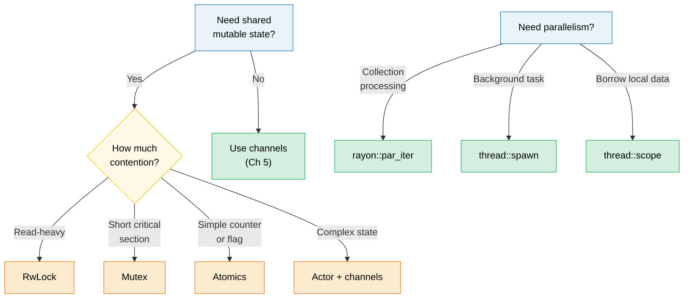

# 6. 并发 vs 并行 vs 线程 🟡

> **学习内容：**
> - 并发与并行的精确区别
> - OS 线程、作用域线程和 rayon 数据并行
> - 共享状态原语：Arc、Mutex、RwLock、原子类型、Condvar
> - 使用 OnceLock/LazyLock 延迟初始化以及无锁模式

## 术语：并发 ≠ 并行

这些术语经常被混淆。以下是精确的区别：

| | 并发 | 并行 |
|---|---|---|
| **定义** | 管理多个可以取得进展的任务 | 同时执行多个任务 |
| **硬件要求** | 一个核心就足够 | 需要多个核心 |
| **类比** | 一个厨师，多道菜（在之间切换） | 多个厨师，每人做一道菜 |
| **Rust 工具** | `async/await`、通道、`select!` | `rayon`、`thread::spawn`、`par_iter()` |

```text
Concurrency (single core):           Parallelism (multi-core):

Task A: ██░░██░░██                   Task A: ██████████
Task B: ░░██░░██░░                   Task B: ██████████
─────────────────→ time              ─────────────────→ time
(interleaved on one core)           (simultaneous on two cores)
```

### std::thread — OS 线程

Rust 线程与 OS 线程一一对应。每个线程有自己的栈（通常 2-8 MB）：

```rust
use std::thread;
use std::time::Duration;

fn main() {
    // Spawn a thread — takes a closure
    let handle = thread::spawn(|| {
        for i in 0..5 {
            println!("spawned thread: {i}");
            thread::sleep(Duration::from_millis(100));
        }
        42 // Return value
    });

    // Do work on the main thread simultaneously
    for i in 0..3 {
        println!("main thread: {i}");
        thread::sleep(Duration::from_millis(150));
    }

    // Wait for the thread to finish and get its return value
    let result = handle.join().unwrap(); // unwrap panics if thread panicked
    println!("Thread returned: {result}");
}
```

**Thread::spawn 类型要求**：

```rust
// The closure must be:
// 1. Send — can be transferred to another thread
// 2. 'static — can't borrow from the calling scope
// 3. FnOnce — takes ownership of captured variables

let data = vec![1, 2, 3];

// ❌ Borrows data — not 'static
// thread::spawn(|| println!("{data:?}"));

// ✅ Move ownership into the thread
thread::spawn(move || println!("{data:?}"));
// data is no longer accessible here
```

### 作用域线程（std::thread::scope）

自 Rust 1.63 起，作用域线程解决了 `'static` 要求的问题——线程可以借用父作用域的数据：

```rust
use std::thread;

fn main() {
    let mut data = vec![1, 2, 3, 4, 5];

    thread::scope(|s| {
        // Thread 1: borrow shared reference
        s.spawn(|| {
            let sum: i32 = data.iter().sum();
            println!("Sum: {sum}");
        });

        // Thread 2: also borrow shared reference (multiple readers OK)
        s.spawn(|| {
            let max = data.iter().max().unwrap();
            println!("Max: {max}");
        });

        // ❌ Can't mutably borrow while shared borrows exist:
        // s.spawn(|| data.push(6));
    });
    // ALL scoped threads joined here — guaranteed before scope returns

    // Now safe to mutate — all threads have finished
    data.push(6);
    println!("Updated: {data:?}");
}
```

> **这很重要**：在作用域线程出现之前，你必须 `Arc::clone()` 所有要在线程间共享的东西。现在你可以直接借用，编译器会证明所有线程都在数据超出作用域之前完成。

### rayon — 数据并行

`rayon` 提供并行迭代器，自动在线程池中分配工作：

```rust,ignore
// Cargo.toml: rayon = "1"
use rayon::prelude::*;

fn main() {
    let data: Vec<u64> = (0..1_000_000).collect();

    // Sequential:
    let sum_seq: u64 = data.iter().map(|x| x * x).sum();

    // Parallel — just change .iter() to .par_iter():
    let sum_par: u64 = data.par_iter().map(|x| x * x).sum();

    assert_eq!(sum_seq, sum_par);

    // Parallel sort:
    let mut numbers = vec![5, 2, 8, 1, 9, 3];
    numbers.par_sort();

    // Parallel processing with map/filter/collect:
    let results: Vec<_> = data
        .par_iter()
        .filter(|&&x| x % 2 == 0)
        .map(|&x| expensive_computation(x))
        .collect();
}

fn expensive_computation(x: u64) -> u64 {
    // Simulate CPU-heavy work
    (0..1000).fold(x, |acc, _| acc.wrapping_mul(7).wrapping_add(13))
}
```

**何时使用 rayon vs 线程**：

| 使用场景 | 何时使用 |
|---------|---------|
| `rayon::par_iter()` | 并行处理集合（map、filter、reduce） |
| `thread::spawn` | 长时间运行的后台任务、I/O 工作线程 |
| `thread::scope` | 借用本地数据的短时并行任务 |
| `async` + `tokio` | I/O 密集型并发（网络、文件 I/O） |

### 共享状态：Arc、Mutex、RwLock、原子类型

当线程需要共享可变状态时，Rust 提供了安全的抽象：

```rust
use std::sync::{Arc, Mutex, RwLock};
use std::sync::atomic::{AtomicU64, Ordering};
use std::thread;

// --- Arc<Mutex<T>>: Shared + Exclusive access ---
fn mutex_example() {
    let counter = Arc::new(Mutex::new(0u64));
    let mut handles = vec![];

    for _ in 0..10 {
        let counter = Arc::clone(&counter);
        handles.push(thread::spawn(move || {
            for _ in 0..1000 {
                let mut guard = counter.lock().unwrap();
                *guard += 1;
            } // Guard dropped → lock released
        }));
    }

    for h in handles { h.join().unwrap(); }
    println!("Counter: {}", counter.lock().unwrap()); // 10000
}

// --- Arc<RwLock<T>>: Multiple readers OR one writer ---
fn rwlock_example() {
    let config = Arc::new(RwLock::new(String::from("initial")));

    // Many readers — don't block each other
    let readers: Vec<_> = (0..5).map(|id| {
        let config = Arc::clone(&config);
        thread::spawn(move || {
            let guard = config.read().unwrap();
            println!("Reader {id}: {guard}");
        })
    }).collect();

    // Writer — blocks and waits for all readers to finish
    {
        let mut guard = config.write().unwrap();
        *guard = "updated".to_string();
    }

    for r in readers { r.join().unwrap(); }
}

// --- Atomics: Lock-free for simple values ---
fn atomic_example() {
    let counter = Arc::new(AtomicU64::new(0));
    let mut handles = vec![];

    for _ in 0..10 {
        let counter = Arc::clone(&counter);
        handles.push(thread::spawn(move || {
            for _ in 0..1000 {
                counter.fetch_add(1, Ordering::Relaxed);
                // No lock, no mutex — hardware atomic instruction
            }
        }));
    }

    for h in handles { h.join().unwrap(); }
    println!("Atomic counter: {}", counter.load(Ordering::Relaxed)); // 10000
}
```

### 快速对比

| 原语 | 使用场景 | 成本 | 竞争 |
|------|---------|------|------|
| `Mutex<T>` | 短关键段 | 加锁 + 解锁 | 线程排队等待 |
| `RwLock<T>` | 读多写少 | 读写锁 | 读者并发，写者独占 |
| `AtomicU64` 等 | 计数器、标志 | 硬件 CAS | 无锁——无需等待 |
| 通道 | 消息传递 | 队列操作 | 生产者/消费者解耦 |

### 条件变量（`Condvar`）

`Condvar` 允许线程**等待**直到另一个线程发信号说条件为真，而无需忙等待。它总是与 `Mutex` 配对使用：

```rust
use std::sync::{Arc, Mutex, Condvar};
use std::thread;

let pair = Arc::new((Mutex::new(false), Condvar::new()));
let pair2 = Arc::clone(&pair);

// Spawned thread: wait until ready == true
let handle = thread::spawn(move || {
    let (lock, cvar) = &*pair2;
    let mut ready = lock.lock().unwrap();
    while !*ready {
        ready = cvar.wait(ready).unwrap(); // atomically unlocks + sleeps
    }
    println!("Worker: condition met, proceeding");
});

// Main thread: set ready = true, then signal
{
    let (lock, cvar) = &*pair;
    let mut ready = lock.lock().unwrap();
    *ready = true;
    cvar.notify_one(); // wake one waiting thread (use notify_all for many)
}
handle.join().unwrap();
```

> **模式**：在 `wait()` 返回后始终在 `while` 循环中重新检查条件——操作系统允许虚假唤醒。

### 延迟初始化：OnceLock 和 LazyLock

在 Rust 1.80 之前，初始化需要运行时计算的全局静态（例如解析配置、编译正则表达式）需要 `lazy_static!` 宏或 `once_cell` crate。标准库现在提供了两种类型来原生覆盖这些使用场景：

```rust
use std::sync::{OnceLock, LazyLock};
use std::collections::HashMap;

// OnceLock — initialize on first use via `get_or_init`.
// Useful when the init value depends on runtime arguments.
static CONFIG: OnceLock<HashMap<String, String>> = OnceLock::new();

fn get_config() -> &'static HashMap<String, String> {
    CONFIG.get_or_init(|| {
        // Expensive: read & parse config file — happens exactly once.
        let mut m = HashMap::new();
        m.insert("log_level".into(), "info".into());
        m
    })
}

// LazyLock — initialize on first access, closure provided at definition site.
// Equivalent to lazy_static! but without a macro.
static REGEX: LazyLock<regex::Regex> = LazyLock::new(|| {
    regex::Regex::new(r"^[a-zA-Z0-9_]+$").unwrap()
});

fn is_valid_identifier(s: &str) -> bool {
    REGEX.is_match(s) // First call compiles the regex; subsequent calls reuse it.
}
```

| 类型 | 稳定版本 | 初始化时机 | 使用场景 |
|------|---------|-----------|---------|
| `OnceLock<T>` | Rust 1.70 | 调用点（`get_or_init`） | 初始化取决于运行时参数 |
| `LazyLock<T>` | Rust 1.80 | 定义点（闭包） | 初始化是自包含的 |
| `lazy_static!` | — | 定义点（宏） | 1.80 之前的代码库（应迁移） |
| `const fn` + `static` | 始终 | 编译时 | 值可以在编译时计算 |

> **迁移提示**：将 `lazy_static! { static ref X: T = expr; }` 替换为 `static X: LazyLock<T> = LazyLock::new(|| expr);`——相同的语义，无需宏，无需外部依赖。

### 无锁模式

对于高性能代码，完全避免锁：

```rust
use std::sync::atomic::{AtomicBool, AtomicUsize, Ordering};
use std::sync::Arc;

// Pattern 1: Spin lock (educational — prefer std::sync::Mutex)
// ⚠️ WARNING: This is a teaching example only. Real spinlocks need:
//   - A RAII guard (so a panic while holding doesn't deadlock forever)
//   - Fairness guarantees (this starves under contention)
//   - Backoff strategies (exponential backoff, yield to OS)
// Use std::sync::Mutex or parking_lot::Mutex in production.
struct SpinLock {
    locked: AtomicBool,
}

impl SpinLock {
    fn new() -> Self { SpinLock { locked: AtomicBool::new(false) } }

    fn lock(&self) {
        while self.locked
            .compare_exchange_weak(false, true, Ordering::Acquire, Ordering::Relaxed)
            .is_err()
        {
            std::hint::spin_loop(); // CPU hint: we're spinning
        }
    }

    fn unlock(&self) {
        self.locked.store(false, Ordering::Release);
    }
}

// Pattern 2: Lock-free SPSC (single producer, single consumer)
// Use crossbeam::queue::ArrayQueue or similar in production
// roll-your-own only for learning.

// Pattern 3: Sequence counter for wait-free reads
// ⚠️ Best for single-machine-word types (u64, f64); wider T may tear on read.
struct SeqLock<T: Copy> {
    seq: AtomicUsize,
    data: std::cell::UnsafeCell<T>,
}

unsafe impl<T: Copy + Send> Sync for SeqLock<T> {}

impl<T: Copy> SeqLock<T> {
    fn new(val: T) -> Self {
        SeqLock {
            seq: AtomicUsize::new(0),
            data: std::cell::UnsafeCell::new(val),
        }
    }

    fn read(&self) -> T {
        loop {
            let s1 = self.seq.load(Ordering::Acquire);
            if s1 & 1 != 0 { continue; } // Writer in progress, retry

            // SAFETY: We use ptr::read_volatile to prevent the compiler from
            // reordering or caching the read. The SeqLock protocol (checking
            // s1 == s2 after reading) ensures we retry if a writer was active.
            // This mirrors the C SeqLock pattern where the data read must use
            // volatile/relaxed semantics to avoid tearing under concurrency.
            let value = unsafe { core::ptr::read_volatile(self.data.get() as *const T) };

            // Acquire fence: ensures the data read above is ordered before
            // we re-check the sequence counter.
            std::sync::atomic::fence(Ordering::Acquire);
            let s2 = self.seq.load(Ordering::Relaxed);

            if s1 == s2 { return value; } // No writer intervened
            // else retry
        }
    }

    /// # Safety contract
    /// Only ONE thread may call `write()` at a time. If multiple writers
    /// are needed, wrap the `write()` call in an external `Mutex`.
    fn write(&self, val: T) {
        // Increment to odd (signals write in progress).
        // AcqRel: the Acquire side prevents the subsequent data write
        // from being reordered before this increment (readers must see
        // odd before they could observe a partial write). The Release
        // side is technically unnecessary for a single writer but
        // harmless and consistent.
        self.seq.fetch_add(1, Ordering::AcqRel);
        unsafe { *self.data.get() = val; }
        // Increment to even (signals write complete).
        // Release: ensure the data write is visible before readers see the even seq.
        self.seq.fetch_add(1, Ordering::Release);
    }
}
```

> **⚠️ Rust 内存模型警告**：`UnsafeCell` 中的非原子写入（在 `write()` 中）与 `read()` 中的非原子 `ptr::read_volatile` 在 Rust 抽象机下实际上是数据竞争——即使 SeqLock 协议确保读者总是在陈旧数据上重试。这反映了 C 内核 SeqLock 模式，对于适合单机器字（如 `u64`）的类型在实践中是安全的。对于更宽的类型，考虑对数据字段使用 `AtomicU64` 或将访问包装在 `Mutex` 中。
> 有关 `UnsafeCell` 并发的最新进展，请参阅[ Rust 不安全代码指南](https://rust-lang.github.io/unsafe-code-guidelines/)。

> **实用建议**：无锁代码很难正确实现。除非性能分析显示锁竞争是瓶颈，否则使用 `Mutex` 或 `RwLock`。当你确实需要无锁时，使用成熟的 crate（`crossbeam`、`arc-swap`、`dashmap`）而不是自己实现。

> **关键要点 — 并发**
> - 作用域线程（`thread::scope`）让你无需 `Arc` 就能借用栈数据
> - `rayon::par_iter()` 用一个方法调用并行化迭代器
> - 使用 `OnceLock`/`LazyLock` 而不是 `lazy_static!`；在需要原子类型之前先使用 `Mutex`
> - 无锁代码很难——优先使用成熟的 crate 而不是手写实现

> **另见：** [第 5 章 — 通道](ch05-channels-and-message-passing.md) 消息传递并发。[第 8 章 — 智能指针](ch08-smart-pointers-and-interior-mutability.md) Arc/Rc 详情。



---

### 练习：使用作用域线程的并行 Map ★★（约 25 分钟）

编写一个函数 `parallel_map<T, R>(data: &[T], f: fn(&T) -> R, num_threads: usize) -> Vec<R>`，将 `data` 分成 `num_threads` 块并在作用域线程中处理每个块。不要使用 `rayon`——使用 `std::thread::scope`。

<details>
<summary>🔑 解答</summary>

```rust
fn parallel_map<T: Sync, R: Send>(data: &[T], f: fn(&T) -> R, num_threads: usize) -> Vec<R> {
    let chunk_size = (data.len() + num_threads - 1) / num_threads;
    let mut results = Vec::with_capacity(data.len());

    std::thread::scope(|s| {
        let mut handles = Vec::new();
        for chunk in data.chunks(chunk_size) {
            handles.push(s.spawn(move || {
                chunk.iter().map(f).collect::<Vec<_>>()
            }));
        }
        for h in handles {
            results.extend(h.join().unwrap());
        }
    });

    results
}

fn main() {
    let data: Vec<u64> = (1..=20).collect();
    let squares = parallel_map(&data, |x| x * x, 4);
    assert_eq!(squares, (1..=20).map(|x: u64| x * x).collect::<Vec<_>>());
    println!("Parallel squares: {squares:?}");
}
```

</details>

***

