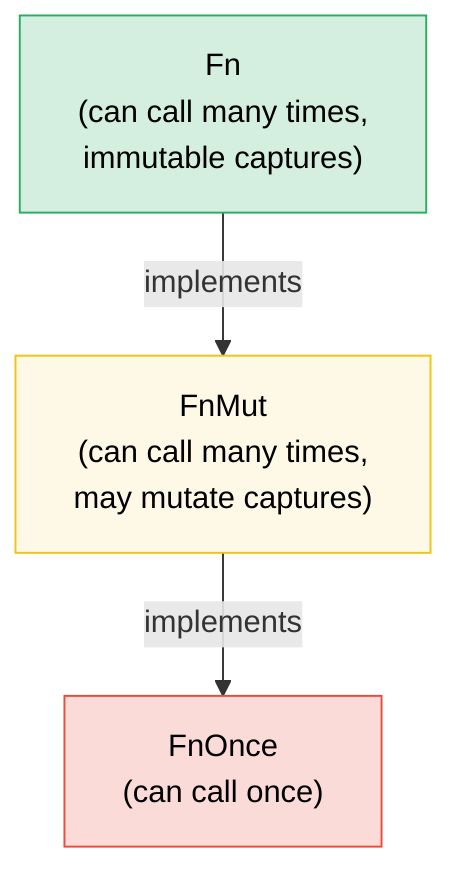

# 7. 闭包与高阶函数 🟢

> **学习内容：**
> - 三个闭包 trait（`Fn`、`FnMut`、`FnOnce`）以及捕获机制
> - 将闭包作为参数传递和从函数返回闭包
> - 函数式编程的组合子链和迭代器适配器
> - 使用正确的 trait 约束设计你自己的高阶 API

## Fn、FnMut、FnOnce — 闭包 Trait

Rust 中的每个闭包都实现三个 trait 中的一个或多个，基于它如何捕获变量：

```rust
// FnOnce — consumes captured values (can only be called once)
let name = String::from("Alice");
let greet = move || {
    println!("Hello, {name}!"); // Takes ownership of `name`
    drop(name); // name is consumed
};
greet(); // ✅ First call
// greet(); // ❌ Can't call again — `name` was consumed

// FnMut — mutably borrows captured values (can be called many times)
let mut count = 0;
let mut increment = || {
    count += 1; // Mutably borrows `count`
};
increment(); // count == 1
increment(); // count == 2

// Fn — immutably borrows captured values (can be called many times, concurrently)
let prefix = "Result";
let display = |x: i32| {
    println!("{prefix}: {x}"); // Immutably borrows `prefix`
};
display(1);
display(2);
```

**层次结构**：`Fn` : `FnMut` : `FnOnce`——每个是下一个的子 trait：

```text
FnOnce  ← everything can be called at least once
 ↑
FnMut   ← can be called repeatedly (may mutate state)
 ↑
Fn      ← can be called repeatedly and concurrently (no mutation)
```

如果一个闭包实现了 `Fn`，它也实现了 `FnMut` 和 `FnOnce`。

### 闭包作为参数和返回值

```rust
// --- Parameters ---

// Static dispatch (monomorphized — fastest)
fn apply_twice<F: Fn(i32) -> i32>(f: F, x: i32) -> i32 {
    f(f(x))
}

// Also written with impl Trait:
fn apply_twice_v2(f: impl Fn(i32) -> i32, x: i32) -> i32 {
    f(f(x))
}

// Dynamic dispatch (trait object — flexible, slight overhead)
fn apply_dyn(f: &dyn Fn(i32) -> i32, x: i32) -> i32 {
    f(x)
}

// --- Return Values ---

// Can't return closures by value without boxing (they have anonymous types):
fn make_adder(n: i32) -> Box<dyn Fn(i32) -> i32> {
    Box::new(move |x| x + n)
}

// With impl Trait (simpler, monomorphized, but can't be dynamic):
fn make_adder_v2(n: i32) -> impl Fn(i32) -> i32 {
    move |x| x + n
}

fn main() {
    let double = |x: i32| x * 2;
    println!("{}", apply_twice(double, 3)); // 12

    let add5 = make_adder(5);
    println!("{}", add5(10)); // 15
}
```

### 组合子链与迭代器适配器

高阶函数与迭代器结合使用时大放异彩——这是惯用的 Rust：

```rust
// C-style loop (imperative):
let data = vec![1, 2, 3, 4, 5, 6, 7, 8, 9, 10];
let mut result = Vec::new();
for x in &data {
    if x % 2 == 0 {
        result.push(x * x);
    }
}

// Idiomatic Rust (functional combinator chain):
let result: Vec<i32> = data.iter()
    .filter(|&&x| x % 2 == 0)
    .map(|&x| x * x)
    .collect();

// Same performance — iterators are lazy and optimized by LLVM
assert_eq!(result, vec![4, 16, 36, 64, 100]);
```

**常用组合子速查表**：

| 组合子 | 作用 | 示例 |
|-------|------|------|
| `.map(f)` | 转换每个元素 | `.map(|x| x * 2)` |
| `.filter(p)` | 保留条件为真的元素 | `.filter(|x| x > &5)` |
| `.filter_map(f)` | 一步完成 map + filter（返回 `Option`） | `.filter_map(|x| x.parse().ok())` |
| `.flat_map(f)` | map 然后展平嵌套迭代器 | `.flat_map(|s| s.chars())` |
| `.fold(init, f)` | 归约为单一值（类似于 C# 的 `Aggregate`） | `.fold(0, |acc, x| acc + x)` |
| `.any(p)` / `.all(p)` | 短路布尔检查 | `.any(|x| x > 100)` |
| `.enumerate()` | 添加索引 | `.enumerate().map(|(i, x)| ...)` |
| `.zip(other)` | 与另一个迭代器配对 | `.zip(labels.iter())` |
| `.take(n)` / `.skip(n)` | 取前/跳过 N 个元素 | `.take(10)` |
| `.chain(other)` | 连接两个迭代器 | `.chain(extra.iter())` |
| `.peekable()` | 不消费地向前看 | `.peek()` |
| `.collect()` | 收集到集合中 | `.collect::<Vec<_>>()` |

### 实现你自己的高阶 API

设计接受闭包来自定义配置的 API：

```rust
/// Retry an operation with a configurable strategy
fn retry<T, E, F, S>(
    mut operation: F,
    mut should_retry: S,
    max_attempts: usize,
) -> Result<T, E>
where
    F: FnMut() -> Result<T, E>,
    S: FnMut(&E, usize) -> bool, // (error, attempt) → try again?
{
    for attempt in 1..=max_attempts {
        match operation() {
            Ok(val) => return Ok(val),
            Err(e) if attempt < max_attempts && should_retry(&e, attempt) => {
                continue;
            }
            Err(e) => return Err(e),
        }
    }
    unreachable!()
}

// Usage — caller controls retry logic:
```

```rust
# fn connect_to_database() -> Result<(), String> { Ok(()) }
# fn http_get(_url: &str) -> Result<String, String> { Ok(String::new()) }
# trait TransientError { fn is_transient(&self) -> bool; }
# impl TransientError for String { fn is_transient(&self) -> bool { true } }
# let url = "http://example.com";
let result = retry(
    || connect_to_database(),
    |err, attempt| {
        eprintln!("Attempt {attempt} failed: {err}");
        true // Always retry
    },
    3,
);

// Usage — retry only specific errors:
let result = retry(
    || http_get(url),
    |err, _| err.is_transient(), // Only retry transient errors
    5,
);
```

### `with` 模式——括号化的资源访问

有时候你需要保证资源在操作期间处于特定状态，并在之后恢复——无论调用者的代码如何退出（提前返回、`?`、panic）。不要直接暴露资源并希望调用者记住设置和清理，而是**通过闭包借出它**：

```text
set up → call closure with resource → tear down
```

调用者从不触碰设置或清理。他们不能忘记，不能做错，也不能在闭包作用域之外持有资源。

#### 示例：GPIO 引脚方向

GPIO 控制器管理支持双向 I/O 的引脚。一些调用者需要将引脚配置为输入，另一些需要配置为输出。控制器不是暴露原始引脚访问并信任调用者正确设置方向，而是提供 `with_pin_input` 和 `with_pin_output`：

```rust
/// GPIO pin direction — not public, callers never set this directly.
#[derive(Debug, Clone, Copy, PartialEq)]
enum Direction { In, Out }

/// A GPIO pin handle lent to the closure. Cannot be stored or cloned —
/// it exists only for the duration of the callback.
pub struct GpioPin<'a> {
    pin_number: u8,
    _controller: &'a GpioController,
}

impl GpioPin<'_> {
    pub fn read(&self) -> bool {
        // Read pin level from hardware register
        println!("  reading pin {}", self.pin_number);
        true // stub
    }

    pub fn write(&self, high: bool) {
        // Drive pin level via hardware register
        println!("  writing pin {} = {high}", self.pin_number);
    }
}

pub struct GpioController {
    current_direction: std::cell::Cell<Option<Direction>>,
}

impl GpioController {
    pub fn new() -> Self {
        GpioController {
            current_direction: std::cell::Cell::new(None),
        }
    }

    /// Configure pin as input, run the closure, restore state.
    /// The caller receives a `GpioPin` that lives only for the callback.
    pub fn with_pin_input<R>(
        &self,
        pin: u8,
        mut f: impl FnMut(&GpioPin<'_>) -> R,
    ) -> R {
        let prev = self.current_direction.get();
        self.set_direction(pin, Direction::In);
        let handle = GpioPin { pin_number: pin, _controller: self };
        let result = f(&handle);
        // Restore previous direction (or leave as-is — policy choice)
        if let Some(dir) = prev {
            self.set_direction(pin, dir);
        }
        result
    }

    /// Configure pin as output, run the closure, restore state.
    pub fn with_pin_output<R>(
        &self,
        pin: u8,
        mut f: impl FnMut(&GpioPin<'_>) -> R,
    ) -> R {
        let prev = self.current_direction.get();
        self.set_direction(pin, Direction::Out);
        let handle = GpioPin { pin_number: pin, _controller: self };
        let result = f(&handle);
        if let Some(dir) = prev {
            self.set_direction(pin, dir);
        }
        result
    }

    fn set_direction(&self, pin: u8, dir: Direction) {
        println!("  [hw] pin {pin} → {dir:?}");
        self.current_direction.set(Some(dir));
    }
}

fn main() {
    let gpio = GpioController::new();

    // Caller 1: needs input — doesn't know or care how direction is managed
    let level = gpio.with_pin_input(4, |pin| {
        pin.read()
    });
    println!("Pin 4 level: {level}");

    // Caller 2: needs output — same API shape, different guarantee
    gpio.with_pin_output(4, |pin| {
        pin.write(true);
        // do more work...
        pin.write(false);
    });

    // Can't use the pin handle outside the closure:
    // let escaped_pin = gpio.with_pin_input(4, |pin| pin);
    // ❌ ERROR: borrowed value does not live long enough
}
```

**`with` 模式保证的事项：**
- 方向**始终在**调用者代码运行**之前**设置
- 方向**始终在之后**恢复，即使闭包提前返回
- `GpioPin` 句柄**不能逃逸**闭包——借用检查器通过绑定到控制器引用的生命周期强制执行此操作
- 调用者从不导入 `Direction`，从不调用 `set_direction`——API 不可能被误用

#### 此模式出现的场景

`with` 模式在 Rust 标准库和生态系统中随处可见：

| API | 设置 | 回调 | 清理 |
|-----|------|------|------|
| `std::thread::scope` | 创建作用域 | `\|s\| { s.spawn(...) }` | 连接所有线程 |
| `Mutex::lock` | 获取锁 | 使用 `MutexGuard`（RAII，非闭包，但想法相同） | 丢弃时释放 |
| `tempfile::tempdir` | 创建临时目录 | 使用路径 | 丢弃时删除 |
| `std::io::BufWriter::new` | 缓冲写入 | 写操作 | 丢弃时刷新 |
| GPIO `with_pin_*`（上例） | 设置方向 | 使用引脚句柄 | 恢复方向 |

当以下情况时，闭包变体最强：
- **设置和清理是成对的**，忘记任一方都是 bug
- **资源不应超过操作的生命周期**——借用检查器自然地强制执行此操作
- **存在多种配置**（`with_pin_input` vs `with_pin_output`）——每个 `with_*` 方法封装不同的设置，而不向调用者暴露配置

> **`with` vs RAII（Drop）：** 两者都保证清理。当调用者需要在多个语句和函数调用之间持有资源时使用 RAII / `Drop`。当操作是**括号化的**——一个设置、一个工作块、一个清理——并且你不希望调用者能够打破这个括号时使用 `with`。

> **API 设计中的 FnMut vs Fn**：使用 `FnMut` 作为默认约束——这是对调用者最灵活的（调用者可以传递 `Fn` 或 `FnMut` 闭包）。只有当你需要并发调用闭包时（例如从多个线程）才要求 `Fn`。只有当你只调用一次时才要求 `FnOnce`。

> **关键要点 — 闭包**
> - `Fn` 借用，`FnMut` 可变借用，`FnOnce` 消费——接受你的 API 需要的最弱约束
> - 参数中用 `impl Fn`，存储用 `Box<dyn Fn>`，返回值用 `impl Fn`（或如果需要动态分派则用 `Box<dyn Fn>`）
> - 组合子链（`map`、`filter`、`and_then`）组合清晰，内联到紧密循环
> - `with` 模式（通过闭包的括号化访问）保证设置/清理并防止资源逃逸——当调用者不应管理配置生命周期时使用它

> **另见：** [第 2 章 — Trait 深入](ch02-traits-in-depth.md) 了解 `Fn`/`FnMut`/`FnOnce` 如何与 trait 对象相关。[第 8 章 — 函数式 vs 命令式](ch08-functional-vs-imperative-when-elegance-wins.md) 何时选择组合子而不是循环。[第 15 章 — API 设计](ch15-crate-architecture-and-api-design.md) 人体工程学参数模式。



> 每个 `Fn` 也是 `FnMut`，每个 `FnMut` 也是 `FnOnce`。默认接受 `FnMut`——这是对调用者最灵活的约束。

---

### 练习：高阶组合子管道 ★★（约 25 分钟）

创建一个 `Pipeline` 结构体来链接转换。它应该支持 `.pipe(f)` 添加转换和 `.execute(input)` 执行完整链。

<details>
<summary>🔑 解答</summary>

```rust
struct Pipeline<T> {
    transforms: Vec<Box<dyn Fn(T) -> T>>,
}

impl<T: 'static> Pipeline<T> {
    fn new() -> Self {
        Pipeline { transforms: Vec::new() }
    }

    fn pipe(mut self, f: impl Fn(T) -> T + 'static) -> Self {
        self.transforms.push(Box::new(f));
        self
    }

    fn execute(self, input: T) -> T {
        self.transforms.into_iter().fold(input, |val, f| f(val))
    }
}

fn main() {
    let result = Pipeline::new()
        .pipe(|s: String| s.trim().to_string())
        .pipe(|s| s.to_uppercase())
        .pipe(|s| format!(">>> {s} <<<"))
        .execute("  hello world  ".to_string());

    println!("{result}"); // >>> HELLO WORLD <<<

    let result = Pipeline::new()
        .pipe(|x: i32| x * 2)
        .pipe(|x| x + 10)
        .pipe(|x| x * x)
        .execute(5);

    println!("{result}"); // (5*2 + 10)^2 = 400
}
```

</details>

***

