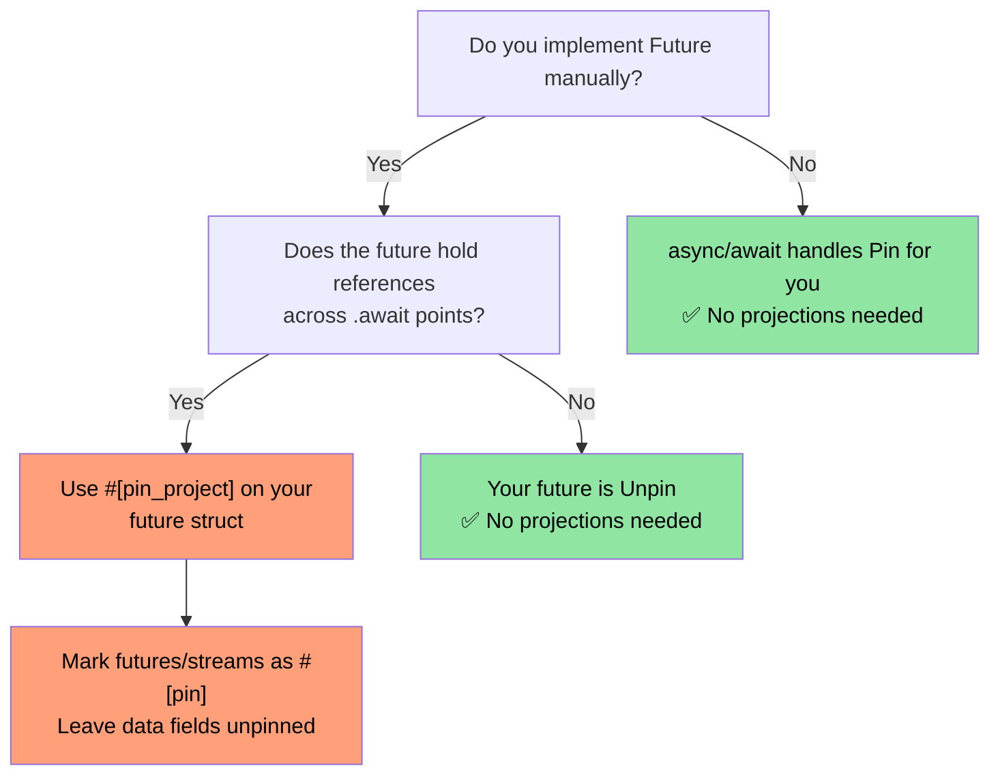
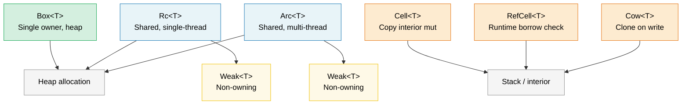

# 8. 智能指针与内部可变性 🟡

> **学习内容：**
> - Box、Rc、Arc 用于堆分配和共享所有权
> - Weak 引用用于打破 Rc/Arc 引用循环
> - Cell、RefCell 和 Cow 用于内部可变性模式
> - Pin 用于自引用类型，ManuallyDrop 用于生命周期控制

## Box、Rc、Arc — 堆分配与共享

```rust
// --- Box<T>: Single owner, heap allocation ---
// Use when: recursive types, large values, trait objects
let boxed: Box<i32> = Box::new(42);
println!("{}", *boxed); // Deref to i32

// Recursive type requires Box (otherwise infinite size):
enum List<T> {
    Cons(T, Box<List<T>>),
    Nil,
}

// Trait object (dynamic dispatch):
let writer: Box<dyn std::io::Write> = Box::new(std::io::stdout());

// --- Rc<T>: Multiple owners, single-threaded ---
// Use when: shared ownership within one thread (no Send/Sync)
use std::rc::Rc;

let a = Rc::new(vec![1, 2, 3]);
let b = Rc::clone(&a); // Increments reference count (NOT deep clone)
let c = Rc::clone(&a);
println!("Ref count: {}", Rc::strong_count(&a)); // 3

// All three point to the same Vec. When the last Rc is dropped,
// the Vec is deallocated.

// --- Arc<T>: Multiple owners, thread-safe ---
// Use when: shared ownership across threads
use std::sync::Arc;

let shared = Arc::new(String::from("shared data"));
let handles: Vec<_> = (0..5).map(|_| {
    let shared = Arc::clone(&shared);
    std::thread::spawn(move || println!("{shared}"))
}).collect();
for h in handles { h.join().unwrap(); }
```

### Weak 引用 — 打破引用循环

`Rc` 和 `Arc` 使用引用计数，这无法释放循环（A → B → A）。
`Weak<T>` 是一个非拥有句柄，**不会**增加强引用计数：

```rust
use std::rc::{Rc, Weak};
use std::cell::RefCell;

struct Node {
    value: i32,
    parent: RefCell<Weak<Node>>,   // does NOT keep parent alive
    children: RefCell<Vec<Rc<Node>>>,
}

let parent = Rc::new(Node {
    value: 0, parent: RefCell::new(Weak::new()), children: RefCell::new(vec![]),
});
let child = Rc::new(Node {
    value: 1, parent: RefCell::new(Rc::downgrade(&parent)), children: RefCell::new(vec![]),
});
parent.children.borrow_mut().push(Rc::clone(&child));

// Access parent from child — returns Option<Rc<Node>>:
if let Some(p) = child.parent.borrow().upgrade() {
    println!("Child's parent value: {}", p.value); // 0
}
// When `parent` is dropped, strong_count → 0, memory is freed.
// `child.parent.upgrade()` would then return `None`.
```

**经验法则**：对所有权边使用 `Rc`/`Arc`，对反向引用和缓存使用 `Weak`。对于线程安全代码，对 `Arc<T>` 使用 `sync::Weak<T>`。

### Cell 和 RefCell — 内部可变性

有时你需要通过共享（`&`）引用来改变数据。Rust 通过运行时借用检查提供*内部可变性*：

```rust
use std::cell::{Cell, RefCell};

// --- Cell<T>: Copy-based interior mutability ---
// Only for Copy types (or types you swap in/out)
struct Counter {
    count: Cell<u32>,
}

impl Counter {
    fn new() -> Self { Counter { count: Cell::new(0) } }

    fn increment(&self) { // &self, not &mut self!
        self.count.set(self.count.get() + 1);
    }

    fn value(&self) -> u32 { self.count.get() }
}

// --- RefCell<T>: Runtime borrow checking ---
// Panics if you violate borrow rules at runtime
struct Cache {
    data: RefCell<Vec<String>>,
}

impl Cache {
    fn new() -> Self { Cache { data: RefCell::new(Vec::new()) } }

    fn add(&self, item: String) { // &self — looks immutable from outside
        self.data.borrow_mut().push(item); // Runtime-checked &mut
    }

    fn get_all(&self) -> Vec<String> {
        self.data.borrow().clone() // Runtime-checked &
    }

    fn bad_example(&self) {
        let _guard1 = self.data.borrow();
        // let _guard2 = self.data.borrow_mut();
        // ❌ PANICS at runtime — can't have &mut while & exists
    }
}
```

> **Cell vs RefCell**：`Cell` 不会 panic（它复制/交换值）但只适用于 `Copy` 类型或通过 `swap()`/`replace()`。`RefCell` 适用于任何类型但在双重可变借用时 panic。两者都不是 `Sync`——对于多线程使用，参见 `Mutex`/`RwLock`。

### Cow — 写时复制

`Cow`（Clone on Write）持有借用的或拥有的值。它只在需要突变时*克隆*：

```rust
use std::borrow::Cow;

// Avoids allocating when no modification is needed:
fn normalize(input: &str) -> Cow<'_, str> {
    if input.contains('\t') {
        // Only allocate if tabs need replacing
        Cow::Owned(input.replace('\t', "    "))
    } else {
        // No allocation — just return a reference
        Cow::Borrowed(input)
    }
}

fn main() {
    let clean = "no tabs here";
    let dirty = "tabs\there";

    let r1 = normalize(clean); // Cow::Borrowed — zero allocation
    let r2 = normalize(dirty); // Cow::Owned — allocated new String

    println!("{r1}");
    println!("{r2}");
}

// Also useful for function parameters that MIGHT need ownership:
fn process(data: Cow<'_, [u8]>) {
    // Can read data without copying
    println!("Length: {}", data.len());
    // If we need to mutate, Cow auto-clones:
    let mut owned = data.into_owned(); // Clone only if Borrowed
    owned.push(0xFF);
}
```

#### `Cow<'_, [u8]>` 用于二进制数据

`Cow` 对于可能需要或不需转换的字节导向 API 特别有用（校验和插入、填充、转义）。这在常见快速路径上避免分配 `Vec<u8>`：

```rust
use std::borrow::Cow;

/// Pads a frame to a minimum length, borrowing when no padding is needed.
fn pad_frame(frame: &[u8], min_len: usize) -> Cow<'_, [u8]> {
    if frame.len() >= min_len {
        Cow::Borrowed(frame)  // Already long enough — zero allocation
    } else {
        let mut padded = frame.to_vec();
        padded.resize(min_len, 0x00);
        Cow::Owned(padded)    // Allocate only when padding is required
    }
}

let short = pad_frame(&[0xDE, 0xAD], 8);    // Owned — padded to 8 bytes
let long  = pad_frame(&[0; 64], 8);          // Borrowed — already ≥ 8
```

> **提示**：当你需要潜在转换缓冲区的引用计数共享时，将 `Cow<[u8]>` 与 `bytes::Bytes`（第 10 章）结合使用。

### 何时使用哪种指针

| 指针 | 拥有者数量 | 线程安全 | 可变性 | 何时使用 |
|------|:---------:|:--------:|:------:|----------|
| `Box<T>` | 1 | ✅（如果 T: Send） | 通过 `&mut` | 堆分配、trait 对象、递归类型 |
| `Rc<T>` | N | ❌ | 无（包装在 Cell/RefCell 中） | 单线程内共享所有权、图/树 |
| `Arc<T>` | N | ✅ | 无（包装在 Mutex/RwLock 中） | 跨线程共享所有权 |
| `Cell<T>` | — | ❌ | `.get()` / `.set()` | Copy 类型的内部可变性 |
| `RefCell<T>` | — | ❌ | `.borrow()` / `.borrow_mut()` | 任何类型的内部可变性，单线程 |
| `Cow<'_, T>` | 0 或 1 | ✅（如果 T: Send） | 写时复制 | 数据经常不变时避免分配 |

### Pin 和自引用类型

`Pin<P>` 防止值在内存中移动。这对于**自引用类型**——包含指向自身数据的指针的结构体——以及 `Future` 至关重要，因为它们可能在 `.await` 点之间持有引用。

```rust
use std::pin::Pin;
use std::marker::PhantomPinned;

// A self-referential struct (simplified):
struct SelfRef {
    data: String,
    ptr: *const String, // Points to `data` above
    _pin: PhantomPinned, // Opts out of Unpin — can't be moved
}

impl SelfRef {
    fn new(s: &str) -> Pin<Box<Self>> {
        let val = SelfRef {
            data: s.to_string(),
            ptr: std::ptr::null(),
            _pin: PhantomPinned,
        };
        let mut boxed = Box::pin(val);

        // SAFETY: we don't move the data after setting the pointer
        let self_ptr: *const String = &boxed.data;
        unsafe {
            let mut_ref = Pin::as_mut(&mut boxed);
            Pin::get_unchecked_mut(mut_ref).ptr = self_ptr;
        }
        boxed
    }

    fn data(&self) -> &str {
        &self.data
    }

    fn ptr_data(&self) -> &str {
        // SAFETY: ptr was set to point to self.data while pinned
        unsafe { &*self.ptr }
    }
}

fn main() {
    let pinned = SelfRef::new("hello");
    assert_eq!(pinned.data(), pinned.ptr_data()); // Both "hello"
    // std::mem::swap would invalidate ptr — but Pin prevents it
}
```

**关键概念**：

| 概念 | 含义 |
|------|------|
| `Unpin`（自动 trait） | "移动此类型是安全的。"大多数类型默认是 `Unpin`。 |
| `!Unpin` / `PhantomPinned` | "我有内部指针——不要移动我。" |
| `Pin<&mut T>` | 一个可变引用，保证 `T` 不会移动 |
| `Pin<Box<T>>` | 一个拥有的、堆固定的的值 |

**这对 async 的意义**：每个 `async fn` 反糖化为一个 `Future`，它可能在 `.await` 点之间持有引用——使其成为自引用的。async 运行时使用 `Pin<&mut Future>` 来保证 future 在被轮询后不会移动。

```rust
// When you write:
async fn fetch(url: &str) -> String {
    let response = http_get(url).await; // reference held across await
    response.text().await
}

// The compiler generates a state machine struct that is !Unpin,
// and the runtime pins it before calling Future::poll().
```

> **何时关注 Pin**：（1）手动实现 `Future`，（2）编写 async 运行时或组合子，（3）任何带有自引用指针的结构体。对于普通应用代码，`async/await` 透明处理 pin。
> 参见配套的 *Async Rust Training* 获取更深入的覆盖。
>
> **Crate 替代品**：对于没有手动 `Pin` 的自引用结构体，考虑 [`ouroboros`](https://crates.io/crates/ouroboros) 或 [`self_cell`](https://crates.io/crates/self_cell)——它们生成具有正确 pin 和 drop 语义的安全包装器。

### Pin 投影 — 结构化 Pinning

当你有 `Pin<&mut MyStruct>` 时，通常需要访问各个字段。
**Pin 投影**是从 `Pin<&mut Struct>` 安全地转到 `Pin<&mut Field>`（对于固定字段）或 `&mut Field`（对于非固定字段）的模式。

#### 问题：固定类型上的字段访问

```rust
use std::pin::Pin;
use std::marker::PhantomPinned;

struct MyFuture {
    data: String,              // Regular field — safe to move
    state: InternalState,      // Self-referential — must stay pinned
    _pin: PhantomPinned,
}

enum InternalState {
    Waiting { ptr: *const String }, // Points to `data` — self-referential
    Done,
}

// Given `Pin<&mut MyFuture>`, how do you access `data` and `state`?
// You CAN'T just do `pinned.data` — the compiler won't let you
// get a &mut to a field of a pinned value without unsafe.
```

#### 手动 Pin 投影（unsafe）

```rust
impl MyFuture {
    // Project to `data` — this field is structurally unpinned (safe to move)
    fn data(self: Pin<&mut Self>) -> &mut String {
        // SAFETY: `data` is not structurally pinned. Moving `data` alone
        // doesn't move the whole struct, so Pin's guarantee is preserved.
        unsafe { &mut self.get_unchecked_mut().data }
    }

    // Project to `state` — this field IS structurally pinned
    fn state(self: Pin<&mut Self>) -> Pin<&mut InternalState> {
        // SAFETY: `state` is structurally pinned — we maintain the
        // pin invariant by returning Pin<&mut InternalState>.
        unsafe { Pin::new_unchecked(&mut self.get_unchecked_mut().state) }
    }
}
```

**结构化 pinning 规则**——如果满足以下条件，字段是"结构化固定的"：
1. 单独移动/交换该字段可能会使自引用失效
2. 结构的 `Drop` 实现不能移动该字段
3. 结构必须是 `!Unpin`（通过 `PhantomPinned` 或 `!Unpin` 字段强制执行）

#### `pin-project` — 安全 Pin 投影（零 Unsafe）

`pin-project` crate 在编译时生成可证明正确的投影，消除了手动 `unsafe` 的需要：

```rust
use pin_project::pin_project;
use std::pin::Pin;
use std::future::Future;
use std::task::{Context, Poll};

#[pin_project]                   // <-- Generates projection methods
struct TimedFuture<F: Future> {
    #[pin]                       // <-- Structurally pinned (it's a Future)
    inner: F,
    started_at: std::time::Instant, // NOT pinned — plain data
}

impl<F: Future> Future for TimedFuture<F> {
    type Output = (F::Output, std::time::Duration);

    fn poll(self: Pin<&mut Self>, cx: &mut Context<'_>) -> Poll<Self::Output> {
        let this = self.project();  // Safe! Generated by pin_project
        //   this.inner   : Pin<&mut F>              — pinned field
        //   this.started_at : &mut std::time::Instant — unpinned field

        match this.inner.poll(cx) {
            Poll::Ready(output) => {
                let elapsed = this.started_at.elapsed();
                Poll::Ready((output, elapsed))
            }
            Poll::Pending => Poll::Pending,
        }
    }
}
```

#### `pin-project` vs 手动投影

| 方面 | 手动（`unsafe`） | `pin-project` |
|------|-----------------|---------------|
| 安全性 | 你证明不变量 | 编译器验证 |
| 样板代码 | 低（但容易出错） | 零——派生宏 |
| `Drop` 交互 | 不能移动固定字段 | 强制执行：`#[pinned_drop]` |
| 编译时成本 | 无 | 过程宏展开 |
| 使用场景 | 原语、`no_std` | 应用/库代码 |

#### `#[pinned_drop]` — 固定类型的 Drop

当类型有 `#[pin]` 字段时，`pin-project` 要求 `#[pinned_drop]` 而不是常规 `Drop` impl，以防止意外移动固定字段：

```rust
use pin_project::{pin_project, pinned_drop};
use std::pin::Pin;

#[pin_project(PinnedDrop)]
struct Connection<F> {
    #[pin]
    future: F,
    buffer: Vec<u8>,  // Not pinned — can be moved in drop
}

#[pinned_drop]
impl<F> PinnedDrop for Connection<F> {
    fn drop(self: Pin<&mut Self>) {
        let this = self.project();
        // `this.future` is Pin<&mut F> — can't be moved, only dropped in place
        // `this.buffer` is &mut Vec<u8> — can be drained, cleared, etc.
        this.buffer.clear();
        println!("Connection dropped, buffer cleared");
    }
}
```

#### Pin 投影在实践中的重要性

> **注意**：下面的图表使用 Mermaid 语法。它在 GitHub 和支持 Mermaid 的工具中渲染（带有 `mermaid` 插件的 mdBook、支持 Mermaid 扩展的 VS Code）。在纯 Markdown 查看器中，你会看到原始源代码。



> **经验法则**：如果你要包装另一个 `Future` 或 `Stream`，使用 `pin-project`。如果你在编写带有 `async/await` 的应用代码，你永远不会直接需要 pin 投影。参见配套的 *Async Rust Training* 获取使用 pin 投影的 async 组合子模式。

### Drop 顺序和 ManuallyDrop

Rust 的 drop 顺序是确定性的，但有值得了解的规则：

#### Drop 顺序规则

```rust
struct Label(&'static str);

impl Drop for Label {
    fn drop(&mut self) { println!("Dropping {}", self.0); }
}

fn main() {
    let a = Label("first");   // Declared first
    let b = Label("second");  // Declared second
    let c = Label("third");   // Declared third
}
// Output:
//   Dropping third    ← locals drop in REVERSE declaration order
//   Dropping second
//   Dropping first
```

**三个规则**：

| 什么 | Drop 顺序 | 理由 |
|------|-----------|------|
| **局部变量** | 逆声明顺序 | 后面的变量可能引用前面的 |
| **结构体字段** | 声明顺序（从上到下） | 匹配构造顺序（自 Rust 1.0 起稳定，由 [RFC 1857](https://rust-lang.github.io/rfcs/1857-stabilize-drop-order.html) 保证） |
| **元组元素** | 声明顺序（从左到右） | `(a, b, c)` → drop `a`，然后 `b`，然后 `c` |

```rust
struct Server {
    listener: Label,  // Dropped 1st
    handler: Label,   // Dropped 2nd
    logger: Label,    // Dropped 3rd
}
// Fields drop top-to-bottom (declaration order).
// This matters when fields reference each other or hold resources.
```

> **实际影响**：如果你的结构体有 `JoinHandle` 和 `Sender`，字段顺序决定哪个先 drop。如果线程从通道读取，先 drop `Sender`（关闭通道）让线程退出，然后 join 句柄。将 `Sender` 放在 `JoinHandle` 上方的结构体中。

#### `ManuallyDrop<T>` — 抑制自动 Drop

`ManuallyDrop<T>` 包装一个值并防止其析构函数自动运行。你负责drop 它（或有意泄漏它）：

```rust
use std::mem::ManuallyDrop;

// Use case 1: Prevent double-free in unsafe code
struct TwoPhaseBuffer {
    // We need to drop the Vec ourselves to control timing
    data: ManuallyDrop<Vec<u8>>,
    committed: bool,
}

impl TwoPhaseBuffer {
    fn new(capacity: usize) -> Self {
        TwoPhaseBuffer {
            data: ManuallyDrop::new(Vec::with_capacity(capacity)),
            committed: false,
        }
    }

    fn write(&mut self, bytes: &[u8]) {
        self.data.extend_from_slice(bytes);
    }

    fn commit(&mut self) {
        self.committed = true;
        println!("Committed {} bytes", self.data.len());
    }
}

impl Drop for TwoPhaseBuffer {
    fn drop(&mut self) {
        if !self.committed {
            println!("Rolling back — dropping uncommitted data");
        }
        // SAFETY: data is always valid here; we only drop it once.
        unsafe { ManuallyDrop::drop(&mut self.data); }
    }
}
```

```rust
// Use case 2: Intentional leak (e.g., global singletons)
fn leaked_string() -> &'static str {
    // Box::leak() is the idiomatic way to create a &'static reference:
    let s = String::from("lives forever");
    Box::leak(s.into_boxed_str())
    // ⚠️ This is a controlled memory leak. The String's heap allocation
    // is never freed. Only use for long-lived singletons.
}

// ManuallyDrop alternative (requires unsafe):
// ⚠️ Prefer Box::leak() above — this is shown only to illustrate
// ManuallyDrop semantics (suppressing Drop while the heap data survives).
fn leaked_string_manual() -> &'static str {
    use std::mem::ManuallyDrop;
    let md = ManuallyDrop::new(String::from("lives forever"));
    // SAFETY: ManuallyDrop prevents deallocation; the heap data lives
    // forever, so a 'static reference is valid.
    unsafe { &*(md.as_str() as *const str) }
}
```

```rust
// Use case 3: Union fields (only one variant is valid at a time)
use std::mem::ManuallyDrop;

union IntOrString {
    i: u64,
    s: ManuallyDrop<String>,
    // String has a Drop impl, so it MUST be wrapped in ManuallyDrop
    // inside a union — the compiler can't know which field is active.
}

// No automatic Drop — the code that constructs IntOrString must also
// handle cleanup. If the String variant is active, call:
//   unsafe { ManuallyDrop::drop(&mut value.s); }
// without a Drop impl, the union is simply leaked (no UB, just a leak).
```

**ManuallyDrop vs `mem::forget`**：

| | `ManuallyDrop<T>` | `mem::forget(value)` |
|---|---|---|
| 何时 | 在构造时包装 | 稍后消耗 |
| 访问内部 | `&*md` / `&mut *md` | 值已消失 |
| 稍后 drop | `ManuallyDrop::drop(&mut md)` | 不可能 |
| 使用场景 | 细粒度生命周期控制 |  fire-and-forget 泄漏 |

> **规则**：在不安全抽象中使用 `ManuallyDrop`，你需要精确控制析构函数何时运行。在安全应用代码中，你几乎不需要它——Rust 的自动 drop 顺序正确处理事情。

> **关键要点 — 智能指针**
> - `Box` 用于堆上的单一所有权；`Rc`/`Arc` 用于共享所有权（单线程/多线程）
> - `Cell`/`RefCell` 提供内部可变性；`RefCell` 在运行时违规时 panic
> - `Cow` 避免常见路径上的分配；`Pin` 阻止自引用类型的移动
> - Drop 顺序：字段按声明顺序 drop（RFC 1857）；局部变量按逆声明顺序 drop

> **另见：** [第 6 章 — 并发](ch06-concurrency-vs-parallelism-vs-threads.md) Arc + Mutex 模式。[第 4 章 — PhantomData](ch04-phantomdata-types-that-carry-no-data.md) 与智能指针一起使用的 PhantomData。



---

### 练习：引用计数图 ★★（约 30 分钟）

使用 `Rc<RefCell<Node>>` 构建一个有向图，其中每个节点有名称和子节点列表。使用 `Weak` 打破反向边（A → B → C → A）来创建循环。验证使用 `Rc::strong_count` 没有内存泄漏。

<details>
<summary>🔑 解答</summary>

```rust
use std::cell::RefCell;
use std::rc::{Rc, Weak};

struct Node {
    name: String,
    children: Vec<Rc<RefCell<Node>>>,
    back_ref: Option<Weak<RefCell<Node>>>,
}

impl Node {
    fn new(name: &str) -> Rc<RefCell<Self>> {
        Rc::new(RefCell::new(Node {
            name: name.to_string(),
            children: Vec::new(),
            back_ref: None,
        }))
    }
}

impl Drop for Node {
    fn drop(&mut self) {
        println!("Dropping {}", self.name);
    }
}

fn main() {
    let a = Node::new("A");
    let b = Node::new("B");
    let c = Node::new("C");

    // A → B → C, with C back-referencing A via Weak
    a.borrow_mut().children.push(Rc::clone(&b));
    b.borrow_mut().children.push(Rc::clone(&c));
    c.borrow_mut().back_ref = Some(Rc::downgrade(&a)); // Weak ref!

    println!("A strong count: {}", Rc::strong_count(&a)); // 1 (only `a` binding)
    println!("B strong count: {}", Rc::strong_count(&b)); // 2 (b + A's child)
    println!("C strong count: {}", Rc::strong_count(&c)); // 2 (c + B's child)

    // Upgrade the weak ref to prove it works:
    let c_ref = c.borrow();
    if let Some(back) = &c_ref.back_ref {
        if let Some(a_ref) = back.upgrade() {
            println!("C points back to: {}", a_ref.borrow().name);
        }
    }
    // When a, b, c go out of scope, all Nodes drop (no cycle leak!)
}
```

</details>

***

