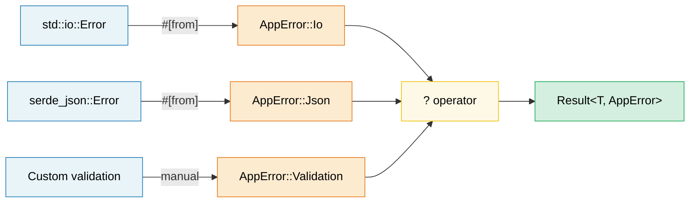

# 9. 错误处理模式 🟢

> **你将学到：**
> - 何时使用 `thiserror`（库）vs `anyhow`（应用）
> - 使用 `#[from]` 和 `.context()` 包装器构建错误转换链
> - `?` 操作符如何展开以及如何在 `main()` 中工作
> - 何时使用 panic vs 返回错误，以及用于 FFI 边界的 `catch_unwind`

## thiserror vs anyhow — 库与应用

Rust 的错误处理以 `Result<T, E>` 类型为中心。两个 crate 占主导地位：

```rust,ignore
// --- thiserror：用于库 ---
// 通过派生宏生成 Display、Error 和 From 实现
use thiserror::Error;

#[derive(Error, Debug)]
pub enum DatabaseError {
    #[error("connection failed: {0}")]
    ConnectionFailed(String),

    #[error("query error: {source}")]
    QueryError {
        #[source]
        source: sqlx::Error,
    },

    #[error("record not found: table={table} id={id}")]
    NotFound { table: String, id: u64 },

    #[error(transparent)] // 将 Display 委托给内部错误
    Io(#[from] std::io::Error), // 自动生成 From<io::Error>
}

// --- anyhow：用于应用 ---
// 动态错误类型 — 非常适合顶层代码，只需传播错误
use anyhow::{Context, Result, bail, ensure};

fn read_config(path: &str) -> Result<Config> {
    let content = std::fs::read_to_string(path)
        .with_context(|| format!("failed to read config from {path}"))?;

    let config: Config = serde_json::from_str(&content)
        .context("failed to parse config JSON")?;

    ensure!(config.port > 0, "port must be positive, got {}", config.port);

    Ok(config)
}

fn main() -> Result<()> {
    let config = read_config("server.toml")?;

    if config.name.is_empty() {
        bail!("server name cannot be empty"); // 立即返回 Err
    }

    Ok(())
}
```

**何时使用哪个**：

| | `thiserror` | `anyhow` |
|---|---|---|
| **用于** | 库、共享 crate | 应用、二进制文件 |
| **错误类型** | 具体枚举 — 调用方可以匹配 | `anyhow::Error` — 不透明 |
| **工作量** | 定义你的错误枚举 | 只需使用 `Result<T>` |
| **向下转换** | 不需要 — 模式匹配 | `error.downcast_ref::<MyError>()` |

### 错误转换链（#[from]）

```rust,ignore
use thiserror::Error;

#[derive(Error, Debug)]
enum AppError {
    #[error("I/O error: {0}")]
    Io(#[from] std::io::Error),

    #[error("JSON error: {0}")]
    Json(#[from] serde_json::Error),

    #[error("HTTP error: {0}")]
    Http(#[from] reqwest::Error),
}

// 现在 ? 自动转换：
fn fetch_and_parse(url: &str) -> Result<Config, AppError> {
    let body = reqwest::blocking::get(url)?.text()?;  // reqwest::Error → AppError::Http
    let config: Config = serde_json::from_str(&body)?; // serde_json::Error → AppError::Json
    Ok(config)
}
```

### 上下文和错误包装

为错误添加人类可读的上下文，同时不丢失原始错误：

```rust,ignore
use anyhow::{Context, Result};

fn process_file(path: &str) -> Result<Data> {
    let content = std::fs::read_to_string(path)
        .with_context(|| format!("failed to read {path}"))?;

    let data = parse_content(&content)
        .with_context(|| format!("failed to parse {path}"))?;

    validate(&data)
        .context("validation failed")?;

    Ok(data)
}

// 错误输出：
// Error: validation failed
//
// Caused by:
//    0: failed to parse config.json
//    1: expected ',' at line 5 column 12
```

### ? 操作符详解

`?` 是 `match` + `From` 转换 + 早期返回的语法糖：

```rust
// 这个：
let value = operation()?;

// 展开为：
let value = match operation() {
    Ok(v) => v,
    Err(e) => return Err(From::from(e)),
    //                  ^^^^^^^^^^^^^^
    //                  通过 From trait 自动转换
};
```

**`?` 也可以用于 `Option`**（在返回 `Option` 的函数中）：

```rust
fn find_user_email(users: &[User], name: &str) -> Option<String> {
    let user = users.iter().find(|u| u.name == name)?; // 未找到时返回 None
    let email = user.email.as_ref()?; // email 为 None 时返回 None
    Some(email.to_uppercase())
}
```

### Panic、catch_unwind 以及何时中止

```rust
// Panic：用于 BUG，不是预期错误
fn get_element(data: &[i32], index: usize) -> &i32 {
    // 如果这里 panic，那是编程错误（bug）。
    // 不要"处理"它 — 修复调用方。
    &data[index]
}

// catch_unwind：用于边界（FFI、线程池）
use std::panic;

let result = panic::catch_unwind(|| {
    // 安全地运行可能 panic 的代码
    risky_operation()
});

match result {
    Ok(value) => println!("Success: {value:?}"),
    Err(_) => eprintln!("Operation panicked — continuing safely"),
}

// 何时使用哪个：
// Result<T, E> → 预期失败（文件未找到、网络超时）
// panic!()     → 编程 bug（索引越界、不变量违反）
// process::abort() → 不可恢复状态（安全违规、数据损坏）
```

> **C++ 比较**：`Result<T, E>` 取代异常来处理预期错误。
> `panic!()` 类似于 `assert()` 或 `std::terminate()` — 它是用于 bug，不是
> 控制流。Rust 的 `?` 操作符使错误传播与异常一样符合人体工程学，
> 但没有不可预测的控制流。

> **关键要点 — 错误处理**
> - 库：使用 `thiserror` 处理结构化错误枚举；应用：使用 `anyhow` 进行符合人体工程学的传播
> - `#[from]` 自动生成 `From` 实现；`.context()` 添加人类可读的包装器
> - `?` 展开为 `From::from()` + 早期返回；在返回 `Result` 的 `main()` 中工作

> **另请参阅：** [第 14 章 — API 设计](ch14-crate-architecture-and-api-design.md) 用于"解析而非验证"模式。[第 10 章 — 序列化](ch10-serialization-zero-copy-and-binary-data.md) 用于 serde 错误处理。



---

### 练习：使用 thiserror 的错误层次结构 ★★（约 30 分钟）

为文件处理应用设计一个错误类型层次结构，该应用可能在 I/O、解析（JSON 和 CSV）以及验证期间失败。使用 `thiserror` 并演示 `?` 传播。

<details>
<summary>🔑 解决方案</summary>

```rust,ignore
use thiserror::Error;

#[derive(Error, Debug)]
pub enum AppError {
    #[error("I/O error: {0}")]
    Io(#[from] std::io::Error),

    #[error("JSON parse error: {0}")]
    Json(#[from] serde_json::Error),

    #[error("CSV error at line {line}: {message}")]
    Csv { line: usize, message: String },

    #[error("validation error: {field} — {reason}")]
    Validation { field: String, reason: String },
}

fn read_file(path: &str) -> Result<String, AppError> {
    Ok(std::fs::read_to_string(path)?) // io::Error → AppError::Io 通过 #[from]
}

fn parse_json(content: &str) -> Result<serde_json::Value, AppError> {
    Ok(serde_json::from_str(content)?) // serde_json::Error → AppError::Json
}

fn validate_name(value: &serde_json::Value) -> Result<String, AppError> {
    let name = value.get("name")
        .and_then(|v| v.as_str())
        .ok_or_else(|| AppError::Validation {
            field: "name".into(),
            reason: "must be a non-null string".into(),
        })?;

    if name.is_empty() {
        return Err(AppError::Validation {
            field: "name".into(),
            reason: "must not be empty".into(),
        });
    }

    Ok(name.to_string())
}

fn process_file(path: &str) -> Result<String, AppError> {
    let content = read_file(path)?;
    let json = parse_json(&content)?;
    let name = validate_name(&json)?;
    Ok(name)
}

fn main() {
    match process_file("config.json") {
        Ok(name) => println!("Name: {name}"),
        Err(e) => eprintln!("Error: {e}"),
    }
}
```

</details>

***

