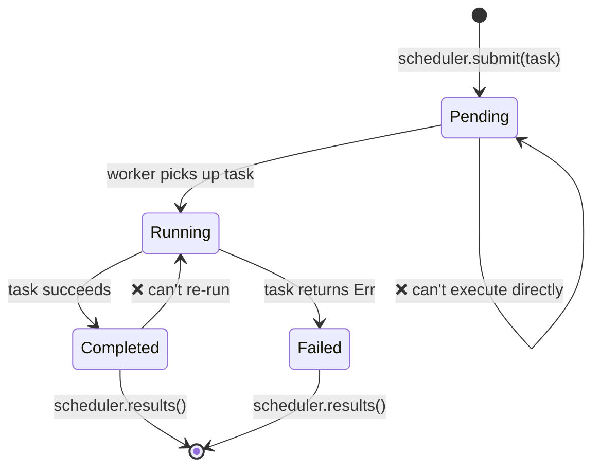

# 终极项目：类型安全的任务调度器

本项目将本书各章节的模式整合到一个生产级风格的系统中。你将构建一个**类型安全的并发任务调度器**，使用泛型、trait、类型状态、通道、错误处理和测试。

**预计时间**：4–6 小时 | **难度**：★★★

> **你将练习的内容：**
> - 泛型和 trait 约束（第 1–2 章）
> - 任务生命周期的类型状态模式（第 3 章）
> - 用于零成本状态标记的 PhantomData（第 4 章）
> - 用于 worker 通信的通道（第 5 章）
> - 使用作用域线程的并发（第 6 章）
> - 使用 `thiserror` 的错误处理（第 9 章）
> - 使用属性测试进行测试（第 13 章）
> - 使用 `TryFrom` 和验证类型的 API 设计（第 14 章）

## 问题

构建一个任务调度器，其中：

1. **任务**有类型化的生命周期：`Pending → Running → Completed`（或 `Failed`）
2. **Workers** 从通道拉取任务、执行并报告结果
3. **调度器**管理任务提交、worker 协调和结果收集
4. 无效的状态转换是**编译时错误**



## 第 1 步：定义任务类型

从类型状态标记和泛型 `Task` 开始：

```rust
use std::marker::PhantomData;

// --- 状态标记（零大小）---
struct Pending;
struct Running;
struct Completed;
struct Failed;

// --- 任务 ID（用于类型安全的新类型）---
#[derive(Debug, Clone, Copy, PartialEq, Eq, Hash)]
struct TaskId(u64);

// --- Task 结构，按生命周期状态参数化 ---
struct Task<State, R> {
    id: TaskId,
    name: String,
    _state: PhantomData<State>,
    _result: PhantomData<R>,
}
```

**你的任务**：实现状态转换，使得：
- `Task<Pending, R>` 可以转换到 `Task<Running, R>`（通过 `start()`）
- `Task<Running, R>` 可以转换到 `Task<Completed, R>` 或 `Task<Failed, R>`
- 其他转换不能编译

<details>
<summary>💡 提示</summary>

每个转换方法应该消费 `self` 并返回新状态：

```rust
impl<R> Task<Pending, R> {
    fn start(self) -> Task<Running, R> {
        Task {
            id: self.id,
            name: self.name,
            _state: PhantomData,
            _result: PhantomData,
        }
    }
}
```

</details>

## 第 2 步：定义工作函数

任务需要一个要执行的函数。使用 boxed 闭包：

```rust
struct WorkItem<R: Send + 'static> {
    id: TaskId,
    name: String,
    work: Box<dyn FnOnce() -> Result<R, String> + Send>,
}
```

**你的任务**：实现 `WorkItem::new()` 接受任务名称和闭包。添加一个 `TaskId` 生成器（简单的原子计数器或互斥体保护的计数器）。

## 第 3 步：错误处理

使用 `thiserror` 定义调度器的错误类型：

```rust,ignore
use thiserror::Error;

#[derive(Error, Debug)]
pub enum SchedulerError {
    #[error("scheduler is shut down")]
    ShutDown,

    #[error("task {0:?} failed: {1}")]
    TaskFailed(TaskId, String),

    #[error("channel send error")]
    ChannelError(#[from] std::sync::mpsc::SendError<()>),

    #[error("worker panicked")]
    WorkerPanic,
}
```

## 第 4 步：调度器

使用通道（第 5 章）和作用域线程（第 6 章）构建调度器：

```rust
use std::sync::mpsc;

struct Scheduler<R: Send + 'static> {
    sender: Option<mpsc::Sender<WorkItem<R>>>,
    results: mpsc::Receiver<TaskResult<R>>,
    num_workers: usize,
}

struct TaskResult<R> {
    id: TaskId,
    name: String,
    outcome: Result<R, String>,
}
```

**你的任务**：实现：
- `Scheduler::new(num_workers: usize) -> Self` — 创建通道并生成 workers
- `Scheduler::submit(&self, item: WorkItem<R>) -> Result<TaskId, SchedulerError>`
- `Scheduler::shutdown(self) -> Vec<TaskResult<R>>` — 丢弃 sender，join workers，收集结果

<details>
<summary>💡 提示 — Worker 循环</summary>

```rust
fn worker_loop<R: Send + 'static>(
    rx: std::sync::Arc<std::sync::Mutex<mpsc::Receiver<WorkItem<R>>>>,
    result_tx: mpsc::Sender<TaskResult<R>>,
    worker_id: usize,
) {
    loop {
        let item = {
            let rx = rx.lock().unwrap();
            rx.recv()
        };
        match item {
            Ok(work_item) => {
                let outcome = (work_item.work)();
                let _ = result_tx.send(TaskResult {
                    id: work_item.id,
                    name: work_item.name,
                    outcome,
                });
            }
            Err(_) => break, // 通道关闭
        }
    }
}
```

</details>

## 第 5 步：集成测试

编写验证以下内容的测试：

1. **快乐路径**：提交 10 个任务，关闭，验证所有 10 个结果是 `Ok`
2. **错误处理**：提交失败的任务，验证 `TaskResult.outcome` 是 `Err`
3. **空调度器**：创建并立即关闭 — 无 panic
4. **属性测试**（奖励）：使用 `proptest` 验证对于任何 N 个任务（1..100），调度器始终返回恰好 N 个结果

```rust
#[cfg(test)]
mod tests {
    use super::*;

    #[test]
    fn happy_path() {
        let scheduler = Scheduler::<String>::new(4);

        for i in 0..10 {
            let item = WorkItem::new(
                format!("task-{i}"),
                move || Ok(format!("result-{i}")),
            );
            scheduler.submit(item).unwrap();
        }

        let results = scheduler.shutdown();
        assert_eq!(results.len(), 10);
        for r in &results {
            assert!(r.outcome.is_ok());
        }
    }

    #[test]
    fn handles_failures() {
        let scheduler = Scheduler::<String>::new(2);

        scheduler.submit(WorkItem::new("good", || Ok("ok".into()))).unwrap();
        scheduler.submit(WorkItem::new("bad", || Err("boom".into()))).unwrap();

        let results = scheduler.shutdown();
        assert_eq!(results.len(), 2);

        let failures: Vec<_> = results.iter()
            .filter(|r| r.outcome.is_err())
            .collect();
        assert_eq!(failures.len(), 1);
    }
}
```

## 第 6 步：整合一切

这里是演示完整系统的 `main()`：

```rust,ignore
fn main() {
    let scheduler = Scheduler::<String>::new(4);

    // 提交不同工作负载的任务
    for i in 0..20 {
        let item = WorkItem::new(
            format!("compute-{i}"),
            move || {
                // 模拟工作
                std::thread::sleep(std::time::Duration::from_millis(10));
                if i % 7 == 0 {
                    Err(format!("task {i} hit a simulated error"))
                } else {
                    Ok(format!("task {i} completed with value {}", i * i))
                }
            },
        );
        scheduler.submit(item).unwrap();
    }

    println!("All tasks submitted. Shutting down...");
    let results = scheduler.shutdown();

    let (ok, err): (Vec<_>, Vec<_>) = results.iter()
        .partition(|r| r.outcome.is_ok());

    println!("\n✅ Succeeded: {}", ok.len());
    for r in &ok {
        println!("  {} → {}", r.name, r.outcome.as_ref().unwrap());
    }

    println!("\n❌ Failed: {}", err.len());
    for r in &err {
        println!("  {} → {}", r.name, r.outcome.as_ref().unwrap_err());
    }
}
```

## 评估标准

| 标准 | 目标 |
|-----------|--------|
| 类型安全 | 无效状态转换不能编译 |
| 并发性 | Workers 并行运行，无数据竞争 |
| 错误处理 | 所有失败都捕获在 `TaskResult` 中，无 panic |
| 测试 | 至少 3 个测试；奖励 proptest |
| 代码组织 | 清晰的模块结构，公共 API 使用验证类型 |
| 文档 | 关键类型有解释不变量的文档注释 |

## 扩展想法

基本调度器工作后，尝试这些增强：

1. **优先队列**：添加 `Priority` 新类型（1–10）并优先处理更高优先级的任务
2. **重试策略**：失败的任务在永久标记为失败前最多重试 N 次
3. **取消**：添加 `cancel(TaskId)` 方法移除待处理任务
4. **Async 版本**：移植到 `tokio::spawn` 和 `tokio::sync::mpsc` 通道（第 15 章）
5. **指标**：跟踪每个 worker 的任务数、平均执行时间和失败率

***
