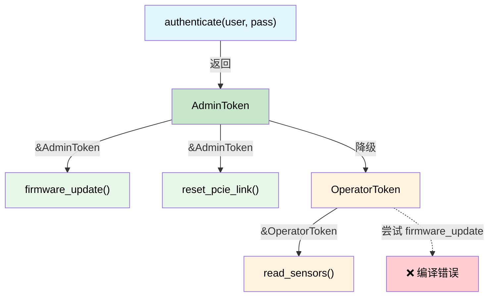

# 能力令牌 — 零成本权威证明 🟡

> **你将学到：** 零大小类型（ZST）如何充当编译时证明令牌，强制执行特权层次结构、电源排序和可撤销权威——全部零运行时成本。
>
> **交叉引用：** [ch03](ch03-single-use-types-cryptographic-guarantee.md)（单次使用类型），[ch05](ch05-protocol-state-machines-type-state-for-r.md)（类型状态），[ch08](ch08-capability-mixins-compile-time-hardware-.md)（混合），[ch10](ch10-putting-it-all-together-a-complete-diagn.md)（集成）

## 问题：谁被允许做什么？

在硬件诊断中，有些操作是 **危险的**：

- 编程 BMC 固件
- 重置 PCIe 链路
- 写入 OTP fuse
- 启用高电压测试模式

在 C/C++ 中，这些由运行时检查保护：

```c
// C — 运行时权限检查
int reset_pcie_link(bmc_handle_t bmc, int slot) {
    if (!bmc->is_admin) {        // 运行时检查
        return -EPERM;
    }
    if (!bmc->link_trained) {    // 又一个运行时检查
        return -EINVAL;
    }
    // ... 做危险的事情 ...
    return 0;
}
```

每个执行危险操作的函数都必须重复这些检查。忘记一个，你就有了特权升级 bug。

## 零大小类型作为证明令牌

**能力令牌** 是一个零大小类型（ZST），证明调用者有权执行某个操作。它在运行时 **零字节成本**——它只存在于类型系统中：

```rust,ignore
use std::marker::PhantomData;

/// 证明调用者有管理员权限。
/// 零大小——完全编译掉。
/// 不是 Clone，不是 Copy——必须显式传递。
pub struct AdminToken {
    _private: (),   // 阻止在此模块外部构造
}

/// 证明 PCIe 链路已训练并就绪。
pub struct LinkTrainedToken {
    _private: (),
}

pub struct BmcController { /* ... */ }

impl BmcController {
    /// 以管理员身份认证——返回一个能力令牌。
    /// 这是创建 AdminToken 的唯一方式。
    pub fn authenticate_admin(
        &mut self,
        credentials: &[u8],
    ) -> Result<AdminToken, &'static str> {
        // ... 验证凭据 ...
        # let valid = true;
        if valid {
            Ok(AdminToken { _private: () })
        } else {
            Err("authentication failed")
        }
    }

    /// 训练 PCIe 链路——返回它已训练的证明。
    pub fn train_link(&mut self) -> Result<LinkTrainedToken, &'static str> {
        // ... 执行链路训练 ...
        Ok(LinkTrainedToken { _private: () })
    }

    /// 重置 PCIe 链路——需要管理员 + 链路已训练的双重证明。
    /// 不需要运行时检查——令牌本身就是证明。
    pub fn reset_pcie_link(
        &mut self,
        _admin: &AdminToken,         // 零成本权威证明
        _trained: &LinkTrainedToken,  // 零成本状态证明
        slot: u32,
    ) -> Result<(), &'static str> {
        println!("Resetting PCIe link on slot {slot}");
        Ok(())
    }
}
```

用法——类型系统强制执行工作流：

```rust,ignore
fn maintenance_workflow(bmc: &mut BmcController) -> Result<(), &'static str> {
    // 步骤 1：认证——获取管理员证明
    let admin = bmc.authenticate_admin(b"secret")?;

    // 步骤 2：训练链路——获取已训练证明
    let trained = bmc.train_link()?;

    // 步骤 3：重置——编译器要求两个令牌
    bmc.reset_pcie_link(&admin, &trained, 0)?;

    Ok(())
}

// 这不会编译：
fn unprivileged_attempt(bmc: &mut BmcController) -> Result<(), &'static str> {
    let trained = bmc.train_link()?;
    // bmc.reset_pcie_link(???, &trained, 0)?;
    //                     ^^^^ 没有 AdminToken——不能调用这个
    Ok(())
}
```

`AdminToken` 和 `LinkTrainedToken` **在编译后的二进制中是零字节**。它们只存在于类型检查期间。函数签名 `fn reset_pcie_link(&mut self, _admin: &AdminToken, ...)` 是一个 **证明义务**——"你只有能产生一个 `AdminToken` 时才能调用这个"——而产生一个的唯一方式是通过 `authenticate_admin()`。

## 电源排序权威

服务器电源排序有严格的顺序：待机 → 辅助 → 主电源 → CPU。反转顺序可能损坏硬件。能力令牌强制执行顺序：

```rust,ignore
/// 状态令牌——每个都证明前一步已完成。
pub struct StandbyOn { _p: () }
pub struct AuxiliaryOn { _p: () }
pub struct MainOn { _p: () }
pub struct CpuPowered { _p: () }

pub struct PowerController { /* ... */ }

impl PowerController {
    /// 步骤 1：启用待机电源。无前置条件。
    pub fn enable_standby(&mut self) -> Result<StandbyOn, &'static str> {
        println!("Standby power ON");
        Ok(StandbyOn { _p: () })
    }

    /// 步骤 2：启用辅助——需要待机证明。
    pub fn enable_auxiliary(
        &mut self,
        _standby: &StandbyOn,
    ) -> Result<AuxiliaryOn, &'static str> {
        println!("Auxiliary power ON");
        Ok(AuxiliaryOn { _p: () })
    }

    /// 步骤 3：启用主电源——需要辅助证明。
    pub fn enable_main(
        &mut self,
        _aux: &AuxiliaryOn,
    ) -> Result<MainOn, &'static str> {
        println!("Main power ON");
        Ok(MainOn { _p: () })
    }

    /// 步骤 4：CPU 上电——需要主电源证明。
    pub fn power_cpu(
        &mut self,
        _main: &MainOn,
    ) -> Result<CpuPowered, &'static str> {
        println!("CPU powered ON");
        Ok(CpuPowered { _p: () })
    }
}

fn power_on_sequence(ctrl: &mut PowerController) -> Result<CpuPowered, &'static str> {
    let standby = ctrl.enable_standby()?;
    let aux = ctrl.enable_auxiliary(&standby)?;
    let main = ctrl.enable_main(&aux)?;
    let cpu = ctrl.power_cpu(&main)?;
    Ok(cpu)
}

// 尝试跳过步骤：
// fn wrong_order(ctrl: &mut PowerController) {
//     ctrl.power_cpu(???);  // ❌ 不能产生 MainOn without enable_main()
// }
```

## 层次化能力

真实系统有 **层次结构**——管理员可以做用户能做的所有事情，加上更多。用 trait 层次结构建模：

```rust,ignore
/// 基本能力——任何已认证的人。
pub trait Authenticated {
    fn token_id(&self) -> u64;
}

/// 操作员可以读取传感器和运行非破坏性诊断。
pub trait Operator: Authenticated {}

/// 管理员可以做操作员能做的所有事情，加上破坏性操作。
pub trait Admin: Operator {}

// 具体令牌：
pub struct UserToken { id: u64 }
pub struct OperatorToken { id: u64 }
pub struct AdminCapToken { id: u64 }

impl Authenticated for UserToken { fn token_id(&self) -> u64 { self.id } }
impl Authenticated for OperatorToken { fn token_id(&self) -> u64 { self.id } }
impl Operator for OperatorToken {}
impl Authenticated for AdminCapToken { fn token_id(&self) -> u64 { self.id } }
impl Operator for AdminCapToken {}
impl Admin for AdminCapToken {}

pub struct Bmc { /* ... */ }

impl Bmc {
    /// 任何已认证的人都可以读取传感器。
    pub fn read_sensor(&self, _who: &impl Authenticated, id: u32) -> f64 {
        42.0 // stub
    }

    /// 只有操作员及以上可以运行诊断。
    pub fn run_diag(&mut self, _who: &impl Operator, test: &str) -> bool {
        true // stub
    }

    /// 只有管理员可以刷固件。
    pub fn flash_firmware(&mut self, _who: &impl Admin, image: &[u8]) -> Result<(), &'static str> {
        Ok(()) // stub
    }
}
```

`AdminCapToken` 可以传递给任何函数——它满足 `Authenticated`、`Operator` 和 `Admin`。`UserToken` 只能调用 `read_sensor()`。编译器以 **零运行时成本** 强制执行整个特权模型。

## 生命周期受限的能力令牌

有时能力应该是 **作用域受限的**——只在某个生命周期内有效。Rust 的借用检查器自然地处理这个问题：

```rust,ignore
/// 一个作用域受限的管理员会话。令牌借用了会话，
/// 所以它不能比会话存在得更久。
pub struct AdminSession {
    _active: bool,
}

pub struct ScopedAdminToken<'session> {
    _session: &'session AdminSession,
}

impl AdminSession {
    pub fn begin(credentials: &[u8]) -> Result<Self, &'static str> {
        // ... 认证 ...
        Ok(AdminSession { _active: true })
    }

    /// 创建一个作用域令牌——只和会话一样长。
    pub fn token(&self) -> ScopedAdminToken<'_> {
        ScopedAdminToken { _session: self }
    }
}

fn scoped_example() -> Result<(), &'static str> {
    let session = AdminSession::begin(b"credentials")?;
    let token = session.token();

    // 在此作用域内使用 token...
    // 当 session drop 时，token 被借用检查器失效。
    // 不需要运行时过期检查。

    // drop(session);
    // ❌ 错误：不能移动 out of `session`因为它被借用
    //    （被 `token` 借用，它持有 &session）
    //
    // 即使我们跳过 drop() 并尝试在 session 离开作用域后使用 `token`——
    // 同样的错误：生命周期不匹配。

    Ok(())
}
```

### 何时使用能力令牌

| 场景 | 模式 |
|----------|---------|
| 特权硬件操作 | ZST 证明令牌（AdminToken） |
| 多步骤排序 | 状态令牌链（StandbyOn → AuxiliaryOn → ...） |
| 基于角色的访问控制 | Trait 层次结构（Authenticated → Operator → Admin） |
| 时间受限特权 | 生命周期受限令牌（`ScopedAdminToken<'a>`） |
| 跨模块权威 | 公共令牌类型，私有构造函数 |

### 成本摘要

| 什么 | 运行时成本 |
|------|:------:|
| 内存中的 ZST 令牌 | 0 字节 |
| 令牌参数传递 | 被 LLVM 优化掉 |
| Trait 层次结构调度 | 静态调度（单态化） |
| 生命周期强制 | 仅编译时 |

**总运行时开销：零。** 特权模型只存在于类型系统中。

## 能力令牌层次结构



## 练习：分层诊断权限

设计一个三层能力系统：`ViewerToken`、`TechToken`、`EngineerToken`。
- 观察者可以调用 `read_status()`
- 技术员还可以调用 `run_quick_diag()`
- 工程师还可以调用 `flash_firmware()`
- 更高级别可以做所有更低级别能做的事情（使用 trait 约束或令牌转换）。

<details>
<summary>解答</summary>

```rust,ignore
// 令牌——零大小，私有构造函数
pub struct ViewerToken { _private: () }
pub struct TechToken { _private: () }
pub struct EngineerToken { _private: () }

// 能力 trait——层次化
pub trait CanView {}
pub trait CanDiag: CanView {}
pub trait CanFlash: CanDiag {}

impl CanView for ViewerToken {}
impl CanView for TechToken {}
impl CanView for EngineerToken {}
impl CanDiag for TechToken {}
impl CanDiag for EngineerToken {}
impl CanFlash for EngineerToken {}

pub fn read_status(_tok: &impl CanView) -> String {
    "status: OK".into()
}

pub fn run_quick_diag(_tok: &impl CanDiag) -> String {
    "diag: PASS".into()
}

pub fn flash_firmware(_tok: &impl CanFlash, _image: &[u8]) {
    // 只有工程师能到达这里
}
```

</details>

## 关键要点

1. **ZST 令牌零字节成本** — 它们只存在于类型系统中；LLVM 完全优化掉它们。
2. **私有构造函数 = 不可伪造** — 只有你模块的 `authenticate()` 可以铸造令牌。
3. **Trait 层次结构建模权限级别** — `CanFlash: CanDiag: CanView` 镜像真实 RBAC。
4. **生命周期受限令牌自动撤销** — `ScopedAdminToken<'session>` 不能比会话存在得更久。
5. **与类型状态结合（ch05）** 用于需要认证 *和* 排序操作的协议。

---

