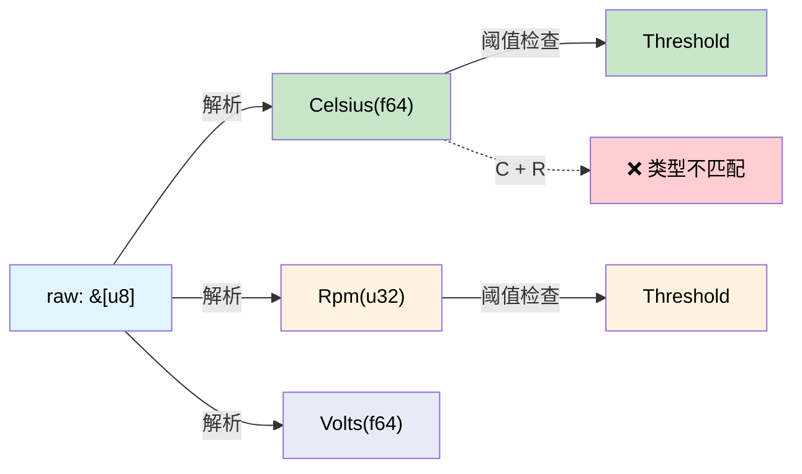

# 量纲分析 — 让编译器检查你的单位 🟢

> **你将学到：** newtype 包装器和 `uom` crate 如何将编译器变成单位检查引擎，防止摧毁价值 $328M 航天器的 bug 类别。
>
> **交叉引用：** [ch02](ch02-typed-command-interfaces-request-determi.md)（类型化命令使用这些类型），[ch07](ch07-validated-boundaries-parse-dont-validate.md)（验证边界），[ch10](ch10-putting-it-all-together-a-complete-diagn.md)（集成）

## 火星气候轨道器

1999 年，NASA 的火星气候轨道器失联，因为一个团队以 **磅力秒** 发送推力数据而导航团队期望 **牛顿秒**。航天器在 57 公里而不是 226 公里进入大气层并解体。
成本：3.276 亿美元。

根本原因：**两个值都是 `double`**。编译器无法区分它们。

同样类别的 bug 潜伏在每个处理物理量的硬件诊断中：

```c
// C — 全部是 double，没有单位检查
double read_temperature(int sensor_id);   // 摄氏度？华氏度？开尔文？
double read_voltage(int channel);          // 伏特？毫伏？
double read_fan_speed(int fan_id);         // RPM？弧度每秒？

// Bug：比较摄氏度和华氏度
if (read_temperature(0) > read_temperature(1)) { ... }  // 单位可能不同！
```

## 物理量的 Newtype

最简单的正确性构造方法：**将每个单位包装在自己的类型中**。

```rust,ignore
use std::fmt;

/// 摄氏度温度。
#[derive(Debug, Clone, Copy, PartialEq, PartialOrd)]
pub struct Celsius(pub f64);

/// 华氏度温度。
#[derive(Debug, Clone, Copy, PartialEq, PartialOrd)]
pub struct Fahrenheit(pub f64);

/// 伏特电压。
#[derive(Debug, Clone, Copy, PartialEq, PartialOrd)]
pub struct Volts(pub f64);

/// 毫伏电压。
#[derive(Debug, Clone, Copy, PartialEq, PartialOrd)]
pub struct Millivolts(pub f64);

/// 风扇速度，单位 RPM。
#[derive(Debug, Clone, Copy, PartialEq, PartialOrd)]
pub struct Rpm(pub f64);

// 转换是显式的：
impl From<Celsius> for Fahrenheit {
    fn from(c: Celsius) -> Self {
        Fahrenheit(c.0 * 9.0 / 5.0 + 32.0)
    }
}

impl From<Fahrenheit> for Celsius {
    fn from(f: Fahrenheit) -> Self {
        Celsius((f.0 - 32.0) * 5.0 / 9.0)
    }
}

impl From<Volts> for Millivolts {
    fn from(v: Volts) -> Self {
        Millivolts(v.0 * 1000.0)
    }
}

impl From<Millivolts> for Volts {
    fn from(mv: Millivolts) -> Self {
        Volts(mv.0 / 1000.0)
    }
}

impl fmt::Display for Celsius {
    fn fmt(&self, f: &mut fmt::Formatter<'_>) -> fmt::Result {
        write!(f, "{:.1}°C", self.0)
    }
}

impl fmt::Display for Rpm {
    fn fmt(&self, f: &mut fmt::Formatter<'_>) -> fmt::Result {
        write!(f, "{:.0} RPM", self.0)
    }
}
```

现在编译器捕获单位不匹配：

```rust,ignore
# #[derive(Debug, Clone, Copy, PartialEq, PartialOrd)]
# pub struct Celsius(pub f64);
# #[derive(Debug, Clone, Copy, PartialEq, PartialOrd)]
# pub struct Volts(pub f64);

fn check_thermal_limit(temp: Celsius, limit: Celsius) -> bool {
    temp > limit  // ✅ 相同单位——编译通过
}

// fn bad_comparison(temp: Celsius, voltage: Volts) -> bool {
//     temp > voltage  // ❌ 错误：类型不匹配——Celsius vs Volts
// }
```

**零运行时成本** — newtype 编译为原始 `f64` 值。包装器纯粹是类型级概念。

## 硬件量的 Newtype 宏

手工编写 newtype 会变得重复。宏消除了样板代码：

```rust,ignore
/// 为物理量生成 newtype。
macro_rules! quantity {
    ($Name:ident, $unit:expr) => {
        #[derive(Debug, Clone, Copy, PartialEq, PartialOrd)]
        pub struct $Name(pub f64);

        impl $Name {
            pub fn new(value: f64) -> Self { $Name(value) }
            pub fn value(self) -> f64 { self.0 }
        }

        impl std::fmt::Display for $Name {
            fn fmt(&self, f: &mut std::fmt::Formatter<'_>) -> std::fmt::Result {
                write!(f, "{:.2} {}", self.0, $unit)
            }
        }

        impl std::ops::Add for $Name {
            type Output = Self;
            fn add(self, rhs: Self) -> Self { $Name(self.0 + rhs.0) }
        }

        impl std::ops::Sub for $Name {
            type Output = Self;
            fn sub(self, rhs: Self) -> Self { $Name(self.0 - rhs.0) }
        }
    };
}

// 用法：
quantity!(Celsius, "°C");
quantity!(Fahrenheit, "°F");
quantity!(Volts, "V");
quantity!(Millivolts, "mV");
quantity!(Rpm, "RPM");
quantity!(Watts, "W");
quantity!(Amperes, "A");
quantity!(Pascals, "Pa");
quantity!(Hertz, "Hz");
quantity!(Bytes, "B");
```

每一行生成一个完整的类型，带有 Display、加法、减法和比较运算符。**全部零运行时成本。**

> **物理注意事项：** 宏为 *所有* 量生成 `Add`，包括 `Celsius`。添加绝对温度（`25°C + 30°C = 55°C`）在物理上没有意义——你需要单独的 `TemperatureDelta` 类型来表示差异。`uom` crate（稍后展示）正确处理这个问题。对于只比较和显示的简单传感器诊断，你可以从温度类型中省略 `Add`/`Sub`，同时保留对加法有意义的量的（Watts、Volts、Bytes）。如果你需要增量算术，定义一个 `CelsiusDelta(f64)` newtype，带有 `impl Add<CelsiusDelta> for Celsius`。

## 应用示例：传感器管道

典型诊断读取原始 ADC 值，将它们转换为物理单位，并与阈值比较。有了量纲类型，每一步都是类型检查的：

```rust,ignore
# macro_rules! quantity {
#     ($Name:ident, $unit:expr) => {
#         #[derive(Debug, Clone, Copy, PartialEq, PartialOrd)]
#         pub struct $Name(pub f64);
#         impl $Name {
#             pub fn new(value: f64) -> Self { $Name(value) }
#             pub fn value(self) -> f64 { self.0 }
#         }
#         impl std::fmt::Display for $Name {
#             fn fmt(&self, f: &mut std::fmt::Formatter<'_>) -> std::fmt::Result {
#                 write!(f, "{:.2} {}", self.0, $unit)
#             }
#         }
#     };
# }
# quantity!(Celsius, "°C");
# quantity!(Volts, "V");
# quantity!(Rpm, "RPM");

/// 原始 ADC 读数——还不是物理量。
#[derive(Debug, Clone, Copy)]
pub struct AdcReading {
    pub channel: u8,
    pub raw: u16,   // 12 位 ADC 值（0–4095）
}

/// 用于将 ADC → 物理单位转换的校准系数。
pub struct TemperatureCalibration {
    pub offset: f64,
    pub scale: f64,   // 每 ADC 计数的 °C
}

pub struct VoltageCalibration {
    pub reference_mv: f64,
    pub divider_ratio: f64,
}

impl TemperatureCalibration {
    /// 将原始 ADC → 摄氏度。返回类型保证输出是摄氏度。
    pub fn convert(&self, adc: AdcReading) -> Celsius {
        Celsius::new(adc.raw as f64 * self.scale + self.offset)
    }
}

impl VoltageCalibration {
    /// 将原始 ADC → 伏特。返回类型保证输出是伏特。
    pub fn convert(&self, adc: AdcReading) -> Volts {
        Volts::new(adc.raw as f64 * self.reference_mv / 4096.0 / self.divider_ratio / 1000.0)
    }
}

/// 阈值检查——仅在单位匹配时编译。
pub struct Threshold<T: PartialOrd> {
    pub warning: T,
    pub critical: T,
}

#[derive(Debug, PartialEq)]
pub enum ThresholdResult {
    Normal,
    Warning,
    Critical,
}

impl<T: PartialOrd> Threshold<T> {
    pub fn check(&self, value: &T) -> ThresholdResult {
        if *value >= self.critical {
            ThresholdResult::Critical
        } else if *value >= self.warning {
            ThresholdResult::Warning
        } else {
            ThresholdResult::Normal
        }
    }
}

fn sensor_pipeline_example() {
    let temp_cal = TemperatureCalibration { offset: -50.0, scale: 0.0625 };
    let temp_threshold = Threshold {
        warning: Celsius::new(85.0),
        critical: Celsius::new(100.0),
    };

    let adc = AdcReading { channel: 0, raw: 2048 };
    let temp: Celsius = temp_cal.convert(adc);

    let result = temp_threshold.check(&temp);
    println!("Temperature: {temp}, Status: {result:?}");

    // 这不会编译——不能用伏特阈值检查摄氏度读数：
    // let volt_threshold = Threshold {
    //     warning: Volts::new(11.4),
    //     critical: Volts::new(10.8),
    // };
    // volt_threshold.check(&temp);  // ❌ 错误：期望 &Volts，找到 &Celsius
}
```

**整个管道** 是静态类型检查的：
- ADC 读数是原始计数（不是单位）
- 校准产生类型化量（Celsius、Volts）
- 阈值对量类型是泛型的
- 摄氏度与伏特比较是 **编译错误**

## uom Crate

对于生产使用，[`uom`](https://crates.io/crates/uom) crate 提供了全面的量纲分析系统，包含数百个单位、自动转换和零运行时开销：

```rust,ignore
// Cargo.toml: uom = { version = "0.36", features = ["f64"] }
//
// use uom::si::f64::*;
// use uom::si::thermodynamic_temperature::degree_celsius;
// use uom::si::electric_potential::volt;
// use uom::si::power::watt;
//
// let temp = ThermodynamicTemperature::new::<degree_celsius>(85.0);
// let voltage = ElectricPotential::new::<volt>(12.0);
// let power = Power::new::<watt>(250.0);
//
// // temp + voltage;  // ❌ 编译错误——不能将温度与电压相加
// // power > temp;    // ❌ 编译错误——不能将功率与温度比较
```

当你需要自动派生单位支持时使用 `uom`（例如，Watts = Volts × Amperes）。当你只需要简单量而不需要派生单位算术时使用手工卷写的 newtype。

### 何时使用量纲类型

| 场景 | 建议 |
|----------|---------------|
| 传感器读数（温度、电压、风扇） | ✅ 始终——防止单位混淆 |
| 阈值比较 | ✅ 始终——泛型 `Threshold<T>` |
| 跨子系统数据交换 | ✅ 始终——在 API 边界强制执行契约 |
| 内部计算（相同单位全程） | ⚠️ 可选——不太容易出错 |
| 字符串/显示格式化 | ❌ 在量类型上使用 Display 实现 |

## 传感器管道类型流程



## 练习：功率预算计算器

创建 `Watts(f64)` 和 `Amperes(f64)` newtype。实现：
- `Watts::from_vi(volts: Volts, amps: Amperes) -> Watts`（P = V × I）
- 一个 `PowerBudget`，跟踪总瓦数并拒绝超过配置限制的添加。
- 尝试 `Watts + Celsius` 应该是编译错误。

<details>
<summary>解答</summary>

```rust,ignore
#[derive(Debug, Clone, Copy, PartialEq, PartialOrd)]
pub struct Watts(pub f64);

#[derive(Debug, Clone, Copy, PartialEq, PartialOrd)]
pub struct Amperes(pub f64);

#[derive(Debug, Clone, Copy, PartialEq, PartialOrd)]
pub struct Volts(pub f64);

#[derive(Debug, Clone, Copy, PartialEq, PartialOrd)]
pub struct Celsius(pub f64);

impl Watts {
    pub fn from_vi(volts: Volts, amps: Amperes) -> Self {
        Watts(volts.0 * amps.0)
    }
}

impl std::ops::Add for Watts {
    type Output = Watts;
    fn add(self, rhs: Watts) -> Watts {
        Watts(self.0 + rhs.0)
    }
}

pub struct PowerBudget {
    total: Watts,
    limit: Watts,
}

impl PowerBudget {
    pub fn new(limit: Watts) -> Self {
        PowerBudget { total: Watts(0.0), limit }
    }
    pub fn add(&mut self, w: Watts) -> Result<(), String> {
        let new_total = Watts(self.total.0 + w.0);
        if new_total > self.limit {
            return Err(format!("budget exceeded: {:?} > {:?}", new_total, self.limit));
        }
        self.total = new_total;
        Ok(())
    }
}

// ❌ 编译错误：Watts + Celsius → "类型不匹配"
// let bad = Watts(100.0) + Celsius(50.0);
```

</details>

## 关键要点

1. **Newtype 以零成本防止单位混淆** — `Celsius` 和 `Rpm` 内部都是 `f64`，但编译器将它们视为不同类型。
2. **火星气候轨道器 bug 是不可能的** — 在期望 `Newtons` 的地方传递 `Pounds` 是编译错误。
3. **`quantity!` 宏减少样板代码** — 为每个单位印出 Display、算术和阈值逻辑。
4. **`uom` crate 处理派生单位** — 当你需要 `Watts = Volts × Amperes` 自动计算时使用它。
5. **Threshold 对量是泛型的** — `Threshold<Celsius>` 不能意外与 `Threshold<Rpm>` 比较。

---

