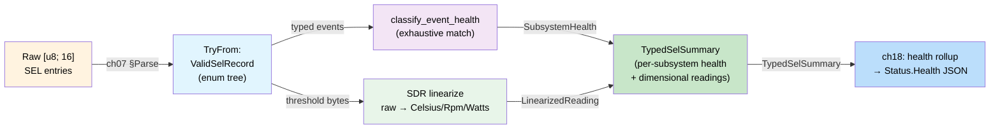
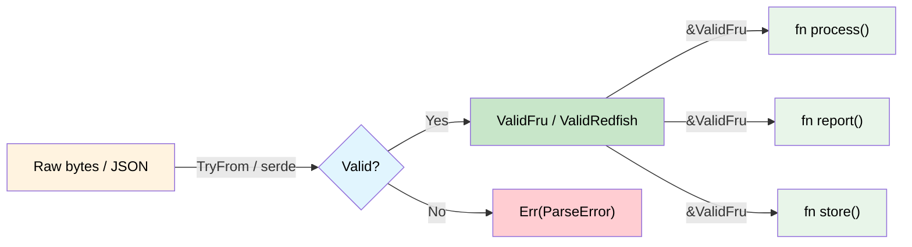

# 验证边界 — 解析，不要验证 🟡

> **你将学到：** 如何在系统边界精确验证数据一次，在专用类型中携带有效性的证明，并且从不重新检查——应用于 IPMI FRU 记录（扁平字节）、Redfish JSON（结构化文档）和 IPMI SEL 记录（带嵌套调度的多态二进制），并附有完整的端到端演练。
>
> **交叉引用：** [ch02](ch02-typed-command-interfaces-request-determi.md)（类型化命令），[ch06](ch06-dimensional-analysis-making-the-compiler.md)（量纲类型），[ch11](ch11-fourteen-tricks-from-the-trenches.md)（技巧2——sealed trait，技巧3——`#[non_exhaustive]`，技巧5——FromStr），[ch14](ch14-testing-type-level-guarantees.md)（proptest）

## 问题：霰弹式验证

在典型代码中，验证分散在各处。每个接收数据的函数都会重新检查它"以防万一"：

```c
// C — 验证分散在代码库中
int process_fru_data(uint8_t *data, int len) {
    if (data == NULL) return -1;          // 检查：非空
    if (len < 8) return -1;              // 检查：最小长度
    if (data[0] != 0x01) return -1;      // 检查：格式版本
    if (checksum(data, len) != 0) return -1; // 检查：校验和

    // ... 10 个更多函数重复相同的检查 ...
}
```

这个模式（"霰弹式验证"）有两个问题：
1. **冗余** — 相同的检查出现在数十个地方
2. **不完整** — 在一个函数中忘记一个检查就有了 bug

## 解析，不要验证

正确性构造方法：**在边界处验证一次，然后将有效性的证明携带在类型中**。

```rust,ignore
/// 来自网络的原始字节——尚未验证。
#[derive(Debug)]
pub struct RawFruData(Vec<u8>);
```

### 案例研究：IPMI FRU 数据

```rust,ignore
# #[derive(Debug)]
# pub struct RawFruData(Vec<u8>);

/// 验证过的 IPMI FRU 数据。只能通过 TryFrom 创建，
/// 它强制执行所有不变量。一旦你有了 ValidFru，
/// 所有数据都保证是正确的。
#[derive(Debug)]
pub struct ValidFru {
    format_version: u8,
    internal_area_offset: u8,
    chassis_area_offset: u8,
    board_area_offset: u8,
    product_area_offset: u8,
    data: Vec<u8>,
}

#[derive(Debug)]
pub enum FruError {
    TooShort { actual: usize, minimum: usize },
    BadFormatVersion(u8),
    ChecksumMismatch { expected: u8, actual: u8 },
    InvalidAreaOffset { area: &'static str, offset: u8 },
}

impl std::fmt::Display for FruError {
    fn fmt(&self, f: &mut std::fmt::Formatter<'_>) -> fmt::Result {
        match self {
            Self::TooShort { actual, minimum } =>
                write!(f, "FRU data too short: {actual} bytes (minimum {minimum})"),
            Self::BadFormatVersion(v) =>
                write!(f, "unsupported FRU format version: {v}"),
            Self::ChecksumMismatch { expected, actual } =>
                write!(f, "checksum mismatch: expected 0x{expected:02X}, got 0x{actual:02X}"),
            Self::InvalidAreaOffset { area, offset } =>
                write!(f, "invalid {area} area offset: {offset}"),
        }
    }
}

impl TryFrom<RawFruData> for ValidFru {
    type Error = FruError;

    fn try_from(raw: RawFruData) -> Result<Self, FruError> {
        let data = raw.0;

        // 1. 长度检查
        if data.len() < 8 {
            return Err(FruError::TooShort {
                actual: data.len(),
                minimum: 8,
            });
        }

        // 2. 格式版本
        if data[0] != 0x01 {
            return Err(FruError::BadFormatVersion(data[0]));
        }

        // 3. 校验和（头部是前 8 字节，校验和在字节 7）
        let checksum: u8 = data[..8].iter().fold(0u8, |acc, &b| acc.wrapping_add(b));
        if checksum != 0 {
            return Err(FruError::ChecksumMismatch {
                expected: 0,
                actual: checksum,
            });
        }

        // 4. 区域偏移必须在范围内
        for (name, idx) in [
            ("internal", 1), ("chassis", 2),
            ("board", 3), ("product", 4),
        ] {
            let offset = data[idx];
            if offset != 0 && (offset as usize * 8) >= data.len() {
                return Err(FruError::InvalidAreaOffset {
                    area: name,
                    offset,
                });
            }
        }

        // 所有检查通过——构造验证过的类型
        Ok(ValidFru {
            format_version: data[0],
            internal_area_offset: data[1],
            chassis_area_offset: data[2],
            board_area_offset: data[3],
            product_area_offset: data[4],
            data,
        })
    }
}

impl ValidFru {
    /// 不需要验证——类型保证正确性。
    pub fn board_area(&self) -> Option<&[u8]> {
        if self.board_area_offset == 0 {
            return None;
        }
        let start = self.board_area_offset as usize * 8;
        Some(&self.data[start..])  // 安全——在解析期间边界检查
    }

    pub fn product_area(&self) -> Option<&[u8]> {
        if self.product_area_offset == 0 {
            return None;
        }
        let start = self.product_area_offset as usize * 8;
        Some(&self.data[start..])
    }

    pub fn format_version(&self) -> u8 {
        self.format_version
    }
}
```

任何接受 `&ValidFru` 的函数 **知道** 数据是良好形成的。不需要重新检查：

```rust,ignore
# pub struct ValidFru { board_area_offset: u8, data: Vec<u8> }
# impl ValidFru {
#     pub fn board_area(&self) -> Option<&[u8]> { None }
# }

/// 这个函数不需要验证 FRU 数据。
/// 类型签名保证它已经是有效的。
fn extract_board_serial(fru: &ValidFru) -> Option<String> {
    let board = fru.board_area()?;
    // ... 从板区域解析序列号 ...
    // 不需要边界检查——ValidFru 保证偏移在范围内
    Some("ABC123".to_string()) // stub
}

fn extract_board_manufacturer(fru: &ValidFru) -> Option<String> {
    let board = fru.board_area()?;
    // 仍然不需要验证——相同的保证
    Some("Acme Corp".to_string()) // stub
}
```

## 验证过的 Redfish JSON

相同的模式适用于 Redfish API 响应。解析一次，在类型中携带有效性：

```rust,ignore
use std::collections::HashMap;

/// 来自 Redfish 端点的原始 JSON 字符串。
pub struct RawRedfishResponse(pub String);

/// 一个验证过的 Redfish 热响应。
/// 所有必填字段保证存在并在范围内。
#[derive(Debug)]
pub struct ValidThermalResponse {
    pub temperatures: Vec<ValidTemperatureReading>,
    pub fans: Vec<ValidFanReading>,
}

#[derive(Debug)]
pub struct ValidTemperatureReading {
    pub name: String,
    pub reading_celsius: f64,     // 保证非 NaN，在传感器范围内
    pub upper_critical: f64,
    pub status: HealthStatus,
}

#[derive(Debug)]
pub struct ValidFanReading {
    pub name: String,
    pub reading_rpm: u32,        // 保证对于存在的风扇 > 0
    pub status: HealthStatus,
}

#[derive(Debug, Clone, Copy, PartialEq)]
pub enum HealthStatus {
    Ok,
    Warning,
    Critical,
}

#[derive(Debug)]
pub enum RedfishValidationError {
    MissingField(&'static str),
    OutOfRange { field: &'static str, value: f64 },
    InvalidStatus(String),
}

impl std::fmt::Display for RedfishValidationError {
    fn fmt(&self, f: &mut std::fmt::Formatter<'_>) -> fmt::Result {
        match self {
            Self::MissingField(name) => write!(f, "missing required field: {name}"),
            Self::OutOfRange { field, value } =>
                write!(f, "field {field} out of range: {value}"),
            Self::InvalidStatus(s) => write!(f, "invalid health status: {s}"),
        }
    }
}

// 一旦验证，下游代码从不重新检查：
fn check_thermal_health(thermal: &ValidThermalResponse) -> bool {
    // 不需要检查缺失字段或 NaN 值。
    // ValidThermalResponse 保证所有读数是合理的。
    thermal.temperatures.iter().all(|t| {
        t.reading_celsius < t.upper_critical && t.status != HealthStatus::Critical
    }) && thermal.fans.iter().all(|f| {
        f.reading_rpm > 0 && f.status != HealthStatus::Critical
    })
}
```

## 多态验证：IPMI SEL 记录

前两个案例研究验证了 **扁平** 结构——固定字节布局（FRU）和已知 JSON schema（Redfish）。现实世界的数据通常是 **多态的**：后面字节的含义取决于前面字节。IPMI 系统事件日志（SEL）记录是典型示例。

### 问题的形状

每个 SEL 记录正好是 16 字节。但这些字节的*含义*取决于调度链：

```
Byte 2: Record Type
  ├─ 0x02 → System Event
  │    Byte 10[6:4]: Event Type
  │      ├─ 0x01       → Threshold event (reading + threshold in data bytes 2-3)
  │      ├─ 0x02-0x0C  → Discrete event (bit in offset field)
  │      └─ 0x6F       → Sensor-specific (meaning depends on Sensor Type in byte 7)
  │           Byte 7: Sensor Type
  │             ├─ 0x01 → Temperature events
  │             ├─ 0x02 → Voltage events
  │             ├─ 0x04 → Fan events
  │             ├─ 0x07 → Processor events
  │             ├─ 0x0C → Memory events
  │             ├─ 0x08 → Power Supply events
  │             └─ ...  → (42 sensor types in IPMI 2.0 Table 42-3)
  ├─ 0xC0-0xDF → OEM Timestamped
  └─ 0xE0-0xFF → OEM Non-Timestamped
```

在 C 中，这是一个 `switch` 嵌套在另一个 `switch` 里面的 `switch`，每层共享相同的 `uint8_t *data` 指针。忘记一层，误读规范表，或索引错误的字节——bug 是静默的。

### 步骤 1 — 解析外层框架

第一个 `TryFrom` 在记录类型上调度——联合的最外层：

```rust,ignore
/// 原始 16 字节 SEL 记录，来自 `Get SEL Entry`（IPMI cmd 0x43）。
pub struct RawSelRecord(pub [u8; 16]);

/// 验证过的 SEL 记录——记录类型已调度，所有字段已检查。
pub enum ValidSelRecord {
    SystemEvent(SystemEventRecord),
    OemTimestamped(OemTimestampedRecord),
    OemNonTimestamped(OemNonTimestampedRecord),
}

#[derive(Debug)]
pub struct OemTimestampedRecord {
    pub record_id: u16,
    pub timestamp: u32,
    pub manufacturer_id: [u8; 3],
    pub oem_data: [u8; 6],
}

#[derive(Debug)]
pub struct OemNonTimestampedRecord {
    pub record_id: u16,
    pub oem_data: [u8; 13],
}

#[derive(Debug)]
pub enum SelParseError {
    UnknownRecordType(u8),
    UnknownSensorType(u8),
    UnknownEventType(u8),
    InvalidEventData { reason: &'static str },
}

impl std::fmt::Display for SelParseError {
    fn fmt(&self, f: &mut std::fmt::Formatter<'_>) -> fmt::Result {
        match self {
            Self::UnknownRecordType(t) => write!(f, "unknown record type: 0x{t:02X}"),
            Self::UnknownSensorType(t) => write!(f, "unknown sensor type: 0x{t:02X}"),
            Self::UnknownEventType(t) => write!(f, "unknown event type: 0x{t:02X}"),
            Self::InvalidEventData { reason } => write!(f, "invalid event data: {reason}"),
        }
    }
}

impl TryFrom<RawSelRecord> for ValidSelRecord {
    type Error = SelParseError;

    fn try_from(raw: RawSelRecord) -> Result<Self, SelParseError> {
        let d = &raw.0;
        let record_id = u16::from_le_bytes([d[0], d[1]]);

        match d[2] {
            0x02 => {
                let system = parse_system_event(record_id, d)?;
                Ok(ValidSelRecord::SystemEvent(system))
            }
            0xC0..=0xDF => {
                Ok(ValidSelRecord::OemTimestamped(OemTimestampedRecord {
                    record_id,
                    timestamp: u32::from_le_bytes([d[3], d[4], d[5], d[6]]),
                    manufacturer_id: [d[7], d[8], d[9]],
                    oem_data: [d[10], d[11], d[12], d[13], d[14], d[15]],
                }))
            }
            0xE0..=0xFF => {
                Ok(ValidSelRecord::OemNonTimestamped(OemNonTimestampedRecord {
                    record_id,
                    oem_data: [d[3], d[4], d[5], d[6], d[7], d[8], d[9],
                               d[10], d[11], d[12], d[13], d[14], d[15]],
                }))
            }
            other => Err(SelParseError::UnknownRecordType(other)),
        }
    }
}
```

在此边界之后，每个消费者匹配枚举。编译器强制处理所有三种记录类型——你不能"忘记"OEM 记录。

### 步骤 2 — 解析系统事件：传感器类型 → 类型化事件

内部调度将事件数据字节转换为由传感器类型索引的和类型。这就是 C 中 `switch`-在-`switch` 中变成嵌套枚举的地方：

```rust,ignore
#[derive(Debug)]
pub struct SystemEventRecord {
    pub record_id: u16,
    pub timestamp: u32,
    pub generator: GeneratorId,
    pub sensor_type: SensorType,
    pub sensor_number: u8,
    pub event_direction: EventDirection,
    pub event: TypedEvent,      // ← 关键：事件数据是类型化的
}

#[derive(Debug)]
pub enum GeneratorId {
    Software(u8),
    Ipmb { slave_addr: u8, channel: u8, lun: u8 },
}

#[derive(Debug, Clone, Copy, PartialEq)]
pub enum EventDirection { Assertion, Deassertion }

// ──── 传感器/事件类型层次结构 ────

/// 传感器类型，来自 IPMI Table 42-3。非穷举，因为未来的
/// IPMI 修订和 OEM 范围将添加变体（见 ch11 技巧 3）。
#[non_exhaustive]
#[derive(Debug, Clone, Copy, PartialEq)]
pub enum SensorType {
    Temperature,    // 0x01
    Voltage,        // 0x02
    Current,        // 0x03
    Fan,            // 0x04
    PhysicalSecurity, // 0x05
    Processor,      // 0x07
    PowerSupply,    // 0x08
    Memory,         // 0x0C
    SystemEvent,    // 0x12
    Watchdog2,      // 0x23
}

/// 多态有效负载——每个变体携带自己的类型化数据。
#[derive(Debug)]
pub enum TypedEvent {
    Threshold(ThresholdEvent),
    SensorSpecific(SensorSpecificEvent),
    Discrete { offset: u8, event_data: [u8; 3] },
}

/// Threshold 事件携带触发读数和阈值。
/// 都是原始传感器值（线性化前），保持为 u8。
/// SDR 线性化后，它们变成量纲类型（ch06）。
#[derive(Debug)]
pub struct ThresholdEvent {
    pub crossing: ThresholdCrossing,
    pub trigger_reading: u8,
    pub threshold_value: u8,
}

#[derive(Debug, Clone, Copy, PartialEq)]
pub enum ThresholdCrossing {
    LowerNonCriticalLow,
    LowerNonCriticalHigh,
    LowerCriticalLow,
    LowerCriticalHigh,
    LowerNonRecoverableLow,
    LowerNonRecoverableHigh,
    UpperNonCriticalLow,
    UpperNonCriticalHigh,
    UpperCriticalLow,
    UpperCriticalHigh,
    UpperNonRecoverableLow,
    UpperNonRecoverableHigh,
}

/// 传感器特定事件——每个传感器类型获得自己的变体
/// 带有该传感器定义事件的穷举枚举。
#[derive(Debug)]
pub enum SensorSpecificEvent {
    Temperature(TempEvent),
    Voltage(VoltageEvent),
    Fan(FanEvent),
    Processor(ProcessorEvent),
    PowerSupply(PowerSupplyEvent),
    Memory(MemoryEvent),
    PhysicalSecurity(PhysicalSecurityEvent),
    Watchdog(WatchdogEvent),
}

// ──── 每个传感器类型的事件枚举（来自 IPMI Table 42-3）────

#[derive(Debug, Clone, Copy, PartialEq)]
pub enum MemoryEvent {
    CorrectableEcc,
    UncorrectableEcc,
    Parity,
    MemoryBoardScrubFailed,
    MemoryDeviceDisabled,
    CorrectableEccLogLimit,
    PresenceDetected,
    ConfigurationError,
    Spare,
    Throttled,
    CriticalOvertemperature,
}

#[derive(Debug, Clone, Copy, PartialEq)]
pub enum PowerSupplyEvent {
    PresenceDetected,
    Failure,
    PredictiveFailure,
    InputLost,
    InputOutOfRange,
    InputLostOrOutOfRange,
    ConfigurationError,
    InactiveStandby,
}

#[derive(Debug, Clone, Copy, PartialEq)]
pub enum TempEvent {
    UpperNonCritical,
    UpperCritical,
    UpperNonRecoverable,
    LowerNonCritical,
    LowerCritical,
    LowerNonRecoverable,
}

#[derive(Debug, Clone, Copy, PartialEq)]
pub enum VoltageEvent {
    UpperNonCritical,
    UpperCritical,
    UpperNonRecoverable,
    LowerNonCritical,
    LowerCritical,
    LowerNonRecoverable,
}

#[derive(Debug, Clone, Copy, PartialEq)]
pub enum FanEvent {
    UpperNonCritical,
    UpperCritical,
    UpperNonRecoverable,
    LowerNonCritical,
    LowerCritical,
    LowerNonRecoverable,
}

#[derive(Debug, Clone, Copy, PartialEq)]
pub enum ProcessorEvent {
    Ierr,
    ThermalTrip,
    Frb1BistFailure,
    Frb2HangInPost,
    Frb3ProcessorStartupFailure,
    ConfigurationError,
    UncorrectableMachineCheck,
    PresenceDetected,
    Disabled,
    TerminatorPresenceDetected,
    Throttled,
}

#[derive(Debug, Clone, Copy, PartialEq)]
pub enum PhysicalSecurityEvent {
    ChassisIntrusion,
    DriveIntrusion,
    IOCardAreaIntrusion,
    ProcessorAreaIntrusion,
    LanLeashedLost,
    UnauthorizedDocking,
    FanAreaIntrusion,
}

#[derive(Debug, Clone, Copy, PartialEq)]
pub enum WatchdogEvent {
    BiosReset,
    OsReset,
    OsShutdown,
    OsPowerDown,
    OsPowerCycle,
    BiosNmi,
    Timer,
}
```

### 步骤 3 — 解析器接线

```rust,ignore
fn parse_system_event(record_id: u16, d: &[u8]) -> Result<SystemEventRecord, SelParseError> {
    let timestamp = u32::from_le_bytes([d[3], d[4], d[5], d[6]]);

    let generator = if d[7] & 0x01 == 0 {
        GeneratorId::Ipmb {
            slave_addr: d[7] & 0xFE,
            channel: (d[8] >> 4) & 0x0F,
            lun: d[8] & 0x03,
        }
    } else {
        GeneratorId::Software(d[7])
    };

    let sensor_type = parse_sensor_type(d[10])?;
    let sensor_number = d[11];
    let event_direction = if d[12] & 0x80 != 0 {
        EventDirection::Deassertion
    } else {
        EventDirection::Assertion
    };

    let event_type_code = d[12] & 0x7F;
    let event_data = [d[13], d[14], d[15]];

    let event = match event_type_code {
        0x01 => {
            // Threshold — event data byte 2 是触发读数，byte 3 是阈值
            let offset = event_data[0] & 0x0F;
            TypedEvent::Threshold(ThresholdEvent {
                crossing: parse_threshold_crossing(offset)?,
                trigger_reading: event_data[1],
                threshold_value: event_data[2],
            })
        }
        0x6F => {
            // Sensor-specific — 在传感器类型上调度
            let offset = event_data[0] & 0x0F;
            let specific = parse_sensor_specific(&sensor_type, offset)?;
            TypedEvent::SensorSpecific(specific)
        }
        0x02..=0x0C => {
            // Generic discrete
            TypedEvent::Discrete { offset: event_data[0] & 0x0F, event_data }
        }
        other => return Err(SelParseError::UnknownEventType(other)),
    };

    Ok(SystemEventRecord {
        record_id,
        timestamp,
        generator,
        sensor_type,
        sensor_number,
        event_direction,
        event,
    })
}

fn parse_sensor_type(code: u8) -> Result<SensorType, SelParseError> {
    match code {
        0x01 => Ok(SensorType::Temperature),
        0x02 => Ok(SensorType::Voltage),
        0x03 => Ok(SensorType::Current),
        0x04 => Ok(SensorType::Fan),
        0x05 => Ok(SensorType::PhysicalSecurity),
        0x07 => Ok(SensorType::Processor),
        0x08 => Ok(SensorType::PowerSupply),
        0x0C => Ok(SensorType::Memory),
        0x12 => Ok(SensorType::SystemEvent),
        0x23 => Ok(SensorType::Watchdog2),
        other => Err(SelParseError::UnknownSensorType(other)),
    }
}

fn parse_threshold_crossing(offset: u8) -> Result<ThresholdCrossing, SelParseError> {
    match offset {
        0x00 => Ok(ThresholdCrossing::LowerNonCriticalLow),
        0x01 => Ok(ThresholdCrossing::LowerNonCriticalHigh),
        0x02 => Ok(ThresholdCrossing::LowerCriticalLow),
        0x03 => Ok(ThresholdCrossing::LowerCriticalHigh),
        0x04 => Ok(ThresholdCrossing::LowerNonRecoverableLow),
        0x05 => Ok(ThresholdCrossing::LowerNonRecoverableHigh),
        0x06 => Ok(ThresholdCrossing::UpperNonCriticalLow),
        0x07 => Ok(ThresholdCrossing::UpperNonCriticalHigh),
        0x08 => Ok(ThresholdCrossing::UpperCriticalLow),
        0x09 => Ok(ThresholdCrossing::UpperCriticalHigh),
        0x0A => Ok(ThresholdCrossing::UpperNonRecoverableLow),
        0x0B => Ok(ThresholdCrossing::UpperNonRecoverableHigh),
        _ => Err(SelParseError::InvalidEventData {
            reason: "threshold offset out of range",
        }),
    }
}

fn parse_sensor_specific(
    sensor_type: &SensorType,
    offset: u8,
) -> Result<SensorSpecificEvent, SelParseError> {
    match sensor_type {
        SensorType::Memory => {
            let ev = match offset {
                0x00 => MemoryEvent::CorrectableEcc,
                0x01 => MemoryEvent::UncorrectableEcc,
                0x02 => MemoryEvent::Parity,
                0x03 => MemoryEvent::MemoryBoardScrubFailed,
                0x04 => MemoryEvent::MemoryDeviceDisabled,
                0x05 => MemoryEvent::CorrectableEccLogLimit,
                0x06 => MemoryEvent::PresenceDetected,
                0x07 => MemoryEvent::ConfigurationError,
                0x08 => MemoryEvent::Spare,
                0x09 => MemoryEvent::Throttled,
                0x0A => MemoryEvent::CriticalOvertemperature,
                _ => return Err(SelParseError::InvalidEventData {
                    reason: "unknown memory event offset",
                }),
            };
            Ok(SensorSpecificEvent::Memory(ev))
        }
        SensorType::PowerSupply => {
            let ev = match offset {
                0x00 => PowerSupplyEvent::PresenceDetected,
                0x01 => PowerSupplyEvent::Failure,
                0x02 => PowerSupplyEvent::PredictiveFailure,
                0x03 => PowerSupplyEvent::InputLost,
                0x04 => PowerSupplyEvent::InputOutOfRange,
                0x05 => PowerSupplyEvent::InputLostOrOutOfRange,
                0x06 => PowerSupplyEvent::ConfigurationError,
                0x07 => PowerSupplyEvent::InactiveStandby,
                _ => return Err(SelParseError::InvalidEventData {
                    reason: "unknown power supply event offset",
                }),
            };
            Ok(SensorSpecificEvent::PowerSupply(ev))
        }
        SensorType::Processor => {
            let ev = match offset {
                0x00 => ProcessorEvent::Ierr,
                0x01 => ProcessorEvent::ThermalTrip,
                0x02 => ProcessorEvent::Frb1BistFailure,
                0x03 => ProcessorEvent::Frb2HangInPost,
                0x04 => ProcessorEvent::Frb3ProcessorStartupFailure,
                0x05 => ProcessorEvent::ConfigurationError,
                0x06 => ProcessorEvent::UncorrectableMachineCheck,
                0x07 => ProcessorEvent::PresenceDetected,
                0x08 => ProcessorEvent::Disabled,
                0x09 => ProcessorEvent::TerminatorPresenceDetected,
                0x0A => ProcessorEvent::Throttled,
                _ => return Err(SelParseError::InvalidEventData {
                    reason: "unknown processor event offset",
                }),
            };
            Ok(SensorSpecificEvent::Processor(ev))
        }
        // 模式为 Temperature、Voltage、Fan 等重复
        // 每个传感器类型将其偏移映射到专用枚举。
        _ => Err(SelParseError::InvalidEventData {
            reason: "sensor-specific dispatch not implemented for this sensor type",
        }),
    }
}
```

### 步骤 4 — 消费类型化 SEL 记录

解析后，下游代码模式匹配嵌套枚举。编译器强制穷举处理——没有静默失败，没有忘记的传感器类型：

```rust,ignore
/// 确定 SEL 事件是否应触发硬件警报。
/// 编译器确保每个变体都被处理。
fn should_alert(record: &ValidSelRecord) -> bool {
    match record {
        ValidSelRecord::SystemEvent(sys) => match &sys.event {
            TypedEvent::Threshold(t) => {
                // 任何关键或不可恢复阈值越限 → 警报
                matches!(t.crossing,
                    ThresholdCrossing::UpperCriticalLow
                    | ThresholdCrossing::UpperCriticalHigh
                    | ThresholdCrossing::LowerCriticalLow
                    | ThresholdCrossing::LowerCriticalHigh
                    | ThresholdCrossing::UpperNonRecoverableLow
                    | ThresholdCrossing::UpperNonRecoverableHigh
                    | ThresholdCrossing::LowerNonRecoverableLow
                    | ThresholdCrossing::LowerNonRecoverableHigh
                )
            }
            TypedEvent::SensorSpecific(ss) => match ss {
                SensorSpecificEvent::Memory(m) => matches!(m,
                    MemoryEvent::UncorrectableEcc
                    | MemoryEvent::Parity
                    | MemoryEvent::CriticalOvertemperature
                ),
                SensorSpecificEvent::PowerSupply(p) => matches!(p,
                    PowerSupplyEvent::Failure
                    | PowerSupplyEvent::InputLost
                ),
                SensorSpecificEvent::Processor(p) => matches!(p,
                    ProcessorEvent::Ierr
                    | ProcessorEvent::ThermalTrip
                    | ProcessorEvent::UncorrectableMachineCheck
                ),
                // 未来版本中添加的新传感器类型变体？
                // ❌ 编译错误：非穷举模式
                _ => false,
            },
            TypedEvent::Discrete { .. } => false,
        },
        // OEM 记录不在此策略中触发警报
        ValidSelRecord::OemTimestamped(_) => false,
        ValidSelRecord::OemNonTimestamped(_) => false,
    }
}

/// 生成人类可读的描述。
/// 每个分支产生特定消息——没有"未知事件"回退。
fn describe(record: &ValidSelRecord) -> String {
    match record {
        ValidSelRecord::SystemEvent(sys) => {
            let sensor = format!("{:?} sensor #{}", sys.sensor_type, sys.sensor_number);
            let dir = match sys.event_direction {
                EventDirection::Assertion => "asserted",
                EventDirection::Deassertion => "deasserted",
            };
            match &sys.event {
                TypedEvent::Threshold(t) => {
                    format!("{sensor}: {:?} {dir} (reading: 0x{:02X}, threshold: 0x{:02X})",
                        t.crossing, t.trigger_reading, t.threshold_value)
                }
                TypedEvent::SensorSpecific(ss) => {
                    format!("{sensor}: {ss:?} {dir}")
                }
                TypedEvent::Discrete { offset, .. } => {
                    format!("{sensor}: discrete offset {offset:#x} {dir}")
                }
            }
        }
        ValidSelRecord::OemTimestamped(oem) =>
            format!("OEM record 0x{:04X} (mfr {:02X}{:02X}{:02X})",
                oem.record_id,
                oem.manufacturer_id[0], oem.manufacturer_id[1], oem.manufacturer_id[2]),
        ValidSelRecord::OemNonTimestamped(oem) =>
            format!("OEM non-ts record 0x{:04X}", oem.record_id),
    }
}
```

### 演练：端到端 SEL 处理

以下是完整流程——从网络上的原始字节到警报决策——展示每个类型化交接：

```rust,ignore
/// 处理来自 BMC 的所有 SEL 条目，产生类型化警报。
fn process_sel_log(raw_entries: &[[u8; 16]]) -> Vec<String> {
    let mut alerts = Vec::new();

    for (i, raw_bytes) in raw_entries.iter().enumerate() {
        // ─── 边界：原始字节 → 验证记录 ───
        let raw = RawSelRecord(*raw_bytes);
        let record = match ValidSelRecord::try_from(raw) {
            Ok(r) => r,
            Err(e) => {
                eprintln!("SEL entry {i}: parse error: {e}");
                continue;
            }
        };

        // ─── 从这里开始，一切都是类型化的 ───

        // 1. 描述事件（穷举匹配——每个变体都被覆盖）
        let description = describe(&record);
        println!("SEL[{i}]: {description}");

        // 2. 检查警报策略（穷举匹配——编译器证明完整性）
        if should_alert(&record) {
            alerts.push(description);
        }

        // 3. 从阈值事件提取量纲读数
        if let ValidSelRecord::SystemEvent(sys) = &record {
            if let TypedEvent::Threshold(t) = &sys.event {
                // 编译器知道 t.trigger_reading 是阈值事件读数，
                // 不是任意字节。经过 SDR 线性化（ch06）后，这变成：
                //   let temp: Celsius = linearize(t.trigger_reading, &sdr);
                // 然后 Celsius 不能与 Rpm 比较。
                println!(
                    "  → raw reading: 0x{:02X}, raw threshold: 0x{:02X}",
                    t.trigger_reading, t.threshold_value
                );
            }
        }
    }

    alerts
}

fn main() {
    // 示例：两个 SEL 条目（为说明而编造）
    let sel_data: Vec<[u8; 16]> = vec![
        // 条目 1：系统事件，内存传感器 #3，传感器特定，
        //          偏移 0x00 = CorrectableEcc，断言
        [
            0x01, 0x00,       // record ID: 1
            0x02,             // record type: system event
            0x00, 0x00, 0x00, 0x00, // timestamp (stub)
            0x20,             // generator: IPMB slave addr 0x20
            0x00,             // channel/lun
            0x04,             // event message rev
            0x0C,             // sensor type: Memory (0x0C)
            0x03,             // sensor number: 3
            0x6F,             // event dir: assertion, event type: sensor-specific
            0x00,             // event data 1: offset 0x00 = CorrectableEcc
            0x00, 0x00,       // event data 2-3
        ],
        // 条目 2：系统事件，温度传感器 #1，阈值，
        //          偏移 0x09 = UpperCriticalHigh，reading=95，threshold=90
        [
            0x02, 0x00,       // record ID: 2
            0x02,             // record type: system event
            0x00, 0x00, 0x00, 0x00, // timestamp (stub)
            0x20,             // generator
            0x00,             // channel/lun
            0x04,             // event message rev
            0x01,             // sensor type: Temperature (0x01)
            0x01,             // sensor number: 1
            0x01,             // event dir: assertion, event type: threshold (0x01)
            0x09,             // event data 1: offset 0x09 = UpperCriticalHigh
            0x5F,             // event data 2: trigger reading (95 raw)
            0x5A,             // event data 3: threshold value (90 raw)
        ],
    ];

    let alerts = process_sel_log(&sel_data);
    println!("\n=== ALERTS ({}) ===", alerts.len());
    for alert in &alerts {
        println!("  {alert}");
    }
}
```

**预期输出：**

```text
SEL[0]: Memory sensor #3: Memory(CorrectableEcc) asserted
SEL[1]: Temperature sensor #1: UpperCriticalHigh asserted (reading: 0x5F, threshold: 0x5A)
  → raw reading: 0x5F, raw threshold: 0x5A

=== ALERTS (1) ===
  Temperature sensor #1: UpperCriticalHigh asserted (reading: 0x5F, threshold: 0x5A)
```

条目 0（可纠正 ECC）被记录但不触发警报。条目 1（上限关键温度）触发警报。两个决定都由穷举模式匹配强制执行——编译器证明每个传感器类型和阈值越限都被处理。

### 解析事件到 Redfish 健康：消费者管道

上面的演练以警报结束——但在真实 BMC 中，解析的 SEL 记录流入 Redfish 健康汇总（ch18）。当前的交接是有损的 `bool`：

```rust,ignore
// ❌ 有损——丢弃每个子系统细节
pub struct SelSummary {
    pub has_critical_events: bool,
    pub total_entries: u32,
}
```

这丢失了类型系统刚刚给我们的所有东西：受影响的子系统、严重程度级别，以及读数是否带有量纲数据。让我们构建完整的管道。

#### 步骤 1 — SDR 线性化：原始字节 → 量纲类型（ch06）

阈值 SEL 事件在事件数据字节 2-3 中携带原始传感器读数。IPMI SDR（传感器数据记录）提供线性化公式。线性化后，原始字节变成量纲类型：

```rust,ignore
/// 单个传感器的 SDR 线性化系数。
/// 详见 IPMI 规范章节 36.3。
pub struct SdrLinearization {
    pub sensor_type: SensorType,
    pub m: i16,        // 乘数
    pub b: i16,        // 偏移
    pub r_exp: i8,     // 结果指数（10 的幂）
    pub b_exp: i8,     // B 指数
}

/// 具有附加单位的线性化传感器读数。
/// 返回类型取决于传感器类型——编译器
/// 强制温度传感器产生 Celsius，而不是 Rpm。
#[derive(Debug, Clone)]
pub enum LinearizedReading {
    Temperature(Celsius),
    Voltage(Volts),
    Fan(Rpm),
    Current(Amps),
    Power(Watts),
}

#[derive(Debug, Clone, Copy, PartialEq, PartialOrd)]
pub struct Amps(pub f64);

impl SdrLinearization {
    /// 应用 IPMI 线性化公式：
    ///   y = (M × raw + B × 10^B_exp) × 10^R_exp
    /// 根据传感器类型返回量纲类型。
    pub fn linearize(&self, raw: u8) -> LinearizedReading {
        let y = (self.m as f64 * raw as f64
                + self.b as f64 * 10_f64.powi(self.b_exp as i32))
                * 10_f64.powi(self.r_exp as i32);

        match self.sensor_type {
            SensorType::Temperature => LinearizedReading::Temperature(Celsius(y)),
            SensorType::Voltage     => LinearizedReading::Voltage(Volts(y)),
            SensorType::Fan         => LinearizedReading::Fan(Rpm(y as u32)),
            SensorType::Current     => LinearizedReading::Current(Amps(y)),
            SensorType::PowerSupply => LinearizedReading::Power(Watts(y)),
            // 其他传感器类型——按需扩展
            _ => LinearizedReading::Temperature(Celsius(y)),
        }
    }
}
```

有了这个，来自 SEL 演练的原始字节 `0x5F`（95 十进制）变成 `Celsius(95.0)`——编译器防止将其与 `Rpm` 或 `Watts` 比较。

#### 步骤 2 — 每个子系统健康分类

不要将所有东西折叠成 `has_critical_events: bool`，而将每个解析的 SEL 事件分类到每个子系统健康桶中：

```rust,ignore
/// 来自单个 SEL 事件的健康贡献，按子系统分类。
#[derive(Debug, Clone)]
pub enum SubsystemHealth {
    Processor(HealthValue),
    Memory(HealthValue),
    PowerSupply(HealthValue),
    Thermal(HealthValue),
    Fan(HealthValue),
    Storage(HealthValue),
    Security(HealthValue),
}

/// 将类型化 SEL 事件分类到每个子系统健康中。
/// 穷举匹配确保每个传感器类型都有贡献。
fn classify_event_health(record: &SystemEventRecord) -> SubsystemHealth {
    match &record.event {
        TypedEvent::Threshold(t) => {
            // 阈值严重程度取决于越限级别
            let health = match t.crossing {
                // 非关键 → 警告
                ThresholdCrossing::UpperNonCriticalLow
                | ThresholdCrossing::UpperNonCriticalHigh
                | ThresholdCrossing::LowerNonCriticalLow
                | ThresholdCrossing::LowerNonCriticalHigh => HealthValue::Warning,

                // 关键或不可恢复 → 关键
                ThresholdCrossing::UpperCriticalLow
                | ThresholdCrossing::UpperCriticalHigh
                | ThresholdCrossing::LowerCriticalLow
                | ThresholdCrossing::LowerCriticalHigh
                | ThresholdCrossing::UpperNonRecoverableLow
                | ThresholdCrossing::UpperNonRecoverableHigh
                | ThresholdCrossing::LowerNonRecoverableLow
                | ThresholdCrossing::LowerNonRecoverableHigh => HealthValue::Critical,
            };

            // 根据传感器类型路由到正确的子系统
            match record.sensor_type {
                SensorType::Temperature => SubsystemHealth::Thermal(health),
                SensorType::Voltage     => SubsystemHealth::PowerSupply(health),
                SensorType::Current     => SubsystemHealth::PowerSupply(health),
                SensorType::Fan         => SubsystemHealth::Fan(health),
                SensorType::Processor   => SubsystemHealth::Processor(health),
                SensorType::PowerSupply => SubsystemHealth::PowerSupply(health),
                SensorType::Memory      => SubsystemHealth::Memory(health),
                _                       => SubsystemHealth::Thermal(health),
            }
        }

        TypedEvent::SensorSpecific(ss) => match ss {
            SensorSpecificEvent::Memory(m) => {
                let health = match m {
                    MemoryEvent::UncorrectableEcc
                    | MemoryEvent::Parity
                    | MemoryEvent::CriticalOvertemperature => HealthValue::Critical,

                    MemoryEvent::CorrectableEccLogLimit
                    | MemoryEvent::MemoryBoardScrubFailed
                    | MemoryEvent::Throttled => HealthValue::Warning,

                    MemoryEvent::CorrectableEcc
                    | MemoryEvent::PresenceDetected
                    | MemoryEvent::MemoryDeviceDisabled
                    | MemoryEvent::ConfigurationError
                    | MemoryEvent::Spare => HealthValue::OK,
                };
                SubsystemHealth::Memory(health)
            }

            SensorSpecificEvent::PowerSupply(p) => {
                let health = match p {
                    PowerSupplyEvent::Failure
                    | PowerSupplyEvent::InputLost => HealthValue::Critical,

                    PowerSupplyEvent::PredictiveFailure
                    | PowerSupplyEvent::InputOutOfRange
                    | PowerSupplyEvent::InputLostOrOutOfRange
                    | PowerSupplyEvent::ConfigurationError => HealthValue::Warning,

                    PowerSupplyEvent::PresenceDetected
                    | PowerSupplyEvent::InactiveStandby => HealthValue::OK,
                };
                SubsystemHealth::PowerSupply(health)
            }

            SensorSpecificEvent::Processor(p) => {
                let health = match p {
                    ProcessorEvent::Ierr
                    | ProcessorEvent::ThermalTrip
                    | ProcessorEvent::UncorrectableMachineCheck => HealthValue::Critical,

                    ProcessorEvent::Frb1BistFailure
                    | ProcessorEvent::Frb2HangInPost
                    | ProcessorEvent::Frb3ProcessorStartupFailure
                    | ProcessorEvent::ConfigurationError
                    | ProcessorEvent::Disabled => HealthValue::Warning,

                    ProcessorEvent::PresenceDetected
                    | ProcessorEvent::TerminatorPresenceDetected
                    | ProcessorEvent::Throttled => HealthValue::OK,
                };
                SubsystemHealth::Processor(health)
            }

            SensorSpecificEvent::PhysicalSecurity(_) =>
                SubsystemHealth::Security(HealthValue::Warning),

            SensorSpecificEvent::Watchdog(_) =>
                SubsystemHealth::Processor(HealthValue::Warning),

            // Temperature、Voltage、Fan 传感器特定事件
            SensorSpecificEvent::Temperature(_) =>
                SubsystemHealth::Thermal(HealthValue::Warning),
            SensorSpecificEvent::Voltage(_) =>
                SubsystemHealth::PowerSupply(HealthValue::Warning),
            SensorSpecificEvent::Fan(_) =>
                SubsystemHealth::Fan(HealthValue::Warning),
        },

        TypedEvent::Discrete { .. } => {
            // 通用离散——按传感器类型分类为警告
            match record.sensor_type {
                SensorType::Processor => SubsystemHealth::Processor(HealthValue::Warning),
                SensorType::Memory    => SubsystemHealth::Memory(HealthValue::Warning),
                _                     => SubsystemHealth::Thermal(HealthValue::OK),
            }
        }
    }
}
```

每个 `match` 分支都是穷举的——添加新的 `MemoryEvent` 变体，编译器强制你决定其严重程度。添加新的 `SensorSpecificEvent` 变体，每个消费者必须对其进行分类。这是解析部分枚举树的回报。

#### 步骤 3 — 聚合为类型化 SEL 摘要

用保留每个子系统健康的结构化摘要替换有损的 `bool`：

```rust,ignore
use std::collections::HashMap;

/// 丰富的 SEL 摘要——从类型化事件导出的每个子系统健康。
/// 这是交给 Redfish 服务器（ch18）进行健康汇总的内容。
#[derive(Debug, Clone)]
pub struct TypedSelSummary {
    pub total_entries: u32,
    pub processor_health: HealthValue,
    pub memory_health: HealthValue,
    pub power_health: HealthValue,
    pub thermal_health: HealthValue,
    pub fan_health: HealthValue,
    pub storage_health: HealthValue,
    pub security_health: HealthValue,
    /// 阈值事件的量纲读数（线性化后）。
    pub threshold_readings: Vec<LinearizedThresholdEvent>,
}

/// 带附加线性化读数的阈值事件。
#[derive(Debug, Clone)]
pub struct LinearizedThresholdEvent {
    pub sensor_type: SensorType,
    pub sensor_number: u8,
    pub crossing: ThresholdCrossing,
    pub trigger_reading: LinearizedReading,
    pub threshold_value: LinearizedReading,
}

/// 从解析的 SEL 记录构建 TypedSelSummary。
/// 这是消费者管道：解析（上面的步骤 0）→ 分类 → 聚合。
pub fn summarize_sel(
    records: &[ValidSelRecord],
    sdr_table: &HashMap<u8, SdrLinearization>,
) -> TypedSelSummary {
    let mut processor = HealthValue::OK;
    let mut memory = HealthValue::OK;
    let mut power = HealthValue::OK;
    let mut thermal = HealthValue::OK;
    let mut fan = HealthValue::OK;
    let mut storage = HealthValue::OK;
    let mut security = HealthValue::OK;
    let mut threshold_readings = Vec::new();
    let mut count = 0u32;

    for record in records {
        count += 1;

        let ValidSelRecord::SystemEvent(sys) = record else {
            continue; // OEM 记录不贡献健康
        };

        // ── 分类事件 → 每个子系统健康 ──
        let health = classify_event_health(sys);
        match &health {
            SubsystemHealth::Processor(h) => processor = processor.max(*h),
            SubsystemHealth::Memory(h)    => memory = memory.max(*h),
            SubsystemHealth::PowerSupply(h) => power = power.max(*h),
            SubsystemHealth::Thermal(h)   => thermal = thermal.max(*h),
            SubsystemHealth::Fan(h)       => fan = fan.max(*h),
            SubsystemHealth::Storage(h)   => storage = storage.max(*h),
            SubsystemHealth::Security(h)  => security = security.max(*h),
        }

        // ── 如果 SDR 可用，线性化阈值读数 ──
        if let TypedEvent::Threshold(t) = &sys.event {
            if let Some(sdr) = sdr_table.get(&sys.sensor_number) {
                threshold_readings.push(LinearizedThresholdEvent {
                    sensor_type: sys.sensor_type,
                    sensor_number: sys.sensor_number,
                    crossing: t.crossing,
                    trigger_reading: sdr.linearize(t.trigger_reading),
                    threshold_value: sdr.linearize(t.threshold_value),
                });
            }
        }
    }

    TypedSelSummary {
        total_entries: count,
        processor_health: processor,
        memory_health: memory,
        power_health: power,
        thermal_health: thermal,
        fan_health: fan,
        storage_health: storage,
        security_health: security,
        threshold_readings,
    }
}
```

#### 步骤 4 — 完整管道：原始字节 → Redfish 健康

以下是完整的消费者管道，展示从原始 SEL 字节到 Redfish 就绪健康值的每个类型化交接：



### 消费者管道证明的内容

| 阶段 | 模式 | 强制执行的内容 |
|-------|---------|-----------------|
| 解析 | 验证边界（ch07） | 每个消费者使用类型化枚举，从不处理原始字节 |
| 分类 | 穷举匹配 | 每个传感器类型和事件变体映射到健康值——不能忘记一个 |
| 线性化 | 量纲分析（ch06） | 原始字节 0x5F 变成 `Celsius(95.0)`，不是 `f64`——不能与 RPM 混淆 |
| 聚合 | 类型化折叠 | 每个子系统健康使用 `HealthValue::max()`——`Ord` 保证正确性 |
| 交接 | 结构化摘要 | ch18 接收 `TypedSelSummary` 和 7 个子系统健康值，不是 `bool` |

与无类型 C 管道比较：

| 步骤 | C | Rust |
|------|---|------|
| 解析记录类型 | 带可能失败的 `switch` | 枚举上的 `match`——穷举 |
| 分类严重程度 | 手动 `if` 链，忘记 PSU | 穷举 `match`——缺少变体时编译器错误 |
| 线性化读数 | `double`——无单位 | `Celsius` / `Rpm` / `Watts`——不同类型 |
| 聚合健康 | `bool has_critical` | 7 个类型化子系统字段 |
| 交给 Redfish | 无类型 `json_object_set("Health", "OK")` | `TypedSelSummary` → 类型化健康汇总（ch18） |

Rust 管道不只是防止更多 bug——它**产生更丰富的输出**。C 管道在每个阶段丢失信息（多态 → 扁平，量纲 → 无类型，每个子系统 → 单个 bool）。Rust 管道保留所有信息，因为类型系统使**保留结构比丢弃它更容易**。

### 编译器证明的内容

| C 中的 Bug | Rust 如何防止 |
|----------|---------------------|
| 忘记检查记录类型 | `match` `ValidSelRecord`——必须处理所有三种变体 |
| 触发读数的错误字节索引 | 解析一次到 `ThresholdEvent.trigger_reading`——消费者从不触碰原始字节 |
| 缺少传感器类型的 `case` | `SensorSpecificEvent` match 是穷举的——缺少变体时编译器错误 |
| 静默丢弃 OEM 记录 | 枚举变体存在——必须处理或显式 `_ =>` 忽略 |
| 将阈值读数（°C）与风扇偏移比较 | SDR 线性化后，`Celsius` ≠ `Rpm`（ch06） |
| 添加新传感器类型，忘记警报逻辑 | `#[non_exhaustive]` + 穷举 match → 下游 crate 中的编译器错误 |
| 两个代码路径中事件数据解析不同 | 单一 `parse_system_event()` 边界——一个真相来源 |

### 三个阶段模式

回顾本章的三个案例研究，注意**渐进弧线**：

| 案例研究 | 输入形状 | 解析复杂度 | 关键技术 |
|---|---|---|---|
| **FRU**（字节） | 扁平，固定布局 | 一个 `TryFrom`，检查字段 | 验证边界类型 |
| **Redfish**（JSON） | 结构化，已知 schema | 一个 `TryFrom`，检查字段 + 嵌套 | 相同技术，不同传输 |
| **SEL**（多态字节） | 嵌套区分联合 | 调度链：记录类型 → 事件类型 → 传感器类型 | 枚举树 + 穷举匹配 |

所有三个原则相同：**在边界处验证一次，在类型中携带证明，从不重新检查。** SEL 案例研究展示此原则如何扩展到任意复杂的多态数据——类型系统处理嵌套调度的能力与处理扁平字段验证一样自然。

## 组合验证类型

验证类型可组合——验证字段的结构本身也是验证的：

```rust,ignore
# #[derive(Debug)]
# pub struct ValidFru { format_version: u8 }
# #[derive(Debug)]
# pub struct ValidThermalResponse { }

/// 一个完全验证过的系统快照。
/// 每个字段独立验证；组合也是有效的。
#[derive(Debug)]
pub struct ValidSystemSnapshot {
    pub fru: ValidFru,
    pub thermal: ValidThermalResponse,
    // 每个字段携带自己的有效性保证。
    // 不需要 "validate_snapshot()" 函数。
}

/// 因为 ValidSystemSnapshot 由验证过的部分组成，
/// 任何接收它的函数都可以信任所有数据。
fn generate_health_report(snapshot: &ValidSystemSnapshot) {
    println!("FRU version: {}", snapshot.fru.format_version);
    // 不需要验证——类型保证一切
}
```

### 关键洞察

> **在边界处验证。在类型中携带证明。从不重新检查。**

这消除了一整类 bug："在这个函数中忘记验证"。如果一个函数接受 `&ValidFru`，数据是有效的。就这样。

### 何时使用验证边界类型

| 数据源 | 使用验证边界类型？ |
|------------|:------:|
| 来自 BMC 的 IPMI FRU 数据 | ✅ 始终——复杂二进制格式 |
| Redfish JSON 响应 | ✅ 始终——许多必填字段 |
| PCIe 配置空间 | ✅ 始终——寄存器布局严格 |
| SMBIOS 表 | ✅ 始终——版本化格式带校验和 |
| 用户提供的测试参数 | ✅ 始终——防止注入 |
| 内部函数调用 | ❌ 通常不是——类型已经约束 |
| 日志消息 | ❌ 否——最大努力，不是安全关键 |

## 验证边界流程



## 练习：验证的 SMBIOS 表

为 SMBIOS Type 17（内存设备）记录设计一个 `ValidSmbiosType17` 类型：
- 原始输入是 `&[u8]`；最小长度 21 字节，字节 0 必须是 0x11。
- 字段：`handle: u16`、`size_mb: u16`、`speed_mhz: u16`。
- 使用 `TryFrom<&[u8]>`，以便所有下游函数接受 `&ValidSmbiosType17`。

<details>
<summary>解答</summary>

```rust,ignore
#[derive(Debug)]
pub struct ValidSmbiosType17 {
    pub handle: u16,
    pub size_mb: u16,
    pub speed_mhz: u16,
}

impl TryFrom<&[u8]> for ValidSmbiosType17 {
    type Error = String;
    fn try_from(raw: &[u8]) -> Result<Self, Self::Error> {
        if raw.len() < 21 {
            return Err(format!("too short: {} < 21", raw.len()));
        }
        if raw[0] != 0x11 {
            return Err(format!("wrong type: 0x{:02X} != 0x11", raw[0]));
        }
        Ok(ValidSmbiosType17 {
            handle: u16::from_le_bytes([raw[1], raw[2]]),
            size_mb: u16::from_le_bytes([raw[12], raw[13]]),
            speed_mhz: u16::from_le_bytes([raw[19], raw[20]]),
        })
    }
}

// 下游函数接受验证类型——不重新检查
pub fn report_dimm(dimm: &ValidSmbiosType17) -> String {
    format!("DIMM handle 0x{:04X}: {}MB @ {}MHz",
        dimm.handle, dimm.size_mb, dimm.speed_mhz)
}
```

</details>

## 关键要点

1. **在边界处解析一次** — `TryFrom` 精确验证原始数据一次；所有下游代码信任该类型。
2. **消除霰弹式验证** — 如果一个函数接受 `&ValidFru`，数据是有效的。就这样。
3. **模式从扁平扩展到多态** — FRU（扁平字节）、Redfish（结构化 JSON）和 SEL（嵌套区分联合）都以递增的复杂度使用相同的技术。
4. **穷举匹配就是验证** — 对于像 SEL 这样的多态数据，编译器的枚举穷举性检查防止"忘记传感器类型"这一类 bug，零运行时成本。
5. **消费者管道保留结构** — 解析 → 分类 → 线性化 → 聚合保持每个子系统健康和量纲读数完整，而 C 有损地简化为单个 `bool`。类型系统使保留信息比丢弃它更容易。
6. **`serde` 是自然的边界** — `#[derive(Deserialize)]` 配合 `#[serde(try_from)]` 在解析时验证 JSON。
7. **组合验证类型** — `ValidServerHealth` 可以要求 `ValidFru` + `ValidThermal` + `ValidPower`。
8. **与 proptest 配对（ch14）** — 对 `TryFrom` 边界进行模糊测试，确保没有有效输入被拒绝，也没有无效输入偷偷通过。
9. **这些模式组合成完整的 Redfish 工作流** — ch17 在客户端应用验证边界（将 JSON 响应解析为类型化结构），而 ch18 在服务器端反转模式（构建器类型状态确保序列化前每个必填字段都存在）。这里构建的 SEL 消费者管道直接输入 ch18 的 `TypedSelSummary` 健康汇总。

---

