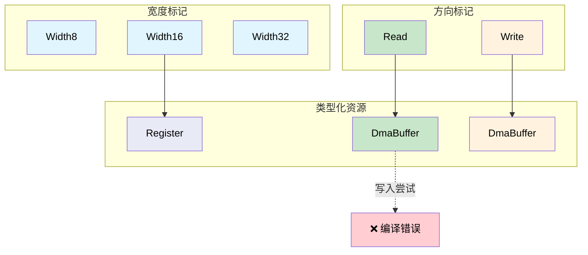

# 幽灵类型用于资源跟踪 🟡

> **你将学到：** `PhantomData` 标记如何在类型级别编码寄存器宽度、DMA 方向和文件描述符状态——以零运行时成本防止整个资源不匹配 bug 类别。
>
> **交叉引用：** [ch05](ch05-protocol-state-machines-type-state-for-r.md)（类型状态），[ch06](ch06-dimensional-analysis-making-the-compiler.md)（量纲类型），[ch08](ch08-capability-mixins-compile-time-hardware-.md)（混合），[ch10](ch10-putting-it-all-together-a-complete-diagn.md)（集成）

## 问题：资源混淆

硬件资源在代码中看起来相似但不可互换：

- 32 位寄存器和 16 位寄存器都是"寄存器"
- 用于读取的 DMA 缓冲区和用于写入的 DMA 缓冲区都看起来像 `*mut u8`
- 打开的文件描述符和关闭的文件描述符都是 `i32`

在 C 中：

```c
// C — 所有寄存器看起来一样
uint32_t read_reg32(volatile void *base, uint32_t offset);
uint16_t read_reg16(volatile void *base, uint32_t offset);

// Bug：用 32 位函数读取 16 位寄存器
uint32_t status = read_reg32(pcie_bar, LINK_STATUS_REG);  // 应该是 reg16！
```

## 幽灵类型参数

**幽灵类型** 是一个出现在结构定义中但不在任何字段中的类型参数。它纯粹是为了携带类型级信息：

```rust,ignore
use std::marker::PhantomData;

// 寄存器宽度标记——零大小
pub struct Width8;
pub struct Width16;
pub struct Width32;
pub struct Width64;

/// 由其宽度参数化的寄存器句柄。
/// PhantomData<W> 成本为零字节——它是仅编译时的标记。
pub struct Register<W> {
    base: usize,
    offset: usize,
    _width: PhantomData<W>,
}

impl Register<Width8> {
    pub fn read(&self) -> u8 {
        // ... 从 base + offset 读取 1 字节 ...
        0 // stub
    }
    pub fn write(&self, _value: u8) {
        // ... 写入 1 字节 ...
    }
}

impl Register<Width16> {
    pub fn read(&self) -> u16 {
        // ... 从 base + offset 读取 2 字节 ...
        0 // stub
    }
    pub fn write(&self, _value: u16) {
        // ... 写入 2 字节 ...
    }
}

impl Register<Width32> {
    pub fn read(&self) -> u32 {
        // ... 从 base + offset 读取 4 字节 ...
        0 // stub
    }
    pub fn write(&self, _value: u32) {
        // ... 写入 4 字节 ...
    }
}

/// PCIe 配置空间寄存器定义。
pub struct PcieConfig {
    base: usize,
}

impl PcieConfig {
    pub fn vendor_id(&self) -> Register<Width16> {
        Register { base: self.base, offset: 0x00, _width: PhantomData }
    }

    pub fn device_id(&self) -> Register<Width16> {
        Register { base: self.base, offset: 0x02, _width: PhantomData }
    }

    pub fn command(&self) -> Register<Width16> {
        Register { base: self.base, offset: 0x04, _width: PhantomData }
    }

    pub fn status(&self) -> Register<Width16> {
        Register { base: self.base, offset: 0x06, _width: PhantomData }
    }

    pub fn bar0(&self) -> Register<Width32> {
        Register { base: self.base, offset: 0x10, _width: PhantomData }
    }
}

fn pcie_example() {
    let cfg = PcieConfig { base: 0xFE00_0000 };

    let vid: u16 = cfg.vendor_id().read();    // 返回 u16 ✅
    let bar: u32 = cfg.bar0().read();         // 返回 u32 ✅

    // 不能混淆它们：
    // let bad: u32 = cfg.vendor_id().read(); // ❌ 错误：期望 u16
    // cfg.bar0().write(0u16);                // ❌ 错误：期望 u32
}
```

## DMA 缓冲区访问控制

DMA 缓冲区有方向：有些用于 **设备到主机**（读取），有些用于 **主机到设备**（写入）。使用错误的方向会破坏数据或导致总线错误：

```rust,ignore
use std::marker::PhantomData;

// 方向标记
pub struct ToDevice;     // 主机写入，设备读取
pub struct FromDevice;   // 设备写入，主机读取

/// 带方向强制的 DMA 缓冲区。
pub struct DmaBuffer<Dir> {
    ptr: *mut u8,
    len: usize,
    dma_addr: u64,  // 设备的物理地址
    _dir: PhantomData<Dir>,
}

impl DmaBuffer<ToDevice> {
    /// 用要发送到设备的数据填充缓冲区。
    pub fn write_data(&mut self, data: &[u8]) {
        assert!(data.len() <= self.len);
        unsafe { std::ptr::copy_nonoverlapping(data.as_ptr(), self.ptr, data.len()) }
    }

    /// 获取设备读取的 DMA 地址。
    pub fn device_addr(&self) -> u64 {
        self.dma_addr
    }
}

impl DmaBuffer<FromDevice> {
    /// 读取设备写入缓冲区的数据。
    pub fn read_data(&self) -> &[u8] {
        unsafe { std::slice::from_raw_parts(self.ptr, self.len) }
    }

    /// 获取设备写入的 DMA 地址。
    pub fn device_addr(&self) -> u64 {
        self.dma_addr
    }
}

// 不能写入 FromDevice 缓冲区：
// fn oops(buf: &mut DmaBuffer<FromDevice>) {
//     buf.write_data(&[1, 2, 3]);  // ❌ FromDevice 上没有方法 write_data
// }

// 不能从 ToDevice 缓冲区读取：
// fn oops2(buf: &DmaBuffer<ToDevice>) {
//     let data = buf.read_data();  // ❌ ToDevice 上没有方法 read_data
// }
```

## 文件描述符所有权

一个常见 bug：在文件描述符关闭后使用它。幽灵类型可以跟踪打开/关闭状态：

```rust,ignore
use std::marker::PhantomData;

pub struct Open;
pub struct Closed;

/// 带状态跟踪的文件描述符。
pub struct Fd<State> {
    raw: i32,
    _state: PhantomData<State>,
}

impl Fd<Open> {
    pub fn open(path: &str) -> Result<Self, String> {
        // ... 打开文件 ...
        Ok(Fd { raw: 3, _state: PhantomData }) // stub
    }

    pub fn read(&self, buf: &mut [u8]) -> Result<usize, String> {
        // ... 从 fd 读取 ...
        Ok(0) // stub
    }

    pub fn write(&self, data: &[u8]) -> Result<usize, String> {
        // ... 写入 fd ...
        Ok(data.len()) // stub
    }

    /// 关闭 fd——返回一个 Closed 句柄。
    /// Open 句柄被消耗，防止关闭后使用。
    pub fn close(self) -> Fd<Closed> {
        // ... 关闭 fd ...
        Fd { raw: self.raw, _state: PhantomData }
    }
}

impl Fd<Closed> {
    // 没有 read() 或 write() 方法——它们在 Fd<Closed> 上不存在。
    // 这使得关闭后使用成为编译错误。

    pub fn raw_fd(&self) -> i32 {
        self.raw
    }
}

fn fd_example() -> Result<(), String> {
    let fd = Fd::open("/dev/ipmi0")?;
    let mut buf = [0u8; 256];
    fd.read(&mut buf)?;

    let closed = fd.close();

    // closed.read(&mut buf)?;  // ❌ Fd<Closed> 上没有方法 read
    // closed.write(&[1])?;     // ❌ Fd<Closed> 上没有方法 write

    Ok(())
}
```

## 将幽灵类型与早期模式结合

幽灵类型与我们见过的所有内容组合：

```rust,ignore
# use std::marker::PhantomData;
# pub struct Width32;
# pub struct Width16;
# pub struct Register<W> { _w: PhantomData<W> }
# impl Register<Width16> { pub fn read(&self) -> u16 { 0 } }
# impl Register<Width32> { pub fn read(&self) -> u32 { 0 } }
# #[derive(Debug, Clone, Copy, PartialEq, PartialOrd)]
# pub struct Celsius(pub f64);

/// 结合幽灵类型（寄存器宽度）和量纲类型（Celsius）。
fn read_temp_sensor(reg: &Register<Width16>) -> Celsius {
    let raw = reg.read();  // 幽灵类型保证是 u16
    Celsius(raw as f64 * 0.0625)  // 返回类型保证是 Celsius
}

// 编译器强制执行：
// 1. 寄存器是 16 位（幽灵类型）
// 2. 结果是摄氏度（newtype）
// 两者都零运行时成本。
```

### 何时使用幽灵类型

| 场景 | 使用幽灵参数？ |
|----------|:------:|
| 寄存器宽度编码 | ✅ 始终——防止宽度不匹配 |
| DMA 缓冲区方向 | ✅ 始终——防止数据破坏 |
| 文件描述符状态 | ✅ 始终——防止关闭后使用 |
| 内存区域权限（读/写/执行） | ✅ 始终——强制访问控制 |
| 通用容器（Vec、HashMap） | ❌ 否——使用具体类型参数 |
| 运行时可变属性 | ❌ 否——幽灵类型仅用于编译时 |

## 幽灵类型资源矩阵



## 练习：内存区域权限

为具有读、写和执行权限的内存区域设计幽灵类型：
- `MemRegion<ReadOnly>` 有 `fn read(&self, offset: usize) -> u8`
- `MemRegion<ReadWrite>` 有 `read` 和 `write`
- `MemRegion<Executable>` 有 `read` 和 `fn execute(&self)`
- 写入 `ReadOnly` 或执行 `ReadWrite` 不应编译。

<details>
<summary>解答</summary>

```rust,ignore
use std::marker::PhantomData;

pub struct ReadOnly;
pub struct ReadWrite;
pub struct Executable;

pub struct MemRegion<Perm> {
    base: *mut u8,
    len: usize,
    _perm: PhantomData<Perm>,
}

// 所有权限类型都可用读取
impl<P> MemRegion<P> {
    pub fn read(&self, offset: usize) -> u8 {
        assert!(offset < self.len);
        unsafe { *self.base.add(offset) }
    }
}

impl MemRegion<ReadWrite> {
    pub fn write(&mut self, offset: usize, val: u8) {
        assert!(offset < self.len);
        unsafe { *self.base.add(offset) = val; }
    }
}

impl MemRegion<Executable> {
    pub fn execute(&self) {
        // 跳转到基地址（概念性）
    }
}

// ❌ region_ro.write(0, 0xFF);  // 编译错误：没有方法 write
// ❌ region_rw.execute();       // 编译错误：没有方法 execute
```

</details>

## 关键要点

1. **PhantomData 以零大小携带类型级信息** — 标记只存在于编译器中。
2. **寄存器宽度不匹配成为编译错误** — `Register<Width16>` 返回 `u16`，不是 `u32`。
3. **DMA 方向被结构性强制执行** — `DmaBuffer<Read>` 没有 `write()` 方法。
4. **与量纲类型结合（ch06）** — `Register<Width16>` 可以通过解析步骤返回 `Celsius`。
5. **幽灵类型仅用于编译时** — 它们不适用于运行时可变属性；为那些使用枚举。

---

