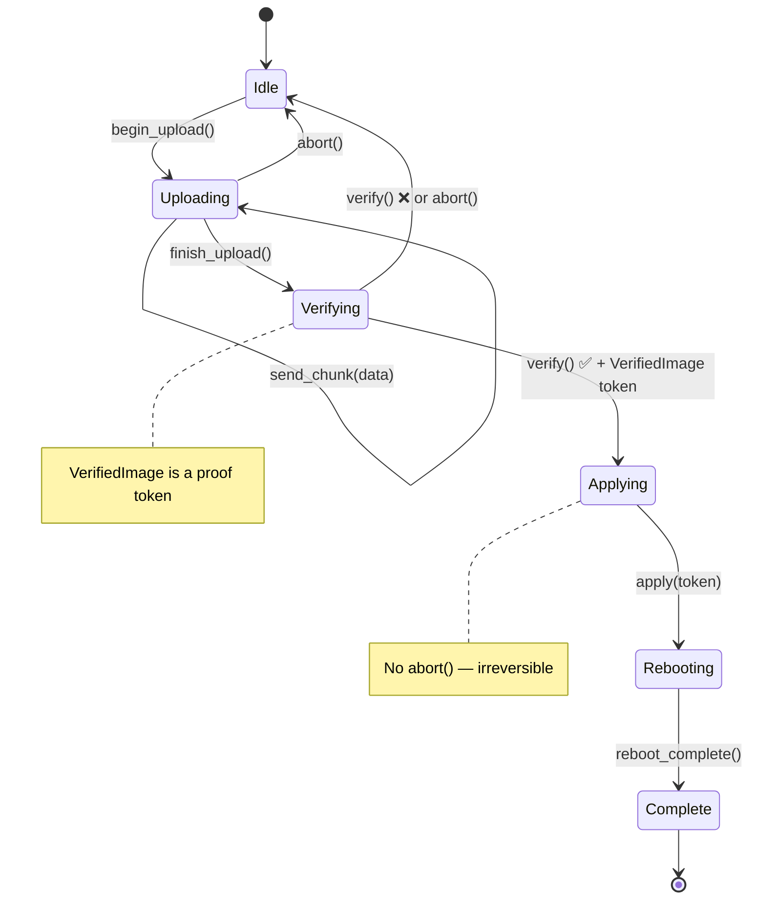

# 练习 🟡

> **你将学到：** 动手实践，将正确性构造模式应用于现实的硬件场景——NVMe 管理命令、固件更新状态机、传感器管道、PCIe 幽灵类型、多协议健康检查和会话类型诊断协议。
>
> **交叉引用：** [ch02](ch02-typed-command-interfaces-request-determi.md)（练习 1），[ch05](ch05-protocol-state-machines-type-state-for-r.md)（练习 2），[ch06](ch06-dimensional-analysis-making-the-compiler.md)（练习 3），[ch09](ch09-phantom-types-for-resource-tracking.md)（练习 4），[ch10](ch10-putting-it-all-together-a-complete-diagn.md)（练习 5）

## 实践问题

### 练习 1：NVMe 管理命令（类型化命令）

为 NVMe 管理命令设计一个类型化命令接口：

- `Identify` → `IdentifyResponse`（型号、序列号、固件版本）
- `GetLogPage` → `SmartLog`（温度、可用备件、数据单元读取）
- `GetFeature` → 特定功能的响应

要求：
1. 命令类型决定响应类型
2. 无运行时分派——仅静态分派
3. 添加一个 `NamespaceId` newtype，防止将命名空间 ID 与其他 `u32` 混合

**提示：** 遵循 ch02 的 `IpmiCmd` trait 模式，但使用 NVMe 特定的常量。

<details>
<summary>示例解答（练习 1）</summary>

```rust,ignore
use std::io;

#[derive(Debug, Clone, Copy, PartialEq, Eq, PartialOrd, Ord, Hash)]
pub struct NamespaceId(pub u32);

#[derive(Debug, Clone, PartialEq)]
pub struct IdentifyResponse {
    pub model: String,
    pub serial: String,
    pub firmware_rev: String,
}

#[derive(Debug, Clone, PartialEq)]
pub struct SmartLog {
    pub temperature_kelvin: u16,
    pub available_spare_pct: u8,
    pub data_units_read: u64,
}

#[derive(Debug, Clone, PartialEq)]
pub struct ArbitrationFeature {
    pub high_priority_weight: u8,
    pub medium_priority_weight: u8,
    pub low_priority_weight: u8,
}

/// 核心模式：关联类型固定每个命令的响应。
pub trait NvmeAdminCmd {
    type Response;
    fn opcode(&self) -> u8;
    fn nsid(&self) -> Option<NamespaceId>;
    fn parse_response(&self, raw: &[u8]) -> io::Result<Self::Response>;
}

pub struct Identify { pub nsid: NamespaceId }

impl NvmeAdminCmd for Identify {
    type Response = IdentifyResponse;
    fn opcode(&self) -> u8 { 0x06 }
    fn nsid(&self) -> Option<NamespaceId> { Some(self.nsid) }
    fn parse_response(&self, raw: &[u8]) -> io::Result<IdentifyResponse> {
        if raw.len() < 12 {
            return Err(io::Error::new(io::ErrorKind::InvalidData, "too short"));
        }
        Ok(IdentifyResponse {
            model: String::from_utf8_lossy(&raw[0..4]).trim().to_string(),
            serial: String::from_utf8_lossy(&raw[4..8]).trim().to_string(),
            firmware_rev: String::from_utf8_lossy(&raw[8..12]).trim().to_string(),
        })
    }
}

pub struct GetLogPage { pub log_id: u8 }

impl NvmeAdminCmd for GetLogPage {
    type Response = SmartLog;
    fn opcode(&self) -> u8 { 0x02 }
    fn nsid(&self) -> Option<NamespaceId> { None }
    fn parse_response(&self, raw: &[u8]) -> io::Result<SmartLog> {
        if raw.len() < 11 {
            return Err(io::Error::new(io::ErrorKind::InvalidData, "too short"));
        }
        Ok(SmartLog {
            temperature_kelvin: u16::from_le_bytes([raw[0], raw[1]]),
            available_spare_pct: raw[2],
            data_units_read: u64::from_le_bytes(raw[3..11].try_into().unwrap()),
        })
    }
}

pub struct GetFeature { pub feature_id: u8 }

impl NvmeAdminCmd for GetFeature {
    type Response = ArbitrationFeature;
    fn opcode(&self) -> u8 { 0x0A }
    fn nsid(&self) -> Option<NamespaceId> { None }
    fn parse_response(&self, raw: &[u8]) -> io::Result<ArbitrationFeature> {
        if raw.len() < 3 {
            return Err(io::Error::new(io::ErrorKind::InvalidData, "too short"));
        }
        Ok(ArbitrationFeature {
            high_priority_weight: raw[0],
            medium_priority_weight: raw[1],
            low_priority_weight: raw[2],
        })
    }
}

/// 静态分派 — 编译器按命令类型单态化。
pub struct NvmeController;

impl NvmeController {
    pub fn execute<C: NvmeAdminCmd>(&self, cmd: &C) -> io::Result<C::Response> {
        // 从 cmd.opcode()/cmd.nsid() 构建 SQE，
        // 提交到 SQ，等待 CQ，然后：
        let raw = self.submit_and_read(cmd.opcode())?;
        cmd.parse_response(&raw)
    }

    fn submit_and_read(&self, _opcode: u8) -> io::Result<Vec<u8>> {
        // 真实实现与 /dev/nvme0 通信
        Ok(vec![0; 512])
    }
}
```

**关键点：**
- `NamespaceId(u32)` 防止将命名空间 ID 与任意 `u32` 值混合。
- `NvmeAdminCmd::Response` 是"类型索引" — `execute()` 返回正好 `C::Response`。
- 完全静态分派：无 `Box<dyn …>`，无运行时向下转换。

</details>

### 练习 2：固件更新状态机（类型状态）

为 BMC 固件更新生命周期建模：



要求：
1. 每个状态是一个不同的类型
2. 上传只能从 Idle 开始
3. 验证需要上传完成
4. 应用只能在成功验证后发生 — 获取一个 `VerifiedImage` 证明令牌
5. 应用后唯一的选择是重启
6. 在 Uploading 和 Verifying 中添加 `abort()` 方法（但不在 Applying — 太晚了）

**提示：** 结合类型状态（ch05）与能力令牌（ch04）。

<details>
<summary>示例解答（练习 2）</summary>

```rust,ignore
// --- 状态类型 ---
// 设计选择：这里我们将状态存储在结构体内（`_state: S`）而不是使用
// `PhantomData<S>`（ch05 的方法）。这让状态携带数据 —
// 例如，`Uploading { bytes_sent: usize }` 跟踪进度。当状态是纯标记（零大小）时使用 `PhantomData`；
// 当状态携带有意义的运行时数据时使用内联存储。
pub struct Idle;
pub struct Uploading { bytes_sent: usize }  // 不是 ZST — 携带进度数据
pub struct Verifying;
pub struct Applying;
pub struct Rebooting;
pub struct Complete;

/// 证明令牌：仅在 verify() 内部构造。
pub struct VerifiedImage { _private: () }

pub struct FwUpdate<S> {
    bmc_addr: String,
    _state: S,
}

impl FwUpdate<Idle> {
    pub fn new(bmc_addr: &str) -> Self {
        FwUpdate { bmc_addr: bmc_addr.to_string(), _state: Idle }
    }
    pub fn begin_upload(self) -> FwUpdate<Uploading> {
        FwUpdate { bmc_addr: self.bmc_addr, _state: Uploading { bytes_sent: 0 } }
    }
}

impl FwUpdate<Uploading> {
    pub fn send_chunk(mut self, chunk: &[u8]) -> Self {
        self._state.bytes_sent += chunk.len();
        self
    }
    pub fn finish_upload(self) -> FwUpdate<Verifying> {
        FwUpdate { bmc_addr: self.bmc_addr, _state: Verifying }
    }
    /// 上传期间可用 abort — 返回 Idle。
    pub fn abort(self) -> FwUpdate<Idle> {
        FwUpdate { bmc_addr: self.bmc_addr, _state: Idle }
    }
}

impl FwUpdate<Verifying> {
    /// 成功时，返回下一个状态和一个 VerifiedImage 证明令牌。
    pub fn verify(self) -> Result<(FwUpdate<Applying>, VerifiedImage), FwUpdate<Idle>> {
        // 真实：检查 CRC、签名、兼容性
        let token = VerifiedImage { _private: () };
        Ok((
            FwUpdate { bmc_addr: self.bmc_addr, _state: Applying },
            token,
        ))
    }
    /// 验证期间可用 abort。
    pub fn abort(self) -> FwUpdate<Idle> {
        FwUpdate { bmc_addr: self.bmc_addr, _state: Idle }
    }
}

impl FwUpdate<Applying> {
    /// 消耗 VerifiedImage 证明 — 没有验证就不能应用。
    /// 注意：这里没有 abort() 方法 — 一旦开始烧写，就太危险了。
    pub fn apply(self, _proof: VerifiedImage) -> FwUpdate<Rebooting> {
        FwUpdate { bmc_addr: self.bmc_addr, _state: Rebooting }
    }
}

impl FwUpdate<Rebooting> {
    pub fn wait_for_reboot(self) -> FwUpdate<Complete> {
        FwUpdate { bmc_addr: self.bmc_addr, _state: Complete }
    }
}

impl FwUpdate<Complete> {
    pub fn version(&self) -> &str { "2.1.0" }
}

// 用法：
// let fw = FwUpdate::new("192.168.1.100")
//     .begin_upload()
//     .send_chunk(b"image_data")
//     .finish_upload();
// let (fw, proof) = fw.verify().map_err(|_| "verify failed")?;
// let fw = fw.apply(proof).wait_for_reboot();
// println!("New version: {}", fw.version());
```

**关键点：**
- `abort()` 仅在 `FwUpdate<Uploading>` 和 `FwUpdate<Verifying>` 上存在 — 在 `FwUpdate<Applying>` 上调用它是 **编译错误**，不是运行时检查。
- `VerifiedImage` 有一个私有字段，所以只有 `verify()` 可以创建一个。
- `apply()` 消耗证明令牌 — 你不能跳过验证。

</details>

### 练习 3：传感器读取管道（量纲分析）

构建一个完整的传感器管道：

1. 定义 newtype：`RawAdc`、`Celsius`、`Fahrenheit`、`Volts`、`Millivolts`、`Watts`
2. 实现 `From<Celsius> for Fahrenheit` 及反向
3. 创建 `impl Mul<Volts, Output=Watts> for Amperes`（P = V × I）
4. 构建一个 `Threshold<T>` 泛型检查器
5. 编写管道：ADC → 校准 → 阈值检查 → 结果

编译器应该拒绝：比较 `Celsius` 和 `Volts`、添加 `Watts` 和 `Rpm`、在期望 `Volts` 的地方传递 `Millivolts`。

<details>
<summary>示例解答（练习 3）</summary>

```rust,ignore
use std::ops::{Add, Sub, Mul};

#[derive(Debug, Clone, Copy, PartialEq, PartialOrd)]
pub struct RawAdc(pub u16);

#[derive(Debug, Clone, Copy, PartialEq, PartialOrd)]
pub struct Celsius(pub f64);

#[derive(Debug, Clone, Copy, PartialEq, PartialOrd)]
pub struct Fahrenheit(pub f64);

#[derive(Debug, Clone, Copy, PartialEq, PartialOrd)]
pub struct Volts(pub f64);

#[derive(Debug, Clone, Copy, PartialEq, PartialOrd)]
pub struct Millivolts(pub f64);

#[derive(Debug, Clone, Copy, PartialEq, PartialOrd)]
pub struct Amperes(pub f64);

#[derive(Debug, Clone, Copy, PartialEq, PartialOrd)]
pub struct Watts(pub f64);

// --- 安全转换 ---
impl From<Celsius> for Fahrenheit {
    fn from(c: Celsius) -> Self { Fahrenheit(c.0 * 9.0 / 5.0 + 32.0) }
}
impl From<Fahrenheit> for Celsius {
    fn from(f: Fahrenheit) -> Self { Celsius((f.0 - 32.0) * 5.0 / 9.0) }
}
impl From<Millivolts> for Volts {
    fn from(mv: Millivolts) -> Self { Volts(mv.0 / 1000.0) }
}
impl From<Volts> for Millivolts {
    fn from(v: Volts) -> Self { Millivolts(v.0 * 1000.0) }
}

// --- 同单位算术 ---
// 注意：添加绝对温度（25°C + 30°C）在物理上是有问题的 —
// 有关于 ΔT newtype 的更严格方法，参见 ch06 的讨论。
// 这里我们为练习保持简单。
impl Add for Celsius {
    type Output = Celsius;
    fn add(self, rhs: Self) -> Celsius { Celsius(self.0 + rhs.0) }
}
impl Sub for Celsius {
    type Output = Celsius;
    fn sub(self, rhs: Self) -> Celsius { Celsius(self.0 - rhs.0) }
}

// P = V × I（跨单位乘法）
impl Mul<Amperes> for Volts {
    type Output = Watts;
    fn mul(self, rhs: Amperes) -> Watts { Watts(self.0 * rhs.0) }
}

// --- 泛型阈值检查器 ---
// 练习 3 扩展了 ch06 的 Threshold，增加了泛型 ThresholdResult<T>，
// 它携带触发的读数 — 这是 ch06 更简单的
// ThresholdResult { Normal, Warning, Critical } 枚举的演进。
pub enum ThresholdResult<T> {
    Normal(T),
    Warning(T),
    Critical(T),
}

pub struct Threshold<T> {
    pub warning: T,
    pub critical: T,
}

// 泛型 impl — 适用于任何支持 PartialOrd 的单位类型。
impl<T: PartialOrd + Copy> Threshold<T> {
    pub fn check(&self, reading: T) -> ThresholdResult<T> {
        if reading >= self.critical {
            ThresholdResult::Critical(reading)
        } else if reading >= self.warning {
            ThresholdResult::Warning(reading)
        } else {
            ThresholdResult::Normal(reading)
        }
    }
}
// 现在 `Threshold<Rpm>`、`Threshold<Volts>` 等都自动工作。

// --- 管道：ADC → 校准 → 阈值 → 结果 ---
pub struct CalibrationParams {
    pub scale: f64,  // 每 °C 的 ADC 计数
    pub offset: f64, // ADC 0 时的 °C
}

pub fn calibrate(raw: RawAdc, params: &CalibrationParams) -> Celsius {
    Celsius(raw.0 as f64 / params.scale + params.offset)
}

pub fn sensor_pipeline(
    raw: RawAdc,
    params: &CalibrationParams,
    threshold: &Threshold<Celsius>,
) -> ThresholdResult<Celsius> {
    let temp = calibrate(raw, params);
    threshold.check(temp)
}

// 编译时安全 — 这些不会编译：
// let _ = Celsius(25.0) + Volts(12.0);   // 错误：类型不匹配
// let _: Millivolts = Volts(1.0);         // 错误：无隐式强制转换
// let _ = Watts(100.0) + Rpm(3000);       // 错误：类型不匹配
```

**关键点：**
- 每个物理单位是一个不同的类型 — 没有意外混合。
- `Mul<Amperes> for Volts` 产生 `Watts`，在类型系统中编码 P = V × I。
- 相关单位之间的显式 `From` 转换（mV ↔ V，°C ↔ °F）。
- `Threshold<Celsius>` 仅接受 `Celsius` — 不能意外地对 RPM 进行阈值检查。

</details>

### 练习 4：PCIe 能力遍历（幽灵类型 + 验证边界）

为 PCIe 能力链表建模：

1. `RawCapability` — 来自配置空间的未验证字节
2. `ValidCapability` — 通过 TryFrom 解析和验证
3. 每种能力类型（MSI、MSI-X、PCIe Express、电源管理）都有自己的幽灵类型寄存器布局
4. 遍历链表返回 `ValidCapability` 值的迭代器

**提示：** 结合验证边界（ch07）与幽灵类型（ch09）。

<details>
<summary>示例解答（练习 4）</summary>

```rust,ignore
use std::marker::PhantomData;

// --- 能力类型的幽灵标记 ---
pub struct Msi;
pub struct MsiX;
pub struct PciExpress;
pub struct PowerMgmt;

// PCI 能力 ID，来自规范
const CAP_ID_PM:   u8 = 0x01;
const CAP_ID_MSI:  u8 = 0x05;
const CAP_ID_PCIE: u8 = 0x10;
const CAP_ID_MSIX: u8 = 0x11;

/// 未验证的字节 — 可能是垃圾。
#[derive(Debug)]
pub struct RawCapability {
    pub id: u8,
    pub next_ptr: u8,
    pub data: Vec<u8>,
}

/// 验证并类型标记的能力。
#[derive(Debug)]
pub struct ValidCapability<Kind> {
    id: u8,
    next_ptr: u8,
    data: Vec<u8>,
    _kind: PhantomData<Kind>,
}

// --- TryFrom：解析而非验证边界 ---
impl TryFrom<RawCapability> for ValidCapability<PowerMgmt> {
    type Error = &'static str;
    fn try_from(raw: RawCapability) -> Result<Self, Self::Error> {
        if raw.id != CAP_ID_PM { return Err("not a PM capability"); }
        if raw.data.len() < 2 { return Err("PM data too short"); }
        Ok(ValidCapability {
            id: raw.id, next_ptr: raw.next_ptr,
            data: raw.data, _kind: PhantomData,
        })
    }
}

impl TryFrom<RawCapability> for ValidCapability<Msi> {
    type Error = &'static str;
    fn try_from(raw: RawCapability) -> Result<Self, Self::Error> {
        if raw.id != CAP_ID_MSI { return Err("not an MSI capability"); }
        if raw.data.len() < 6 { return Err("MSI data too short"); }
        Ok(ValidCapability {
            id: raw.id, next_ptr: raw.next_ptr,
            data: raw.data, _kind: PhantomData,
        })
    }
}

// （类似的 MsiX、PciExpress 的 TryFrom 实现 — 为简洁省略）

// --- 类型安全访问器：仅在正确的能力类型上可用 ---
impl ValidCapability<PowerMgmt> {
    pub fn pm_control(&self) -> u16 {
        u16::from_le_bytes([self.data[0], self.data[1]])
    }
}

impl ValidCapability<Msi> {
    pub fn message_control(&self) -> u16 {
        u16::from_le_bytes([self.data[0], self.data[1]])
    }
    pub fn vectors_requested(&self) -> u32 {
        1 << ((self.message_control() >> 1) & 0x07)
    }
}

impl ValidCapability<MsiX> {
    pub fn table_size(&self) -> u16 {
        (u16::from_le_bytes([self.data[0], self.data[1]]) & 0x07FF) + 1
    }
}

// --- 能力遍历器：迭代链表 ---
pub struct CapabilityWalker<'a> {
    config_space: &'a [u8],
    next_ptr: u8,
}

impl<'a> CapabilityWalker<'a> {
    pub fn new(config_space: &'a [u8]) -> Self {
        // 能力指针位于 PCI 配置空间偏移 0x34 处
        let first_ptr = if config_space.len() > 0x34 {
            config_space[0x34]
        } else { 0 };
        CapabilityWalker { config_space, next_ptr: first_ptr }
    }
}

impl<'a> Iterator for CapabilityWalker<'a> {
    type Item = RawCapability;
    fn next(&mut self) -> Option<RawCapability> {
        if self.next_ptr == 0 { return None; }
        let off = self.next_ptr as usize;
        if off + 2 > self.config_space.len() { return None; }
        let id = self.config_space[off];
        let next = self.config_space[off + 1];
        let end = if next > 0 { next as usize } else {
            (off + 16).min(self.config_space.len())
        };
        let data = self.config_space[off + 2..end].to_vec();
        self.next_ptr = next;
        Some(RawCapability { id, next_ptr: next, data })
    }
}

// 用法：
// for raw_cap in CapabilityWalker::new(&config_space) {
//     if let Ok(pm) = ValidCapability::<PowerMgmt>::try_from(raw_cap) {
//         println!("PM control: 0x{:04X}", pm.pm_control());
//     }
// }
```

**关键点：**
- `RawCapability` → `ValidCapability<Kind>` 是解析而非验证的边界。
- `pm_control()` 仅在 `ValidCapability<PowerMgmt>` 上存在 — 在 MSI 能力上调用它是编译错误。
- `CapabilityWalker` 迭代器产生原始能力；调用者用 `TryFrom` 验证他们关心的能力。

</details>

### 练习 5：多协议健康检查（能力混合）

创建一个健康检查框架：

1. 定义成分 trait：`HasIpmi`、`HasRedfish`、`HasNvmeCli`、`HasGpio`
2. 创建混合 trait：
   - `ThermalHealthMixin`（需要 HasIpmi + HasGpio）— 读取温度、检查警报
   - `StorageHealthMixin`（需要 HasNvmeCli）— SMART 数据检查
   - `BmcHealthMixin`（需要 HasIpmi + HasRedfish）— 交叉验证 BMC 数据
3. 构建实现所有成分 trait 的 `FullPlatformController`
4. 构建仅实现 `HasNvmeCli` 的 `StorageOnlyController`
5. 验证 `StorageOnlyController` 获得 `StorageHealthMixin` 但不是其他

<details>
<summary>示例解答（练习 5）</summary>

```rust,ignore
// --- 成分 trait ---
pub trait HasIpmi {
    fn ipmi_read_sensor(&self, id: u8) -> f64;
}
pub trait HasRedfish {
    fn redfish_get(&self, path: &str) -> String;
}
pub trait HasNvmeCli {
    fn nvme_smart_log(&self, dev: &str) -> SmartData;
}
pub trait HasGpio {
    fn gpio_read_alert(&self, pin: u8) -> bool;
}

pub struct SmartData {
    pub temperature_kelvin: u16,
    pub spare_pct: u8,
}

// --- 带空白实现的混合 trait ---
pub trait ThermalHealthMixin: HasIpmi + HasGpio {
    fn thermal_check(&self) -> ThermalStatus {
        let temp = self.ipmi_read_sensor(0x01);
        let alert = self.gpio_read_alert(12);
        ThermalStatus { temperature: temp, alert_active: alert }
    }
}
impl<T: HasIpmi + HasGpio> ThermalHealthMixin for T {}

pub trait StorageHealthMixin: HasNvmeCli {
    fn storage_check(&self) -> StorageStatus {
        let smart = self.nvme_smart_log("/dev/nvme0");
        StorageStatus {
            temperature_ok: smart.temperature_kelvin < 343, // 70 °C
            spare_ok: smart.spare_pct > 10,
        }
    }
}
impl<T: HasNvmeCli> StorageHealthMixin for T {}

pub trait BmcHealthMixin: HasIpmi + HasRedfish {
    fn bmc_health(&self) -> BmcStatus {
        let ipmi_temp = self.ipmi_read_sensor(0x01);
        let rf_temp = self.redfish_get("/Thermal/Temperatures/0");
        BmcStatus { ipmi_temp, redfish_temp: rf_temp, consistent: true }
    }
}
impl<T: HasIpmi + HasRedfish> BmcHealthMixin for T {}

pub struct ThermalStatus { pub temperature: f64, pub alert_active: bool }
pub struct StorageStatus { pub temperature_ok: bool, pub spare_ok: bool }
pub struct BmcStatus { pub ipmi_temp: f64, pub redfish_temp: String, pub consistent: bool }

// --- 全平台：所有成分 → 免费获得所有三个混合 ---
pub struct FullPlatformController;

impl HasIpmi for FullPlatformController {
    fn ipmi_read_sensor(&self, _id: u8) -> f64 { 42.0 }
}
impl HasRedfish for FullPlatformController {
    fn redfish_get(&self, _path: &str) -> String { "42.0".into() }
}
impl HasNvmeCli for FullPlatformController {
    fn nvme_smart_log(&self, _dev: &str) -> SmartData {
        SmartData { temperature_kelvin: 310, spare_pct: 95 }
    }
}
impl HasGpio for FullPlatformController {
    fn gpio_read_alert(&self, _pin: u8) -> bool { false }
}

// --- 仅存储：只有 HasNvmeCli → 只有 StorageHealthMixin ---
pub struct StorageOnlyController;

impl HasNvmeCli for StorageOnlyController {
    fn nvme_smart_log(&self, _dev: &str) -> SmartData {
        SmartData { temperature_kelvin: 315, spare_pct: 80 }
    }
}

// StorageOnlyController 自动获得 storage_check()。
// 在其上调用 thermal_check() 或 bmc_health() 是编译错误。
```

**关键点：**
- 空白 `impl<T: HasIpmi + HasGpio> ThermalHealthMixin for T {}` — 任何实现两种成分的类型自动获得混合。
- `StorageOnlyController` 仅实现 `HasNvmeCli`，所以编译器授予它 `StorageHealthMixin` 但拒绝 `thermal_check()` 和 `bmc_health()` — 不需要运行时检查。
- 添加新混合（例如 `NetworkHealthMixin: HasRedfish + HasGpio`）是一个 trait + 一个空白实现 — 现有控制器如果符合条件会自动获取它。

</details>

### 练习 6：会话类型诊断协议（单次使用 + 类型状态）

设计一个带有单次使用测试执行令牌的诊断会话：

1. `DiagSession` 从 `Setup` 状态开始
2. 转换到 `Running` 状态 — 颁发 `N` 个执行令牌（每个测试用例一个）
3. 每个 `TestToken` 在测试运行时被消耗 — 防止运行同一测试两次
4. 所有令牌消耗后，转换到 `Complete` 状态
5. 生成报告（仅在 `Complete` 状态）

**高级：** 使用 const 泛型 `N` 在类型级别跟踪剩余测试数量。

<details>
<summary>示例解答（练习 6）</summary>

```rust,ignore
// --- 状态类型 ---
pub struct Setup;
pub struct Running;
pub struct Complete;

/// 单次使用测试令牌。不是 Clone，不是 Copy — 使用时消耗。
pub struct TestToken {
    test_name: String,
}

#[derive(Debug)]
pub struct TestResult {
    pub test_name: String,
    pub passed: bool,
}

pub struct DiagSession<S> {
    name: String,
    results: Vec<TestResult>,
    _state: S,
}

impl DiagSession<Setup> {
    pub fn new(name: &str) -> Self {
        DiagSession {
            name: name.to_string(),
            results: Vec::new(),
            _state: Setup,
        }
    }

    /// 转换到 Running — 为每个测试用例颁发一个令牌。
    pub fn start(self, test_names: &[&str]) -> (DiagSession<Running>, Vec<TestToken>) {
        let tokens = test_names.iter()
            .map(|n| TestToken { test_name: n.to_string() })
            .collect();
        (
            DiagSession {
                name: self.name,
                results: Vec::new(),
                _state: Running,
            },
            tokens,
        )
    }
}

impl DiagSession<Running> {
    /// 消耗令牌以运行一个测试。移动防止重复运行。
    pub fn run_test(mut self, token: TestToken) -> Self {
        let passed = true; // 真实代码在这里运行实际诊断
        self.results.push(TestResult {
            test_name: token.test_name,
            passed,
        });
        self
    }

    /// 转换到 Complete。
    ///
    /// **注意：** 此解决方案不强制所有令牌已被消耗 — `finish()` 可以用未完成的令牌调用。
    /// 令牌将简单被丢弃（它们不是 `#[must_use]`）。
    /// 对于完整的编译时强制执行，使用下面描述的 const 泛型变体，
    /// 其中 `finish()` 仅在 `DiagSession<Running, 0>` 上可用。
    pub fn finish(self) -> DiagSession<Complete> {
        DiagSession {
            name: self.name,
            results: self.results,
            _state: Complete,
        }
    }
}

impl DiagSession<Complete> {
    /// 报告仅在 Complete 状态可用。
    pub fn report(&self) -> String {
        let total = self.results.len();
        let passed = self.results.iter().filter(|r| r.passed).count();
        format!("{}: {}/{} passed", self.name, passed, total)
    }
}

// 用法：
// let session = DiagSession::new("GPU stress");
// let (mut session, tokens) = session.start(&["vram", "compute", "thermal"]);
// for token in tokens {
//     session = session.run_test(token);
// }
// let session = session.finish();
// println!("{}", session.report());  // "GPU stress: 3/3 passed"
//
// // 这些不会编译：
// // session.run_test(used_token);  →  错误：使用了已移动的值
// // running_session.report();      →  错误：DiagSession<Running> 上没有方法 `report`
```

**关键点：**
- `TestToken` 不是 `Clone` 或 `Copy` — 通过 `run_test(token)` 消耗它会移动它，所以重复运行同一个测试是编译错误。
- `report()` 仅在 `DiagSession<Complete>` 上存在 — 在运行中间调用它是不可能的。
- **高级** 变体将使用带 const 泛型的 `DiagSession<Running, N>`，其中 `run_test` 返回 `DiagSession<Running, {N-1}>` 且 `finish` 仅在 `DiagSession<Running, 0>` 上可用 — 这确保在完成前 *所有* 令牌都被消耗。

</details>

## 关键要点

1. **使用现实协议练习** — NVMe、固件更新、传感器管道、PCIe 都是这些模式的真实目标。
2. **每个练习映射到一个核心章节** — 在尝试之前使用交叉引用来复习模式。
3. **解决方案使用可扩展细节** — 在揭示解决方案之前尝试每个练习。
4. **在练习 5 中组合模式** — 多协议健康检查结合类型化命令、量纲类型和验证边界。
5. **会话类型（练习 6）是前沿** — 它们在通道间强制消息顺序，将类型状态扩展到分布式系统。

---
